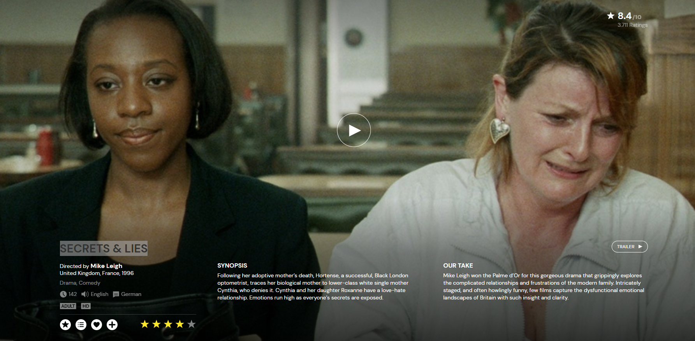

Auf Mubi gesehen, Ein Film von Mike Leigh

Following her adoptive mother’s death, Hortense, a successful, Black London optometrist, traces her biological mother to lower-class white single mother Cynthia, who denies it. Cynthia and her daughter Roxanne have a love-hate relationship. Emotions run high as everyone’s secrets are exposed.

Mike Leigh won the Palme d’Or for this gorgeous drama that grippingly explores the complicated relationships and frustrations of the modern family. Intricately staged, and often howlingly funny, few films capture the dysfunctional emotional landscapes of Britain with such insight and clarity.

Ein englischer Film, ein Familiengeschichte der besondern Art, mit Drama am End.

