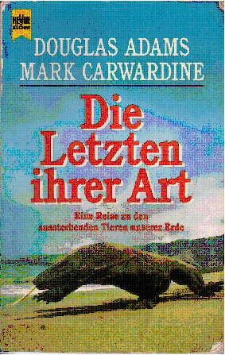

20101130
  

  

  

Adam Douglas, Mark Carwardine  

Die Letzten ihrer Art  

Wilhelm Heyne Verlag  

  

So 30.01.2011  

  

Interessant geschrieben, Kapitel immer f�r ein einzelnes Tier, teilweise recht witzig der Schreibstil  

Eher ein Beschreibung, kein Roman, aber auch kein Sachbuch  

