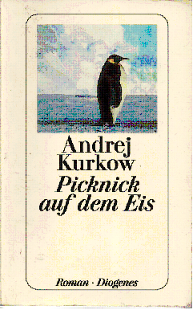

20110220\_Kurkow
  

  

  

Andrej Kurkow  

Picknick auf dem Eis  

Diogenes  

  

Sa 12.03.2011  

  

Guter Roman, ein Mann, alleine bekommt eine Stelle bei einer Zeitung  

in der er Nachrufe schon im voraus schreibt, danach stirbt dann auch die Person.  

Er hat einen Pinguin zuhause, ist ansonsten alleine, lernt verschieden Menschen kennen,  

die ihm gut tun oder auch nicht. Ein Mann dessen NAchruf er geschrieben hat, kommt auf ihn zu und gibt  

seine Tochter zu ihm, dann stirbt er. So hat er jetzt ein Kind, er sucht ein Kinderm�dchen, mit der auch ein Liebes-  

oder vielleicht auch eine nur Bettbeziehnung.  

  

Der Pinguin ist krank, bzw. auch traurig �ber die W�rme. Er soll zum Nordpol gefahren werden, so zusagen als Therapie.  

Aber am Ende f�hrt er selbst an den Nordpol, er ist der Pinguin sozusagen und rettet sich dadurch von der unklaren �usseren Bedrohung, aber auch aus den Beziehungen, die f�r ihn schwierig sind vielleicht auch tats�chlich keine sind. Das Kinderm�dchen hat einen j�ngeren kennengelernt.  

  

Sehr gutes Buch, wirklich nicht gerade aus und zeigt glaube ich auch so eine russische/ukrainische Seele, zumindest stelle ich mir das so vor.  

  

