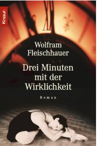

20110701\_Fleischhauer
  

  

  

So 09.10.2011  

  

Wolfram Fleischhauer  

Drei Minuten mit der Wirklichkeit / Knaur

Sehr mitreisender Roman 2023 nochmal gelesen. Eine Libesgeschichte und einem anscheinend
verücktem jungen Argentinier, der sehr mit in der Diktatur gelitten hat. Mit vielen Wendungen

  

  

Ein sehr spannendes Buch. Die Geschichte ist sehr verwirrend erst. Es gibt eine Verbindung von DDR und Argetinien, die in der Liebe zwischen Damian (El Loco, der Verr�ckte) und der Hauptdarstellerin zu einem Tabubruch f�hrt.   

  

Danneben, was ich auch sehr interessant finde, gibt es, bei der Suche der Geliebten nach ihrem Freund (Tangot�nzer) in Buenos Aires, eine sch�ne Beschreibung des Tangos in Argentinien.   

  

Insgesamt ein sehr spannendes Buch  

  

Lieder aus dem ersten Teil  

  

- Das in der Auff�hrung ge�nderte St�ck mit dem Lied "Renacer� en Buones Aires"  

