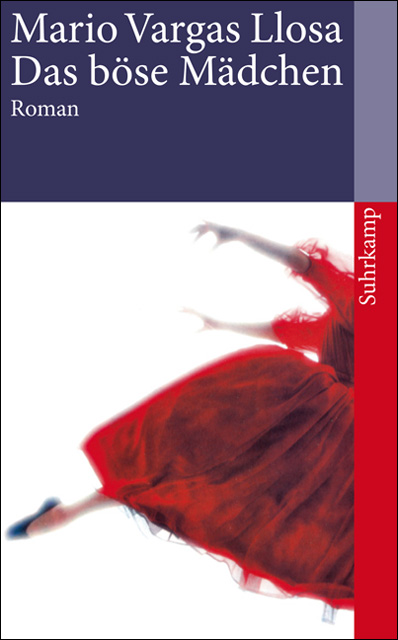

20110915
  

from unknown source:  

�   

  

�Vargas Llosa  

Das b�se M�dchen  

Suhrcamp Verlag  

  

  

Ein sehr anrührendes Buch mit ungewöhnlichen Karakteren, auf der einen Seite ein schlauer Junge/Mann aus Lima, der als Übersetzer in Paris lebt und eigentlich sonst nicht will, dann ein Mädchen/Frau, die er in der Schule kennenlernnt, die Chilennin, die eigentlich nicht mit ihm gehen will, sie aber sein ganzes Leben immer wieder trifft und im Grunde sein ganzes Leben ihr widmet. Der Mann ist der einzige Halt in ihrem Leben, was sie aber nicht daran hindert, mit gemeinen Männern zusammen zu sein, ausgenutzt und benutzt zu werden. DAs ganze geht bis zu dem Tot der Frau, die körperlich sehr geschunden und kaputt ist.  

  

Ein sehr anr�hrender Roman, der all meine Traurigkeit findet.  

