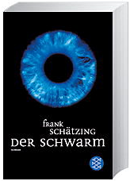

20111003

  

Frank Schätzing  

Der Schwarm  

Fischer Verlag  

Größtenteils grusseliger Roman, da er die Uwegbarkeiten des Meeres, bzw. die Unerforschtheit benutzt, um sehr realistische Katastrophen herbei zuführen, dem Meer eine eigene Intelligenz von schwärmenden Ageneinzellern gibt, die dann von der westlichen Welt, inform von hochspezielisierten Forschern, beherrscht werden soll oder zumindest mit dem Schwarm in Kontakt tretend lässt. Bei Seite 500 wollte ich aufhören, da zu grausam. Das Ende ist in sofern tröstlich, das es in einem Hollywood ähnlichen Disaster endet, was das ganze wieder etwas von einem weg rückt.   
