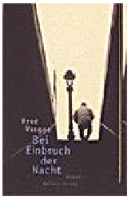

20111008
  

Fred Vargas  

Bei Einbruch Nacht  

Aufbau Verlag  

EIn intelligenter Roman, bei dem ich reingefallen bin, da der M�rdern schon sehr schnell bekannt und auch komisch handelt, was aber bei ihn nicht so verd�chtig gemacht hat, da zu entfernt der Zusammenhang.  

Schrullige Karakteren, die in Verbund zusammen bei der Verfolgung zusammen kommen. Insbesondere dr Komisar, der sehr sehr tiefgr�ndig aufmerksam ist und Sch��e ziehen kann. Aber vordergr�ndig tr�umt und sich sebst in seinen Gedanken treiben l��t und dazu steht. K�nnte ich mir eine Scheibe abschneiden.  

Ein guter Krimi, der nicht so ganz geradeaus geht  
