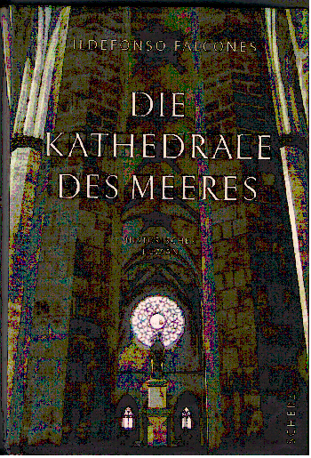

20111130
  

  

  

Ildefonso Falcones  

Die Kathedrale des Meeres  

Scherz Verlag  

  

Guter spannender historischer Roman. Spielt in Barcelona, als freie Stadt. Ist wohl auch recheriert, was das Juristische angeht. Im Stil errinnert ein bischen an Die S�ulen der Erde.  

  

  

  

  

  

