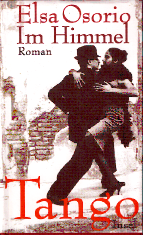

20120505
  

  

  

Elsa Osorio  

Im Himmel Tango   

Insel Verlag  

  

Guter Roman �ber eine gro�e Zeitspanne der Entstehung des Tango Argentinien, aber auch in Frankreich.  

Etwas kitschig. Im Tangohimmel sind die toten Tangot�nzer und reden �ber die Handlung. Der Tango wird als Person beschrieben.  

Und am Ende macht es nur noch schwach einen Bogen zur Gegenwart, mit den Ana (Paris) und ich glaube Luis(Buenos Aires) , bz.w ist kurz.  

