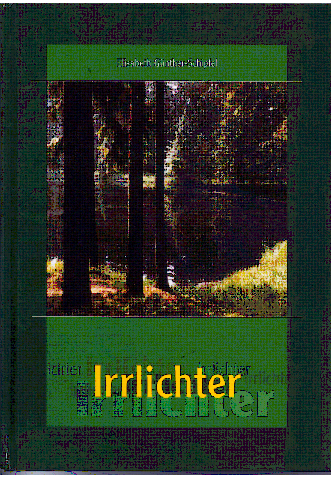

20120528
  

  

  

  

Elisabeth Günther-Schipfel  

Irrlichter  

  

  

Romangeschichte einer Frau/M�dchen Fena, die aus Joachimsthal vertrieben wurde.  

Von der Hauptperson etwas zu sch�n geradling geschrieben, zumindest was Gesinnung angeht. Die Umst�nde sind alles andere als geradlinig  

Aber interessant, um die zeitlichen Dinge mitzubekommen, vor 45, z.B. Annexion Sudenland von Deutschland etwa 38 oder die Jahre 45/46/47/  

  

  

Irrlichter - ja, es hat sie gegeben, die unheimlich flackernden Fla'mm der ,,Armen Seelen" im Hochmoor urn den sagenumwobenen Spitz auf dem Erzgebirgskamm. Die Menschen in den einsamen Anwesen grenznahen Ortschaften hatten ein hartes Leben, schlugen sich durch Kleinbauern, Holzfaller, Torfstecher und Bergleute. Sie waren aber auch Musikanten, Pascher und Wilderer. Das ist die Heimat des Volksdich1 \*-\*� Ciinther, der die Verhaltnisse seiner Heimat erlebte, erlitt . Die Geschichte dieses Gebietes darf nicht in Vergessenheit ten, aber ehrlich, was wissen Sie eigentlich authentisch von den Wi, n der bohmisch-sachsischen Grenze, die das Erzgebirge in zwei T trennt, von Unterdriickung, Krieg und Vertreibung der deutschen Bewoh-ner? Wer erinnert sich noch an die Leiden deutscher Kriegsgefangener in 'in ' agern der Uranbergwerke, die man die ,,H6lle von JoachimstL~' .?  

spannend geschriebene Buch in Romanform gibt darauf die r Xntworten. Erlebnisberichte hunderter Zeitzeugen machen es let id lebensnah. Gleichzeitig gibt das Buch auch einen aufschl i Einblick in die Schicksale jener Erzgebirger, die man mittello imde Welt hinaus jagte, die Trennung, Niedergang und Armut ii  

anden, zu neuen Hohen aufstiegen und doch sich selbst und i  

'eimat treu blieben.  

  

Ein Buch, das denen, die es schwer haben, Hoffnung macht!  

ISBN 3-931770-62-1  

Druck- und Verlagsgesellschaft  

Marienberg mbH  

www.buecher-aus-dem-erzgebirge.de  

