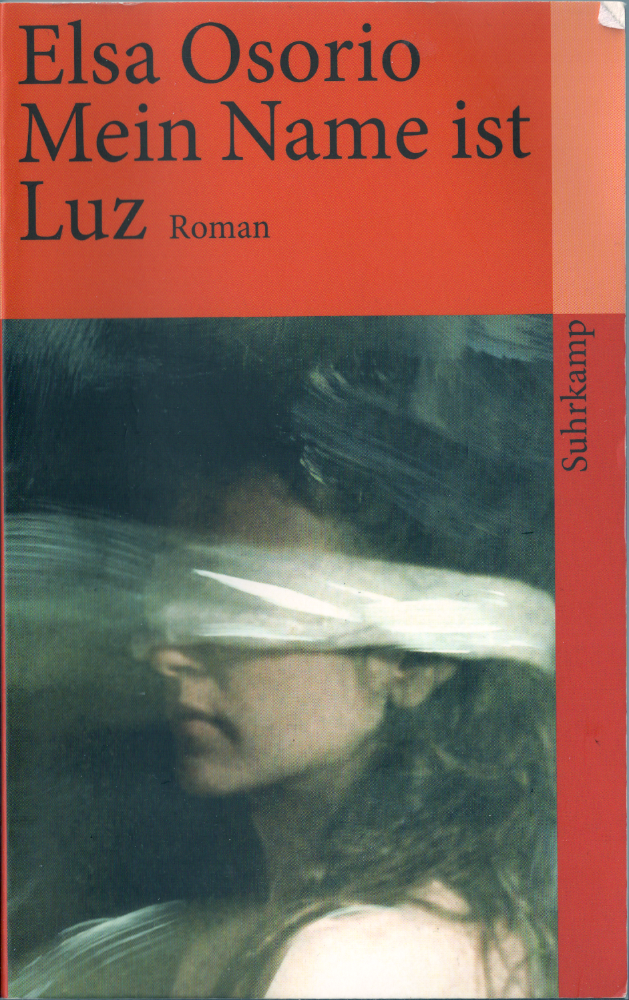

20120715
  

from unknown source:  

  

  

  

Buch habe ich beim Autokauf in Bremerhafen im Deutschen Asuwandererhaus Bremerhaven gekauft.  

Davor habe ich den Roman im Himmel Tango (siehe 20120505) gelesen. Dieser Roman ist im Gegensatz dazu alles andere als   

kitschig. Es beschreibt ein Schicksal eines Mädchens, die von den Militärs einer Gefangenen entrissen wurde und diese später  

umkam. Eine aufwühlende Geschichte. Das Mädchen wuchs als Kind in der Militärsfamilie auf und hat erst in Barcelona nach einer  

langen Geschichte ihren Vater gefunden und die Wahrheit zusammengesetzt.  

  

Sehr lesenswert, so ähnlich muss es Schiksale zu dieser Zeit ergangen sein, auch wenn diese erfunden.