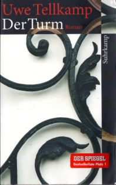

2012129
  

  

  

An dem Roman habe ich drei Monate gelesen, eine Riesengeschichte drei M�nner in  

der DDR, etwas besser gestellt (Vater Arzt, Sohn Internatssch�ler und Soldat und desssen Onkel als Lektor)  

Die Geschichte geht von 70er bis zur Wende. Schwierig zu lesen, da viele Anspielung, viele Nebens�tze,  

anders gebaut als mir �blich, manchmal habe ich mich gefragt wo ist Subjekt Pr�dikat Objekt. Aber sehr interessant.  

Mit vielen Zwischent�nen und Nuancen zur Lebensgewohnheiten und Umst�nden, Heimlichkeiten.  

Es gibt auch ien Film, den will ich auch noch mal schauen  

  

