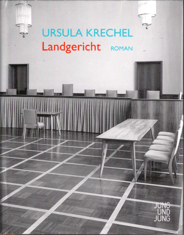

20130115
  

  

  

  

Habe ich von Doris zu Weihnachten bekommen. Ein Richter, der in der NS-Zeit, da Jude, alle Rechte genommen bekommen hat und schliesslich ausgeb�rgert wurde.  

Dadurch kam er nach Kuba. Seine Kinder wurden schon fr�her nach England weggegeben, da sie auch unter die Rassengesetze gefallen sind. Zum Schlu� war die Frau, Nichtjude, alleine und hat aber auch alles weggenommen bekommen, da sie sich nicht hat scheiden lassen.  

  

Die Geschichte geht um die Wiederzusammenf�hrung der Familie nach dem Krieg. Erst sucht Frau ihren Mann, dann sp�ter suche sie die Kinder. Diese sind aber nicht bereit mit nach Deutschland zu kommen, da sie schon zu sehr verwurzelt sind in England, vielleicht auch zu sehr gekr�nkt, das was ihre Eltern gemacht haben.  

  

Insgesamt ein trauriger Roman, bei dem man nicht ermessen kann, wieso die Eltern so sp�t die Kinder gesucht haben, bzw. so lange gebraucht haben. Aber das war auch das zerst�rte Deutschland.  

  

Zu Beginn hat er mich nicht so gepackt, sp�ter schon. Der Mann hat dann in Mainz im Landgericht als Richter gearbeitet und hat sich sp�t mit einer Verlautbarung gegen den Rechtssumpf aufgelehnt, zumindest begonnen, aber auch gleich beendet. Er war da halt auch elleine. Er h�tte den Richterjob nicht machen sollen, er hat es gerne gemacht, aber ist da nicht mit den alten Strukturen fertig geworden. Darunter haben Frau und Kinder glaube gelitten.  

  

Warum sind sie in Deutschland geblieben, wo doch als erstes ihre Kinder weg mu�ten. Wie denkt man sich dass, wie das wieder gut werden kann??  

  

