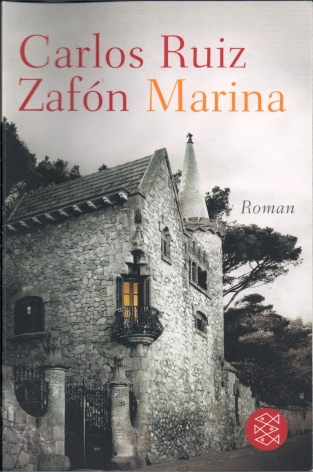

20130131
  

  

  

Der Roman ist ganz ergreifend, zumindest am Ende als seine Freundin sterben wird. Davor ist eine bizarre Geschichte um einen Mann der versucht hat dem Menschen aus orthop�dischen Bauteilen zusammen mit einem Lebenselexier aus einem Serum von Teufels-Schmetterlinge. Dann spielt es wie wohl immer in einem maroden Jetzt mit einem Blick in die Vergangenheit. Es ist schon eine phantastische Geschichte mit einem sehr traurigen Ende, das mich bei der Verbundenheit vom Marinas Freund und ihr Vater bei dem nahenden Tod �zum Heulen gebracht hat.  

  

Trotzdem ist �f�r mich der erste Roman "Im Schatten des Windes" der bessere, wenn man das so �berhaupt sagen kann. "Das �Spsiel des Engels" war dagegen zu kitschig oder so.