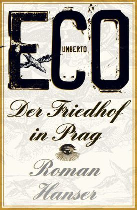

   
  
EIn bizzarer Roman in der Zeit von Garibali, Napoleon der 3. usw.  
Ein Skrupelloser Fälscher schlägt sich durch Leben in Italien und Paris.  
Die Voreingenommenheit durch seine  Abscheu seines Opas gegen die Juden, Freimauer und Republikaner, versucht er durch  
Fälschungen und Intrigen mit den Geheimdiensten wahr werden zu lassen.  
  
Wer ist Garibaldi gewesen.  
Wer die Carnonari (Italien)  
Wer Dreyfuss und seine Affäre (Frankreich)