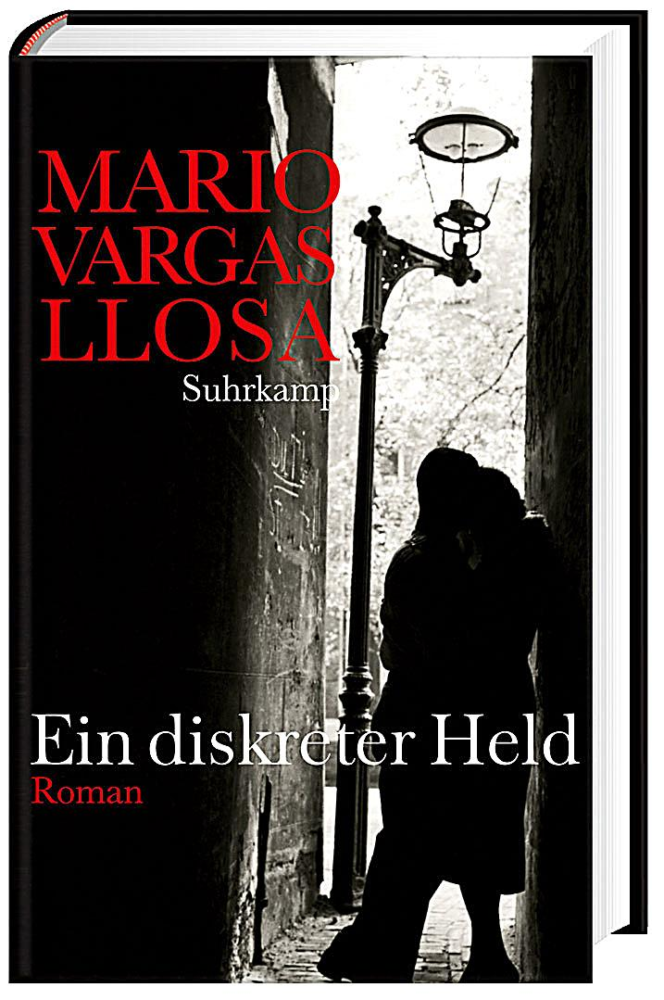

20140815
�   

  

Ein gut geschriebenes Buch mit interessanten Wendungen, letztendlich auch Familiengeschichten.  

Zum einen Lima, ein Bankdirektor heiratet seine Haushaltshilfe und der Freund, der Generaldirektor   

gerade in Rente, muss mit den entebrten S�hnen k�mpfen. Und gleichzeitig ein Piuranischer Fuhrunternehmer  

wir anscheinend von der Mafia mit Schutzgeldforderungrn bedroht wird und sich wiederetzt. Die Haushaltshilfe ist   

die Schwester der Frau vom Fuhrunternehmer. 