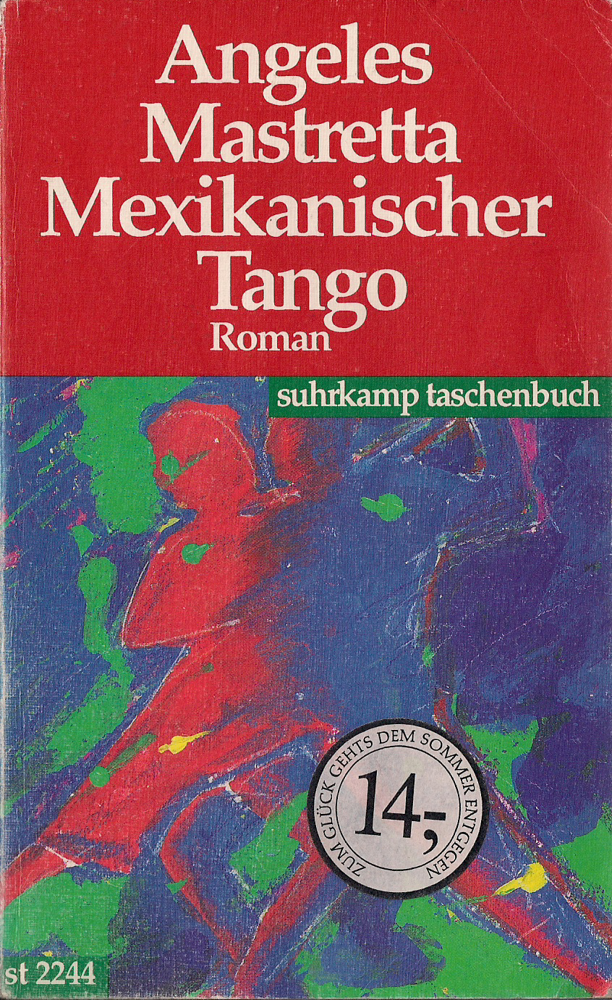

20140827
  

  

Mexikanischer Tango, die Geschichte einer Frau aus Puebla, die mit 15 Jahren einen Generalen heirateten musste. War mal gl�cklich und sp�ter sehr ungl�cklich mit ihm.  

Hat sich in einem Dirigenten verliebt, und ein Verh�ltnis gehabt, der aber dann wahrscheinlich im Auftrag von ihrem Mann umgebracht wurde. Naja ganz gut geschrieben, dicht gedruckt,  

Ein Familienepos aus Sicht der Frau des Generals