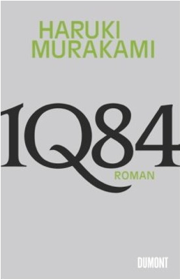

20150214\_Murakami
   

  

Ein Roman der sehr langsam ist, zwei Mesnchen beschreibt, deren Tun, Verwicklung und Verwicklung untereinander.  

Uber Sinn des Lebens und eigne Unzulanglichkeiten, aber auch Extremen.  

Geschichte ist unglaublich und auch abgefahren mit einer zweiten Welt 1Q84 und der darin vorhandenen "Little People"  

Sehr gut zu lesen, am Ende wird es ein bischen kitschig oder schw�lstig nach meinem Geschmack.  

Es sind 2 Bande in einem Buch, den dritten lese ich jetzt auch noch.