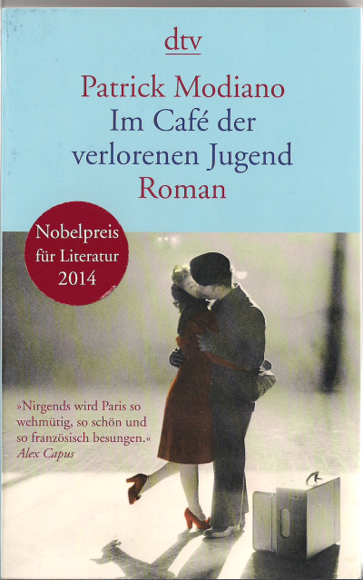

20150405\_Modiano
  

  

  

  

So 05.04.2015 17:38:21  

  

Patrick Modiano  

Im Caf� der verlorenen Jugend  

dtv  

  

Heut fertig gelesen, das Ende ist schon sehr traurig. Es geht um eine Frau Jaquline genannt Louki. Sie taucht in einem Caf� auf wird dort aufgenommen, ist still,  

hat eine schwierige vielleicht eher stille Kindheit, kein Vater und Mutter arbeitet immer Abends, so dass sie alleine anf�ngt als Kind, Nachts Paris zu entdecken.  

Sp�ter, als sie von der Mutter weg ist, wohnt sie in Hotels und wird von ihrem Chef geheiratet. Der aber eher versucht ein Vater zu sein. Sie entfieht, muss zu bestimmten   

Zeitpunkten ihre Freunde und Bekannte verlassen, sozusagen hinter sich lassen, so auch ihren Ehemann. Mit einem neuen Freund tr�umt sie sich �berall hin  

Und wann es am sch�nsten ist, bringt sie sich um. Wahrscheinlich waren auch ein paar Drogen im Spiel (Schnee) traurig, traurig   

  

Anfangs konnte ich mit dem Schreibstil mich nicht so sehr anfreunden, er geht im Erz�hlen in der Zeit weit zur�ck und wieder vor. Sp�ter war es ganz gut.