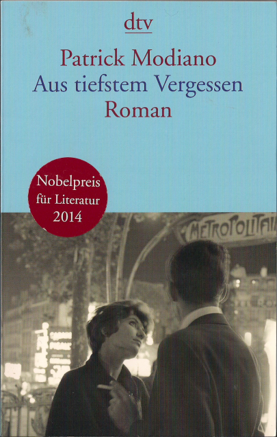

20150501\_Modiano
  

  

Sa 26.12.2015 10:44:52  

  

Patrick Modiano  

Aus tiefstem Vergessen  

dtv  

  

Ist jetzt schon eine Weil her mit Lesen. Sehr gut geschrieben. Schreibt in einer Zeit, wo auf der einen Seite Ausbruch aus Gewhnheiten/B�rgerlichkeit beschrienen ist, aber auf der anderen Seite trotzdem irgendwie Kleinb�rgerlich. Sch�n zu lesen, eher beschreibend distanziert.  

  

Aus https://www.perlentaucher.de/buch/patrick-modiano/aus-tiefstem-vergessen.html  

  

Ein Mann erinnert sich. In der Metro sieht er eine Frau, die vor drei�ig Jahren seine Jugendliebe gewesen sein k�nnte. Er folgt dieser Frau bis auf die Party eines v�llig Unbekannten. Obwohl die vermeintliche Jacqueline r�tselhaft unger�hrt bleibt, steht er so im Banne der Erinnerung, dass er ihr �nicht mehr von der Seite weicht... Patrick Mondiano erz�hlt eine nostalgische Liebesgeschichte aus dem Paris und London der sechziger Jahre. Der Reiz dieses poetischen Romans besteht in seiner unverwechselbaren Atmosph�re und darin, dass so vieles in der Schwebe bleibt. � �  

  

  

