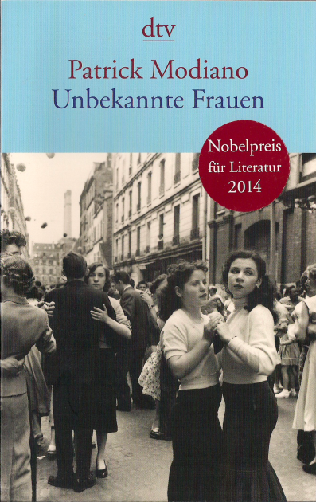

20150601\_Modiano
  

  

Patrick Modiano  

Unbekannte Frauen  

dtv  

  

Drei von einander unabh�ngeige Geschichten von drei Frauen, ich glaube alles spielt in Paris, gut geschrieben  

  

Aus https://www.perlentaucher.de/buch/patrick-modiano/unbekannte-frauen.html:  

  

Aus dem Franz�sischen von Elisabeth Edl. Drei Frauen, drei Schicksale. Modiano verleiht ihnen eine wunderbar melodische Stimme, und die drei Unbekannten erz�hlen von der gescheiterten und der ungl�cklichen Liebe. Jung sind sie, einsam und verletzlich, ohne festen Wohnsitz oder gesicherte Identit�t - eine leichte Beute f�r ihre Verf�hrer. �  

  

Patrick Modiano ist f�r Martin Meyer einer der "Gro�en der franz�sischen Gegenwartsliteratur". Einer, der wenig Worte und wenig Dramatik in seine Werke einbindet, der seine Betrachtung �ber das Leben immer "k�hler und karger" kundtut. Ein H�hepunkt dieses Ansatzes scheint f�r den Rezensenten denn auch das neue Werk Modianos zu sein. Darin schildert er in drei Episoden das Leben dreier Frauen, die allesamt auf der Suche nach dem Gl�ck und der Liebe sind und kl�glich scheitern, berichtet Meyer. Sie k�nnten Schwestern sein, so der Rezensent, verbunden in einem "bodenlosen Fatalismus", in einer "Perfidie des Schmerzes", der aus "vollkommener Banalit�t" entstanden ist. Manches erinnert Meyer an Camus' "Der Fremde", nur dass hier das Metaphysische, das Philosophische fehlt. Erz�hlt wird in "monotonen S�tzen" und "kurzen und gleichf�rmigen Perioden", ohne den "Glanz der Metaphern" und der "rhythmischen Vitalit�t", so der Rezensent. Die Geschichten seien "einfach und umweglos", meint Meyer, der angesichts des Episodischen denkt, dass sie, zwar gelungen sind, sich aber nicht als Roman zusammenf�gen. �