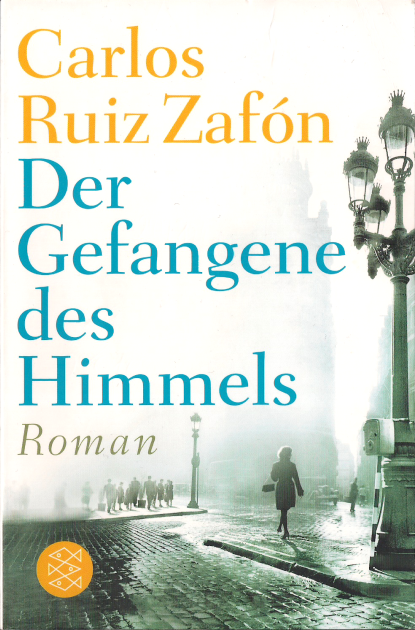

20150701\_Zafon
  

  

  

Sa 26.12.2015 11:09:01  

  

Carlos Ruiz Zaf�n  

Der Gefabgene des Himmels  

Fischer Verlag  

  

Kein schlechter Roman nach "Der Schatten des Windes" (sehr gut) und "Das Spiel des Engels" (war mir zu doll)  

Eine gute Geschichte nicht so atemberaubend wie "Der Schatten des Windes", aber trotzdem ganz gut, sch�n zu lesen.  

  

https://www.perlentaucher.de/buch/carlos-ruiz-zafon/der-gefangene-des-himmels.html  

  

Aus dem Spanischen von Peter Schwaar. Barcelona, Weihnachten 1957. Der Buchh�ndler Daniel Sempere und sein Freund Ferm�n werden erneut in ein gro�es Abenteuer hineingezogen. In der Fortf�hrung seiner Welterfolge nimmt Carlos Ruiz Zaf�n den Leser mit auf eine Reise in sein Barcelona. Unheimlich und spannend schildert der Roman die Geschichte von Ferm�n, der "von den Toten auferstanden ist und den Schl�ssel zur Zukunft hat". Ferm�ns Lebensgeschichte verkn�pft die F�den von "Der Schatten des Windes" mit denen aus "Das Spiel des Engels". �  

  

Neu Z�richer Zeitung 2012:  

  

Literatur f�r die Bahnhofsbuchhandlung hat Eberhard Geisler zu annoncieren. Der neu auf Deutsch erschienene Roman "Der Gefangene des Himmels" von Carlos Ruiz Zafon �berzeugt den Rezensenten nur auf den ersten Blick. Hinter der komplex erscheinenden Handlung um einen Regimegegner Francos, der nach dem B�rgerkrieg versucht ein neues Leben zu f�hren und in ein undurchdringliches Geflecht zwischenmenschlicher Beziehungen verwoben wird, hinter der beklemmenden Atmosph�re im Barcelona der 50er Jahre und bissigen Dialogen entdeckt der Rezensent schlie�lich: hei�e Luft. Dagegen, dass der Autor schreibt wie ein Schweizer Uhrwerk, ist eigentlich nichts zu sagen, dagegen dass er seine Figuren einmal benutzt und dann wegschmei�t, wie Geisler erkl�rt, jedoch schon. Puppen statt Charaktere, �u�erlichkeit statt Geistigkeit, das ist dem Rezensenten schlie�lich nicht genug. �