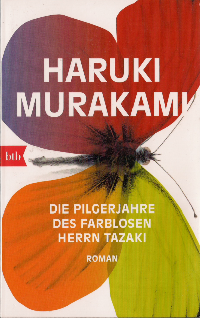

20150801\_Murakami
  

  

Sa 26.12.2015 11:14:07  

  

Haruki Murakami  

Die Pilgerjahre des farblosen Herrn Tazaki  

btb  

  

Ein gutes Buch, sch�n langsam aufbauend, aber nicht zu konztuiert. Eine interessante Geschichte, jetzt im Gegensatz zu IQ1984 aus Sicht eines jungen Mannes.  

  

Aus https://de.wikipedia.org/wiki/Die\_Pilgerjahre\_des\_farblosen\_Herrn\_Tazaki  

  

Der 36-j�hrige Tsukuru Tazaki sucht auf Anraten seiner Freundin Sara seine alten Freunde aus der Oberschule auf, um herauszufinden, warum sie ihn vor 16 Jahren aus dem Freundeskreis versto�en hatten. Der Verlust ihrer Freundschaft hatte ihn als 20-j�hrigen in eine tiefe Lebenskrise und in gro�e Einsamkeit versetzt, die bis heute anh�lt. Er besucht nacheinander seine ehemaligen Freunde in [Nagoya](https://de.wikipedia.org/wiki/Nagoya)�und Finnland und kommt langsam der Wahrheit auf die Spur.  

�Handelnde Personen * Tsukuru Tazaki ist der 36-j�hrige Protagonist. Er hat seit seiner Kindheit eine Vorliebe f�r Bahnh�fe und arbeitet bei einem Eisenbahnunternehmen in Tokyo.
* Kei Akamatsu wohnt in Nagoya und f�hrt eine Firma, die Seminare f�r Angestellte veranstaltet.
* Yoshio Oumi wohnt in Nagoya und ist Autoh�ndler.
* Yuzuki Shirane ist eine verstorbene Klavierlehrerin.
* Eri Kurono Haatainen ist eine T�pferin, die einen Finnen geheiratet hat, der nach Japan kam, um das T�pfern zu lernen. Sp�ter zog das Paar nach Finnland.
* Sara Kimoto, Tazakis Freundin, ist zwei Jahre �lter als er. Sie arbeitet in einem Reiseb�ro in Tokyo.
* Haida ist ein Freund von Tazaki aus Studienzeiten, der kommentarlos und offenbar geplant aus Tazakis Leben verschwand.

Motive   

Wie h�ufig in Romanen Murakamis spielt die Musik eine gro�e Rolle, Klaviermusik von Franz Liszt � [Ann�es de p�lerinage](https://de.wikipedia.org/wiki/Ann%C3%A9es_de_p%C3%A8lerinage)�(Pilgerjahre). �Le Mal du Pays� (�Heimweh�), das achte St�ck aus dem ersten Band "Premi�re ann�e: Suisse" (Erstes Jahr: Schweiz), ist ein wiederkehrendes Motiv.  

�   

Aus https://www.perlentaucher.de/buch/haruki-murakami/die-pilgerjahre-des-farblosen-herrn-tazaki.html:  

  

Aus dem Japanischen von Ursula Gr�fe. Der junge Tsukuru Tazaki ist Teil einer Clique von f�nf Freunden, deren Mitglieder alle eine Farbe im Namen tragen. Nur Tsukuru f�llt aus dem Rahmen und empfindet sich - auch im �bertragenen Sinne - als farblos. Als er nach der Oberschule die gemeinsame Heimatstadt Nagoya verl�sst, um in Tokio zu studieren, tut dies der Freundschaft keinen Abbruch. Zumindest nicht bis zu jenem Sommertag, an dem Tsukuru voller Vorfreude auf die Ferien nach Nagoya zur�ckkehrt - und herausfindet, dass seine Freunde ihn pl�tzlich und unerkl�rlicherweise schneiden. Erfolglos versucht er wieder und wieder, sie zu erreichen, bis er schlie�lich einen Anruf erh�lt: Tsukuru solle sich in Zukunft von ihnen fernhalten, lautet die Botschaft, er wisse schon, warum. Verzweifelt kehrt Tsukuru nach Tokio zur�ck, wo er ein halbes Jahr am Rande des Selbstmords verbringt. Viele Jahre sp�ter offenbart sich der inzwischen 36-j�hrige Tsukuru seiner neuen Freundin Sara, die nicht glauben kann, dass er nie versucht hat, der Geschichte auf den Grund zu gehen. Von ihr ermutigt, macht Tsukuru sich auf, um sich den D�monen seiner Vergangenheit zu stellen. �  

  

S�ddeutsche Zeitung 2014:  

  

Als gro�es Werk voller "Ruhe und Spannung" w�rdigt Burkhard M�ller den neuen Roman von Haruki Murakami. Der Roman um einen Mann, der in seiner Jugend von seinen besten Freunden versto�en wurde, dar�ber in schwere Depression geriet und jetzt mit Mitte 30 die ihm r�tselhaften Hintergr�nde des Zerberechens des Freundschaftskreis verstehen m�chte, pendelt f�r ihn zwischen "kosmologischer Parabel" und einer zwar unkonventionellen, aber nicht unglaubw�rdigen, auf Alltageserfahrungen basierenden Geschichte, in deren Zentrum ein ungeheuerliches Geheimnis steht. Die Gr��e des Autors sieht M�ller einmal mehr in dessen Kunst, lakonisch und ruhig zu erz�hlen, eine hohe Spannung zu erzeugen und den Leser zugleich emotional zu ber�hren. Gerade diese "emotionale Kraft" des Romans - sie spricht f�r M�ller aus Murakamis Dialogen und der Beschreibung von Dingen wie Gef��en aus Keramik - hat ihn tief beeindruckt. �  

