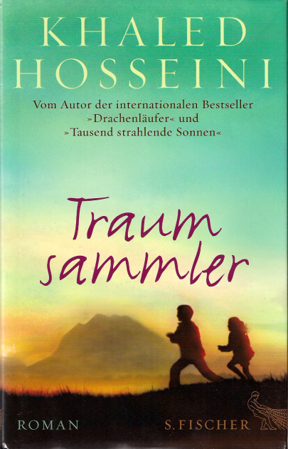

20151001\_Hosseini
  

  

Khaled Hosseini  

Traumsammler  

S. Fischer  

  

Von Doris geschenkt bekommen. Eine afganische Familiengeschichte, die sich in Afganistan, Pakistan, Frankreich und USA verteilt. Es sind auch mehrere Familien, die �ber Anstellung, Nachbarschaft, Besetzung ein Bezug zueinander haben. Teils verlaufen die Wirren in ein Gutes, teils endet es sehr traurig. Wie schon in den anderen Romanen ist das Schreckliche, der Tabubruch der Spannungsh�hepunkt, damit arbeitet der Autor. Aber nicht so schlimm, wie in "Der Drachenl�ufer"  

  

Aus https://www.perlentaucher.de/buch/khaled-hosseini/traumsammler.html  

  

Aus dem Amerikanischen von Henning Ahrens. In "Traumsammler" erz�hlt Khaled Hosseini die bewegende Geschichte zweier Geschwister aus einem kleinen afghanischen Dorf. Pari ist drei Jahre alt, ihr Bruder Abdullah zehn, als der Vater sie auf einem Fu�marsch quer durch die W�ste nach Kabul bringt. Doch am Ende der Reise wartet nicht das Paradies, sondern die herzzerrei�ende Trennung der beiden Geschwister, die ihr Leben f�r immer ver�ndern wird. �  

  

Rezensionsnotiz zu Neue Z�rcher Zeitung 2013  

Mit viel Lob bedenkt Rezensentin Irene Binal den neuen Roman von Khaled Hosseini. Sie beschreibt "Traumsammler" als �berbordendes Werk voller Geschichten, die der Autor zu einem gro�en Familien-Epos zusammenf�hrt. Trotz zahlreicher Figuren und Lebensl�ufe, Zeiten und Schaupl�tze wie Kabul, San Francisco, Paris oder Griechenland scheint ihr der Roman nie auseinanderzufallen. Die ausladende, dramaturgisch gekonnt zusammengehaltene Handlung steht f�r Binal in einem reizvollen Kontrast zur "eleganten Schlichtheit des Stils". Die Auseinandersetzung mit den eigenen Wurzeln findet sie ebenso thematisiert wie die Idee, dass eine einzige Entscheidung das Leben von vielen Menschen �ber Generationen hinweg beeinflussen kann. Das Fazit der Rezensentin: ein gro�artiger, bewegender und mitunter melancholischer Roman. � 