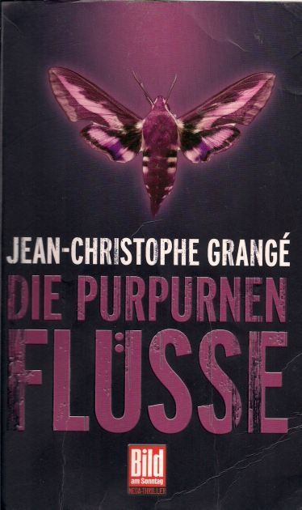

20151214\_
  

  

Sa 26.12.2015 11:38:07  

  

Jean-Christophe Grang�  

Die purpurnen Fl�sse  

Axel Springer AG  

  

Habe ich gelesen, nach dem ich den Film gesehen habe. Von Johannes Eck bekommen, gut zu lesen, Thriller mit martialischen Polizisten.   

Fiktive Uni mit Inzest und dem Versuch frisches b�uerliches Blut hinzuzumischen. Spannend geschrieben. Der Film l�sst die Aufl�sung offen,  

und wandelt auch ein paar Dinge ab.  

  

Aus https://de.wikipedia.org/wiki/Die\_purpurnen\_Fl�sse\_(Roman):  

  

**Die purpurnen Fl�sse**�(Originaltitel: Les Rivi�res pourpres, 1997) ist ein Roman des franz�sischen Schriftstellers und Journalisten [Jean-Christophe Grang�](https://de.wikipedia.org/wiki/Jean-Christophe_Grang%C3%A9), der 2000 [unter dem gleichen Titel verfilmt](https://de.wikipedia.org/wiki/Die_purpurnen_Fl%C3%BCsse_%28Film%29)�wurde.  

�Inhalt   

Pierre Ni�mans � ein harter Bulle � schl�gt einen [Hooligan](https://de.wikipedia.org/wiki/Hooligan)�krankenhausreif. Nur ein zuf�lliger Handyanruf seines Chefs rettet diesem kleinen Schl�ger das Leben. Pierre wird beauftragt, seinen Schreibtisch zu verlassen � zu dem er aufgrund seiner Gewaltt�tigkeit �bef�rdert� wurde - und in einem Mordfall zu ermitteln. Der 25-j�hrige [Bibliothekar](https://de.wikipedia.org/wiki/Bibliothekar)�R�my Caillois wurde brutal gefoltert und dann erdrosselt. Pierre f�hrt in die [Provinz](https://de.wikipedia.org/wiki/Provinz)�und lernt Fanny Ferreira kennen, eine sehr junge [Professorin](https://de.wikipedia.org/wiki/Professorin), die die Leiche w�hrend einer [Kajak](https://de.wikipedia.org/wiki/Kajak)-Berg-Tour fand. Bei der [Obduktion](https://de.wikipedia.org/wiki/Obduktion)�stellt sich heraus, dass die Augen der Leiche entfernt und die [Orbita](https://de.wikipedia.org/wiki/Orbita)�mit �saurem� Wasser gef�llt wurden. Durch einen Umweltaktivisten wird Pierre auf den sauren Regen aufmerksam gemacht, der vor vielen Jahren fiel. Folglich stand f�r ihn der Tatort fest � die Tat musste am [Gletscher](https://de.wikipedia.org/wiki/Gletscher)�erfolgt sein, denn dort wird alter Regen wahrhaft konserviert. Er sucht gemeinsam mit der bergerfahrenen Fanny Ferreira den Gletscher auf � und findet eine weitere Leiche. Auch dieses Opfer wurde erdrosselt und verst�mmelt. Hierbei handelte es sich um Philippe Sertys, der in einer Klinik arbeitete. Wie auch Remy �bte er den gleichen Beruf wie sein Vater aus, sie waren also Bibliothekar und Pfleger in 2. Generation. Die Ermittlungen f�hrten Eric Joisneau, einen Mitarbeiter von Pierre, zu dem [Augenarzt](https://de.wikipedia.org/wiki/Augenarzt)�Edmond Chernec�. Dieser brachte Eric um, um sich zu sch�tzen. Pierre macht sich auf die Suche nach seinem vermissten Kollegen und befragt auch diesen Arzt. Erst hat er keinen Verdacht, doch als in den Augen der zweiten Leiche Glassplitter gefunden werden, verd�chtigt er diesen Mediziner als n�chstes Opfer. Doch Pierre kam zu sp�t - der Arzt wurde ermordet. In dessen Klinik findet er auch die Leiche seines Kollegen. Pierre findet heraus, dass Philippe Sertys ein Lagerhaus von seinem Vater geerbt hatte. Als er dieses untersucht, ist es leer � aber er findet ein kleines Notizheft mit folgenden Zeilen: �Wir sind die neuen Herren, wir sind die [Sklaven](https://de.wikipedia.org/wiki/Sklaven). Wir sind �berall, wir sind nirgendwo. Wir sind die [Vermesser](https://de.wikipedia.org/wiki/Vermesser), wir beherrschen die Purpurnen Fl�sse�.  

�  

Zeitgleich ermittelt Karim Abdouf in einem anderen Bezirk eine Grabsch�ndung. Jemand ist in die [Gruft](https://de.wikipedia.org/wiki/Gruft)�eines kleinen Jungen namens Jude It�ro eingebrochen. Sein Chef Henri Crozier vermutet, dass dies eine Tat von Rechtsradikalen sei. Karim macht sich auf den Weg zu diesen, und pr�gelt auf harte Weise die Informationen aus ihnen heraus. Doch sie haben nichts mit der Tat zu tun. Karim ermittelt weiter und findet heraus, dass alle Schulaufzeichnungen und auch alle Fotografien von diesem vor 14 Jahren gestorbenen Kind entwendet wurden. Er vermutet erst, dass dies von den [Grabsch�ndern](https://de.wikipedia.org/wiki/Grabsch%C3%A4nder)�veranlasst worden sei. Doch dies ist nicht der Fall. Eine [Nonne](https://de.wikipedia.org/wiki/Nonne)�namens Andr�e hatte die Bilder bereits vor vielen Jahren entwendet. �ber den Hinweis �[Zirkus](https://de.wikipedia.org/wiki/Zirkus)� kommt er auf die Spur, dass es sich bei dem Kind namens Jude It�ro um ein M�dchen handelt. Karim vermutet zu Recht, dass bei dieser T�uschung die Lehrerin eine Rolle gespielt haben k�nnte. Diese hat die Stelle unter ihrem Geburtsnamen Pascaud angenommen, hie� aber tats�chlich H�rault. F�r Karim ist klar, dass das M�dchen in Wirklichkeit Judith H�rault hei�t � ein Name, der im Franz�sischen gleich klingt wie Jude It�ro. Er sieht die Akte des Kindes ein, es starb tats�chlich in einem Verkehrsunfall. Bei diesem wurde die Leiche so zerfetzt, dass man das Geschlecht des Kindes nicht mehr bestimmen konnte. Die Leiche wurde allerdings mit einem Fingerabdruck identifiziert. Bei der Grabsch�ndung wurde von den [Skinheads](https://de.wikipedia.org/wiki/Skinhead)�ein [Lada](https://de.wikipedia.org/wiki/AwtoWAS)�gesehen. Die Ermittlungen ergeben, dass es sich hierbei um den Wagen von Philippe Sertys handelte.  

�  

Die beiden harten Cops Karim und Pierre treffen aufeinander und ermitteln an ihrem gemeinsamen Fall weiter.  

�  

Sie stellen fest, dass das Motiv Rache ist. Die drei Mordopfer tauschten Neugeborene aus, um das [Erbmaterial](https://de.wikipedia.org/wiki/Erbmaterial)�der intellektuellen Universit�ts-[Enklave](https://de.wikipedia.org/wiki/Enklave), die mit den Auswirkungen der [Inzucht](https://de.wikipedia.org/wiki/Inzucht_beim_Menschen)�zu k�mpfen hatte, aufzubessern. Der Austausch war die Aufgabe von Philippe Sertys. R�mys Job war, die Sitzordnung der Studenten in der [Bibliothek](https://de.wikipedia.org/wiki/Bibliothek)�so zu steuern, dass sich die �gen�-richtigen Paare regelm��ig �treffen / verlieben / heiraten / Kinderzeugen� konnten. Diese Aufgabe erbten die beiden von ihren V�tern. Der Arzt kam erst nachtr�glich hinzu. Aber sie tauschten nicht nur die Kinder aus � sie brachten die schw�chlichen Professorenkinder in der Regel auch um.  

�  

Ihre V�ter wollten auch das Neugeborene der H�raults austauschen. Doch rechneten sie nicht mit Zwillingen. Sie nahmen den Austausch wie geplant mit einem Baby vor, das schw�chliche Intellektuellen-Kind wurde umgebracht. Die leiblichen Eltern gingen mit ihrer Judith nach Hause, ihre Zwillingsschwester Fanny wurde von Professoren aufgezogen. Da die H�raults weit weg wohnten, bestand anfangs auch keine Gefahr. Doch die Mutter wurde als Lehrerin an die Schule von Guernon versetzt. Und so kamen Judith und Fanny in die gleiche Klasse, wo die �hnlichkeit nat�rlich auffiel. Der leibliche Vater wollte den Sachverhalt kl�ren, wurde aber ermordet, der Mord als Verkehrsunfall kaschiert. Judith und ihre Mutter flohen nach Sarzac, das M�dchen gab sich zur Tarnung als Junge aus. Doch sie erkannten, dass sie gefunden werden w�rden � und daher beschloss die Mutter einen verzweifelten Plan. Sie lie� mit Hilfe der Nonne Andr�e alle Fotos beseitigen, und inszenierte einen Verkehrsunfall, bei dem Jude / Judith angeblich gestorben ist. Hierzu verwendete sie die Leiche eines anderen Verkehrsunfallopfers. Damit diese Leiche als ihr Kind identifiziert werden konnte, trennte sie ihrer Tochter einfach ein Fingerglied ab und schob es der zerfetzten Leiche unter.  

�  

Judith kam zu Fanny. Beide M�dchen teilten sich eine [Existenz](https://de.wikipedia.org/wiki/Existenz). Als sie Anhaltspunkte f�r die T�ter fanden, beschlossen sie sich zu r�chen. Und sie brachten nacheinander die 3 M�nner bestialisch um, raubten ihnen bewusst die Augen und drapierten die Leichen so, dass zuerst ihr Spiegelbild gesehen werden w�rde. Sie wollten sie nicht nur umbringen, sie wollten ihnen ihre Identit�t rauben � sowie diese die Identit�t von unschuldigen Kindern geraubt hatten.  

�  

Karims Chef Henri Crozier war ebenfalls in diese T�uschung verwickelt. �ber diesen findet Karim die Mutter der beiden M�dchen, von welcher er ein Foto bekommt, wo die [Zwillinge](https://de.wikipedia.org/wiki/Zwillinge)�zu sehen sind. Als er das Foto Pierre zeigt, wissen die Polizisten nat�rlich sofort, wer die M�rder sind. F�r Pierre ist dies besonders schlimm � denn er hat gerade erst eine [Aff�re](https://de.wikipedia.org/wiki/Aff%C3%A4re)�mit Fanny begonnen.  

�  

Beim [Showdown](https://de.wikipedia.org/wiki/Showdown)�ersticht Fanny Pierre. Doch dieser konnte noch auf sie schie�en. Beide sterben, Pierre entkommt auf diesem Wege wenigstens der Schmach einer Mordanklage - der Hooligan vom Anfang der Geschichte starb durch seine Schl�ge. Judith wird im Anschluss von Karim erschossen. Daraufhin wird ihm bewusst, dass er sich im Laufe der Ermittlungen in dieses M�dchen verliebt hat. Der Roman schlie�t mit den Worten �*Die Dunkelheit, die sein Herz gefangen hielt, vermochte keine Sonne zu durchdringen*�.  

�Handelnde Personen * Pierre Ni�mans: harter Bulle, ehemaliger Star des [RAID](https://de.wikipedia.org/wiki/Recherche_Assistance_Intervention_Dissuasion), ehemaliger [Kommissar](https://de.wikipedia.org/wiki/Kommissar)�der BRB, ehemaliger M�rder- und Dealerj�ger � mit einem Drang zur Gewaltt�tigkeit, mit einer Schw�che � er hat eine [Hunde-Phobie](https://de.wikipedia.org/wiki/Canophobie)
* Antoine Rheims: Pierre Niemans Chef der Zentralen Dienststelle
* Eric Joisneau: Kripo Grenoble � hat sein Jura Studium in Guernon abgebrochen, um Polizist zu werden
* R�my Caillois: Mordopfer, 25 Jahre, Chefbibliothekar an der Uni von Guernon, sein gefolterter K�rper wurde in einer Felsspalte gefunden
* Sophie Caillois: Remys Frau
* Captain Roger Barnes: Chef der [Gendarmerie](https://de.wikipedia.org/wiki/Gendarmerie)�von Guernon
* Bernhard Terpentes: Untersuchungsrichter
* Fanny Ferreira: Professorin, Sportlerin
* Vincent Luyse: der [Rektor](https://de.wikipedia.org/wiki/Rektor)�der Universit�t
* Marc Costes: [Gerichtsmediziner](https://de.wikipedia.org/wiki/Gerichtsmediziner)
* Karim Abdouf: ehemaliger [Krimineller](https://de.wikipedia.org/wiki/Krimineller), M�rder � nun Provinzpolizist in Sarzac, war [Punk](https://de.wikipedia.org/wiki/Punk), hat mit 21 Jahren sein [Jura](https://de.wikipedia.org/wiki/Rechtswissenschaft)-Studium beendet, wortkarger Kampfsportler, Einzelg�nger
* Henry Crozier: Karims Chef
* Jude It�ro: dessen Grab wurde von Unbekannten gesch�ndet
* Judith H�rault: die Zwillingsschwester von Fanny, [aka](https://de.wikipedia.org/wiki/Aka)�Jude It�ro
* Schwester Andr�e: Nonne, Fabiennes Helferin
* Philippe Sertys: das zweite Mordopfer, Hilfspfleger im Krankenhaus von Guernon
* Fabienne H�rault (geb. Pascaud): die Mutter von Fanny und Judith
* Sylvain H�rault: Fabiennes Mann und Vater von Fanny und Judith
* Dr. Edmond Chernec�: Augenarzt

�