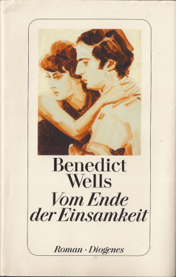

20160601\_Wells
  

  

Bendeikt Wells, Vom Ende der Einsamkeit  

  

Wei� nicht mehr wann gelesen, glaube von Doris geschenkt bekommen.  

Sehr trauriger und anr�hrender Roman �ber das Leben eine Mannes und �insbesondere die Beziehungen zu einer Frau,  

soweit ich mich errinern kann, hat er den Kontakt schmerzlich verloren in jungen Jahren und sp�ter wieder aufegnommen,  

dabei ihren Ehemann hintergangen und dann ein Beziehung mit ihr gehabt. Auch spielt der Bruder eine Rolle. Sehr trauriger Roman, aber gut