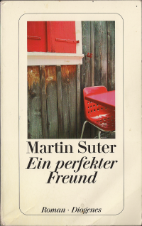

20170512\_Suter
  

  

Roman ganz okay, mehr Krimi, ein Mann der durch einen Kampf eine Verletzung am Kopf hat und sein Gedächtnis verloren hat.  

Und dann verzweifelt versucht alles wieder aufzurollen, was als Journalist mit BSE und Verunreinigung von Schokolade zu tun hat.  

Ein treuer Journalistenfreund, der seiner alten Freundin, von der er sich getrennt hatte, zusammen war, hat er mit der Amnesie f�r  

alles verd�chtigt, aber es stellte sich ganz anders. Durch die Amnesie war ihm auch nicht mehr klar warum er so ein anderes   

Leben begonnen hatte. Das zielt wohl darauf das man sich mit Geld kaufen lassen kann, bis dahin, dass man sein Leben, Lebens-  

stil �ndert. Das kommt so nach und nach raus. 