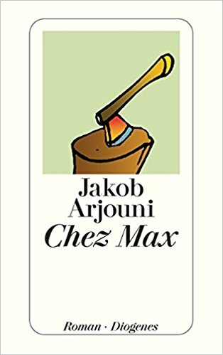

10180201\_Jourdani
  

  

  

  

EIn Sience Fiction, mit Blick nach dem 11. September 2011, USA ist Bauernstaat, Europa und China eng miteinander verbunden,  

totalit�rer Staat, Polizei, die die Verbrecher vor dem Vergehen festnehmen. Dieser Max, solcher verdeckter Polizist, getarnt als Restaurantbesitzer, r�umt einen Konkurenten beiseite,  

in dem er sich das sch�n redet und einen indirekten Beweis hat, das sein Konkurennt ein Aufst�ndiger, also auch ein Verbrecher ist.  

  

Roman ging so, war interessnt, aber nicht packend. �