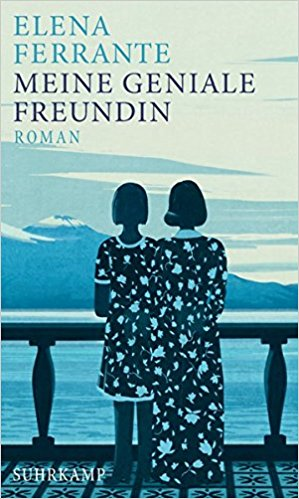
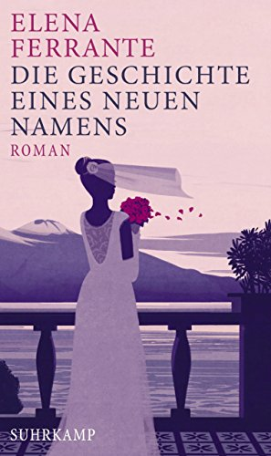

20180801\_Ferantes
+  

  

Habe die ersten zweit B�nde gelesen. Ziemlich aufreibender Roman, mit allen Intrigen und Treiben in einer kleinen Stadt.  

Erz�hlt vom Lebensweg zweier Freundinnen, die Elena ist Ich-Erz�hlerin, die andere ist Lila, die als Handwerkstochter keine  

weiterf�hrende Schule besuchen darf, obwohl hoch intelligent. Elena da gegen ist sehr gut in der Schule und schafft es bis zu  

Studium mit Unterst�tzung. Die andere heirat fr�h im Dorf, aber es l�uft alles schief und bekommt bis hier am Ende ein Kind   

von einem im Urlaub kennengelernter Studenten. Der glaube ich aber dann stirbt. In diesen Studenten ist aber auch Elena   

verliebt, also engste Freundin und Rivalin zugleich. Jedesmal nehmen die B�cher ein heftiges Ende. Es gibt noch 3 B�nde