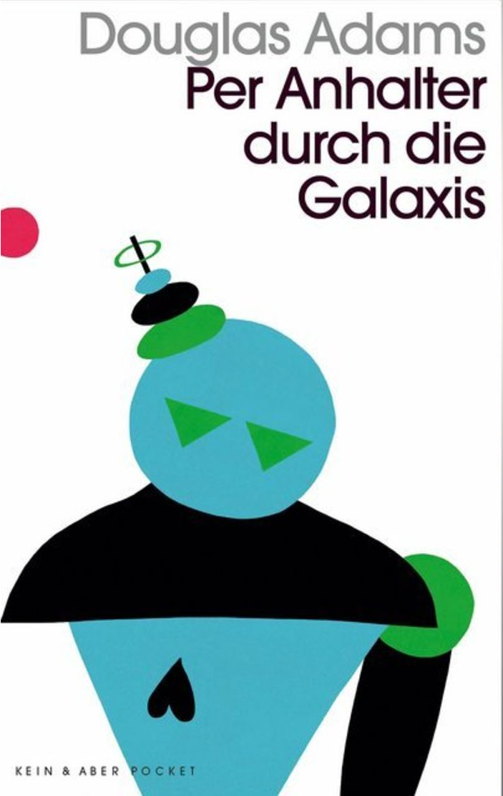

20191220\_Adams
  

  

  

Per Anhalter durch die Galaxis, witziges Buch, habe alles schon vergessen gehabt.  

Wird aber erst weit im zweiten Teil witzig und interessant, manchmal wollte ich bis dahin hin aufh�ren  

Ist irgendwie aus seiner Zeit heraus und alt.  

  

Witzig waren die Philosophen, die keine Erkl�rung f�r die Antwort aller Fragen "Nach dem sinn des Lebens und alles" von 42 haben  

Und die Erde war der Computer zum herausfinden dieses, wurde aber zerst�rt. AUnd der letzte Erdling wu�te es nicht.   

DAnn sagten sie einfach, dass man 42 St�dte oder Stra�en bereisen muss um zum Gl�ck zu kommen!!! �