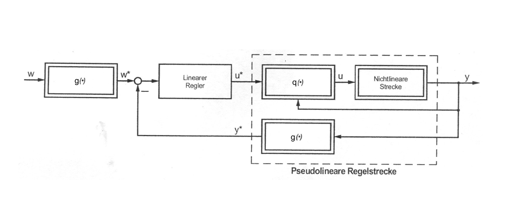

# Modellprädiktive Regelung #

Pannek - 2006

## Nichtlineare Modellprädiktive Regelung ##

### Linearisierung durch Variablen Transformation ##

$$
\dot{x}(t) = \frac{dx}{dt}=f(x,u)
$$

$$
\frac{dx}{dt} =f(x,u)=c1\cdot f_1(x) + c2\cdot f_
2(x,u)
$$

Man findet eine Tranformation $g(\cdot)$
$$
z = g(x)
$$
mit zwei Möglichkeiten der Ableitung
$$
\frac{dz}{dt}=a\cdot z + b\cdot v  \hspace{1cm} (oder\hspace{5mm} \frac{dz}{dt}=a + b\cdot v)
$$
Mit Ableitung von (3)
$$
\frac{dz}{dt}=\frac{dz}{dx}\cdot\frac{dx}{dt}
$$
Mit (2) in (5)
$$
\frac{dz}{dt}=c1\cdot f_1(x)\cdot \frac{dz}{dx} + c2\cdot f_2(x,u)\cdot \frac{dz}{dx}
$$
Die Gleichung (3) muss dann die Bedingung erfüllen
$$
\frac{dz}{dx}=\frac{z}{f_1(x)}\hspace{1cm} (bzw. \hspace{5mm} \frac{dz}{dx}=\frac{1}{f_1(x)})
$$
zusätzlich
$$
f_2(x,u)\cdot\frac{dz}{dx}=v
$$
durch (6)==(4) wird  $a=c1$ und $b=c2$ 

Durch Umformung von (7)
$$
\frac{dz}{z}=\frac{dx}{f_1(x)}\hspace{1cm}(bzw. \hspace{5mm}dz=\frac{dx}{f_1(x)})
$$

oder
$$
ln z =\int\frac{dx}{f_1(x)}\hspace{1cm}(bzw. \hspace{5mm}z =\int\frac{dx}{f_1(x)})
$$
Damit ist
$$
z = \exp\left[\int\frac{dx}{f_1(x)}\right]\hspace{1cm}(bzw. \hspace{5mm}z =\int\frac{dx}{f_1(x)})
$$
Durch Einsetzen von (7) in (8) und Umformen ergibt
$$
f_2(x,u)=\frac{v\cdot f_1(x)}{z}\hspace{1cm}(bzw. \hspace{5mm}f_2(x,u)=v\cdot f_1(x))
$$
(12) löst man nach u auf, um $q(\cdot)$ zu bekommen
$$
u=q(x,v)
$$

Beipiel
$$
\dot{x_v} = v \cdot \cos{\phi}\\
\dot{y_v} = v \cdot \sin{\phi}\\
\dot{\phi} = v \cdot \frac{\tan \delta}{l}\\
\dot{v} = a
$$

$$
u = [\delta, a]\\
x = [x_v, y_v, \phi,v]
$$

$$
\dot{x_v}= 1\cdot f_{11}\\
\dot{y_v}= 1\cdot f_{12}\\
\dot{\phi}=1\cdot f_{21}\\
\dot{v}=1\cdot f_{22}
$$

Funktion $f_1(x)$
$$
f_{11}= v \cdot \cos{\phi}\\
f_{12}= v \cdot \sin{\phi}
$$
Funktion $f_2(x,u)$
$$
f_{21}=v\cdot \frac{\tan\delta}{l}\\
f_{22}=a
$$

$$
\begin{align*}
\frac{d}{dt}
\begin{bmatrix}
x_v\\
y_v\\
\phi\\
v
\end{bmatrix}
=
\begin{bmatrix}
1 & 0 \\
0 & 1 \\
0 & 0 \\
0 & 0 \\
\end{bmatrix}
\cdot
\begin{bmatrix}
f_{11}(x)\\
f_{12}(x)\\
\end{bmatrix}
+
\begin{bmatrix}
0 & 0\\
0 & 0\\
1 & 0\\
0 & 1
\end{bmatrix}
*
\begin{bmatrix}
f_{21}(x,u)\\
f_{22}(x,u)
\end{bmatrix}
\end{align*}\\
\frac{dx}{dt} = c1\cdot f_1(x) + c2\cdot f_
2(x,u)\hspace{36mm}
$$

Das zu lösende Integral (11) lautet
$$
z_1	= \exp \left[int\frac{dx_v}{f_{11}}\right]=\exp \left[\int \frac{dx_v}{v\cdot \cos\phi}\right]=\exp \left[\frac{x_v}{v\cdot\cos\phi}\right]\\
z_2	= \exp \left[\int\frac{dy_v}{f_{12}}\right]=\exp \left[\int \frac{dy_v}{v\cdot \cos\phi}\right]=\exp \left[\frac{y_v}{v\cdot\sin\phi}\right]
$$
