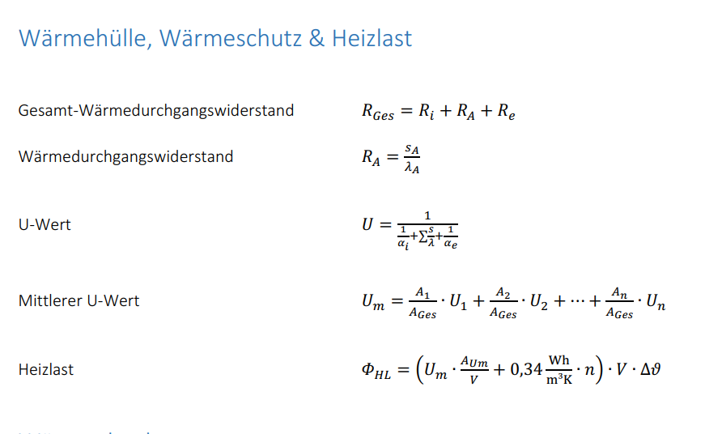
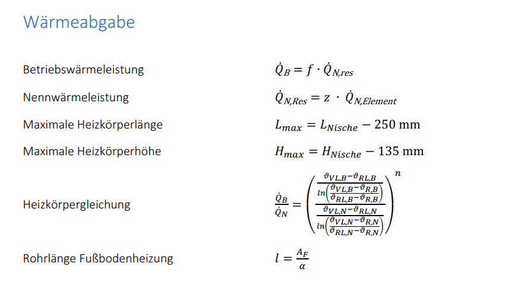
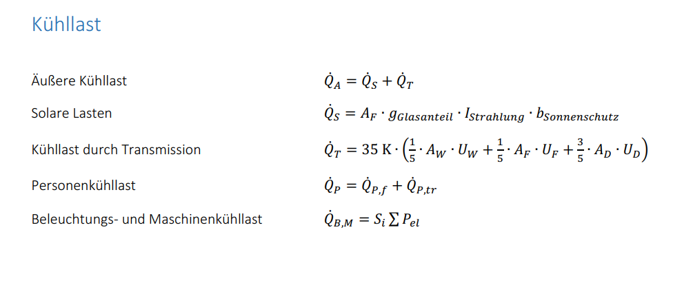
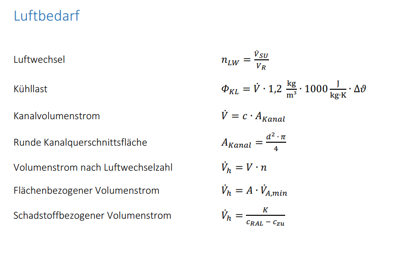
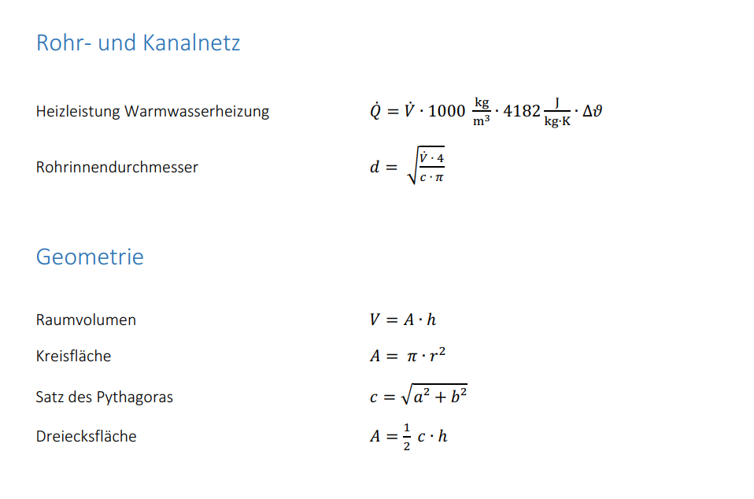
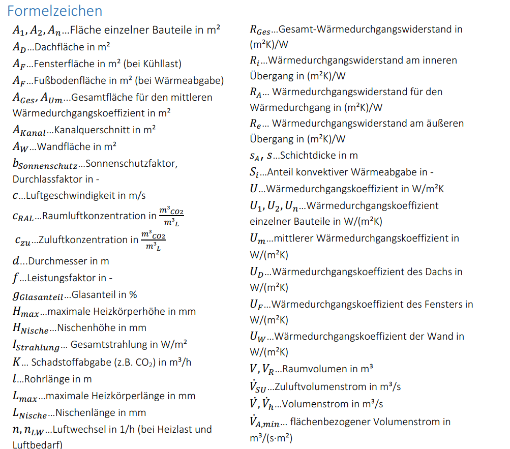
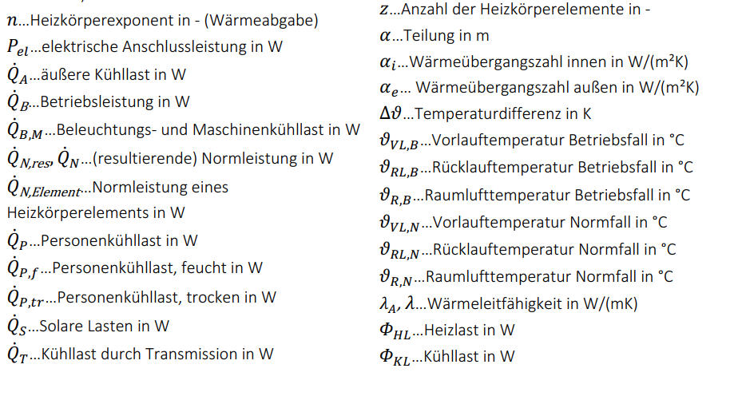
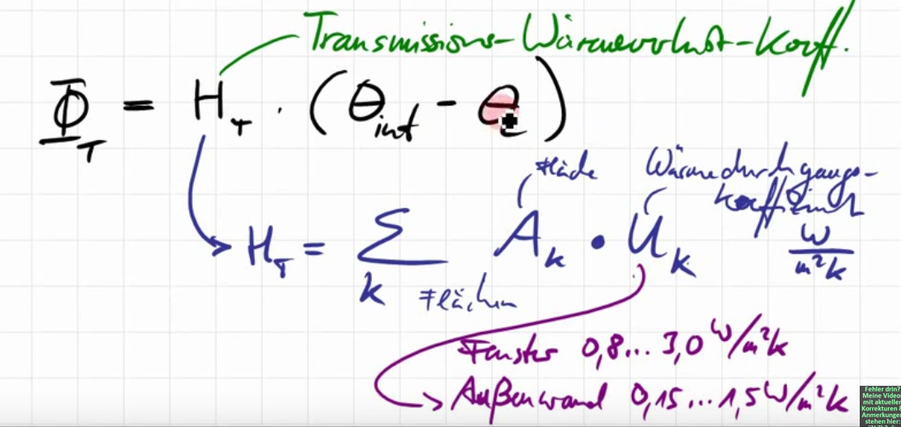

# Formelsammlung

## Formelsammlung

## Video

Wärmedurchgangskoeffizient

$$
\begin{aligned}
U_k &= 0.8 ... 3.0 [\frac{W}{m^2\cdot K}]   Fenster neue - alt \\
U_k &= 0.15 ... 1.5 [\frac{W}{m^2\cdot K}]   Außenwand Neubau - Altbau \\

\end{aligned}
$$

Wärmedurchgnag mit Außenmaße, und wenn Innenwand angrenzt, dann halbe Außenwand.

Normaußentemperatur z.B. Bielefel $\Theta_e = -12 °C$

Raumhöhe ist innen, Geschosshöhe ist außen (Wärmedurchgangsberechne mit Geschoßhöhe)

### Wärmedurchgang Außenwand:

### Lüftungswärmeaustausch:
