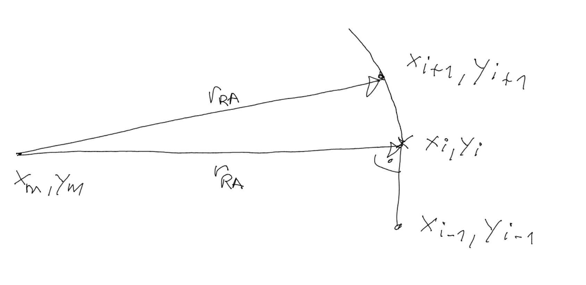
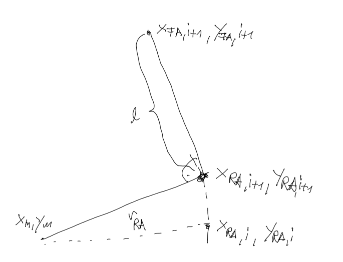

# Build Front Axle Path from Rear Axle Path #

Based on Ackermann Model a front axle path will be build from a rear axle path. The rear axle  path is defined in x-y-vector coordinates. A given path of the rear axle the actual point $x_{i},y_{i}$ a radius with its middle in $x_m,y_m$ is calculated to fit to the point  $x_{i+1},y_{i+1}$, With $x_m,y_m$ the radius $r_{RA}$ is determined. An additional assumption is that the point from $x_{i},y_{i}$ to $x_m,y_m$  is perpendicular to the last segment $x_{i},y_{i}$ to $x_{i-1},y_{i-1}$ . The point product of both vectors must be zero



So three equation can be build
$$
\begin{align*}
(x_m-x_i)\cdot(x_i-x_{i-1})+(y_m-y_i)\cdot(y_i-y_{i-1}) &= 0\\
\\
(x_m-x_i)^2+(y_m-y_i)^2 &= r^2_{RA}\\
\\
(x_m-x_{i+1})^2+(y_m-y_{i+1})^2 &= r^2_{RA}\\
\\
\end{align*}
$$
The left side of second and third equation are equal which could be written as:
$$
\begin{align*}
(x_m-x_i)\cdot(x_i-x_{i-1})+(y_m-y_i)\cdot(y_i-y_{i-1}) &= 0\\
\\
(x_m-x_i)^2+(y_m-y_i)^2 &= (x_m-x_{i+1})^2+(y_m-y_{i+1})^2 \\
\\
\end{align*}
$$
The solution for  $x_m,y_m$   is:
$$
\begin{align*}
\mathit{x_m}&=-\frac{\mathit{y_i}\, \left( {{\mathit{y_{i+1}}}^{2}}+2 \mathit{y_{i-1}}\, \mathit{y_{i+1}}+{{\mathit{x_{i+1}}}^{2}}+{{\mathit{x_i}}^{2}}-2 \mathit{x_{i-1}}\, \mathit{x_i}\right) +\mathit{y_{i-1}}\, \left( -{{\mathit{y_{i+1}}}^{2}}-{{\mathit{x_{i+1}}}^{2}}+{{\mathit{x_i}}^{2}}\right) -2 {{\mathit{x_i}}^{2}}\, \mathit{y_{i+1}}+2 \mathit{x_{i-1}}\, \mathit{x_i}\, \mathit{y_{i+1}}+{{\mathit{y_i}}^{2}}\, \left( -2 \mathit{y_{i+1}}-\mathit{y_{i-1}}\right) +{{\mathit{y_i}}^{3}}}{2 \mathit{x_i}\, \mathit{y_{i+1}}-2 \mathit{x_{i-1}}\, \mathit{y_{i+1}}+\left( 2 \mathit{x_{i-1}}-2 \mathit{x_{i+1}}\right) \, \mathit{y_i}+\left( 2 \mathit{x_{i+1}}-2 \mathit{x_i}\right) \, \mathit{y_{i-1}}},\\
\\
\mathit{y_m}&=\frac{\mathit{x_i}\, \left( {{\mathit{y_{i+1}}}^{2}}+{{\mathit{x_{i+1}}}^{2}}+2 \mathit{x_{i-1}}\, \mathit{x_{i+1}}\right) +\mathit{x_{i-1}}\, \left( -{{\mathit{y_{i+1}}}^{2}}-{{\mathit{x_{i+1}}}^{2}}\right) +\left( -2 \mathit{x_{i+1}}+\mathit{x_i}+\mathit{x_{i-1}}\right) \, {{\mathit{y_i}}^{2}}+\left( 2 \mathit{x_{i+1}}-2 \mathit{x_i}\right) \, \mathit{y_{i-1}}\, \mathit{y_i}+{{\mathit{x_i}}^{2}}\, \left( -2 \mathit{x_{i+1}}-\mathit{x_{i-1}}\right) +{{\mathit{x_i}}^{3}}}{2 \mathit{x_i}\, \mathit{y_{i+1}}-2 \mathit{x_{i-1}}\, \mathit{y_{i+1}}+\left( 2 \mathit{x_{i-1}}-2 \mathit{x_{i+1}}\right) \, \mathit{y_i}+\left( 2 \mathit{x_{i+1}}-2 \mathit{x_i}\right) \, \mathit{y_{i-1}}}\mbox{}
\end{align*}
$$


```matlab
nenn = (2*x(i)*y(i+1) - 2*x(i-1)*y(i+1) + (2*x(i-1) - 2*x(i+1))*y(i) + (2*x(i+1) - 2*x(i))*y(i-1));

x_{m} = -(y(i)*(y(i+1)^2+2*y(i-1)*y(i+1)+x(i+1)^2+x(i)^2 - 2*x(i-1)*x(i))+y(i-1)*(-y(i+1)^2 - x(i+1)^2+x(i)^2) - 2*x(i)^2*y(i+1)+2*x(i-1)*x(i)*y(i+1)+y(i)^2*(-2*y(i+1) - y(i-1))+y(i)^3) / nenn;

y_{m}=(x(i)*(y(i+1)^2+x(i+1)^2+2*x(i-1)*x(i+1))+x(i-1)*(\-y(i+1)^2\-x(i+1)^2)+(\-2*x(i+1)+x(i)+x(i-1))*y(i)^2+(2*x(i+1)\-2*x(i))*y(i-1)*y(i)+x(i)^2*(\-2*x(i+1)\-x(i-1))+x(i)^3)/nenn;

```


With $x_m,y_m$ perpedicular to line between them and the rear axle the front axle point can be calculated based on the wheel base l of the vehicle:



The dot product of both perpendicular vectors can set to zero
$$
(x_{FA,i+1}-x_{RA,i+1})\cdot (x_{RA,i+1}-x_{m})+(y_{FA,i+1}-y_{RA,i+1})\cdot (y_{RA,i+1}-y_{m})=0
$$
And the distance between FA and RA is l:
$$
(x_{FA,i+1}-x_{RA,i+1})^2+(y_{FA,i+1}-y_{RA,i+1})^2=l^2
$$
There are two solutions
$$
\begin{align*}
\mathit{x_{fa,i+1}}&=-\frac{\left( \mathit{y_{ra,i+1}}-\mathit{y_{m}}\right) \, \sqrt{\mathit{l^2}\, {{\mathit{y_{RA,i+1}}}^{2}}-2 \mathit{l^2}\, \mathit{y_{m}}\, \mathit{y_{RA,i+1}}+\mathit{l^2}\, {{\mathit{y_{m}}}^{2}}+\mathit{l^2}\, {{\mathit{x_{RA,i+1}}}^{2}}-2 \mathit{l^2}\, \mathit{x_{m}}\, \mathit{x_{RA,i+1}}+\mathit{l^2}\, {{\mathit{x_{m}}}^{2}}}-\mathit{x_{RA,i+1}}\, {{\mathit{y_{RA,i+1}}}^{2}}+2 \mathit{x_{RA,i+1}}\, \mathit{y_{m}}\, \mathit{y_{RA,i+1}}-\mathit{x_{RA,i+1}}\, {{\mathit{y_{m}}}^{2}}-{{\mathit{x_{RA,i+1}}}^{3}}+2 \mathit{x_{m}}\, {{\mathit{x_{RA,i+1}}}^{2}}-{{\mathit{x_{m}}}^{2}}\, \mathit{x_{RA,i+1}}}{{{\mathit{y_{RA,i+1}}}^{2}}-2 \mathit{y_{m}}\, \mathit{y_{RA,i+1}}+{{\mathit{y_{m}}}^{2}}+{{\mathit{x_{RA,i+1}}}^{2}}-2 \mathit{x_{m}}\, \mathit{x_{RA,i+1}}+{{\mathit{x_{m}}}^{2}}}\\
\\
\mathit{y_{fa,i+1}}&=\frac{\left( \mathit{x_{RA,i+1}}-\mathit{x_{m}}\right) \, \sqrt{\mathit{l^2}\, {{\mathit{y_{RA,i+1}}}^{2}}-2 \mathit{l^2}\, \mathit{y_{m}}\, \mathit{y_{RA,i+1}}+\mathit{l^2}\, {{\mathit{y_{m}}}^{2}}+\mathit{l^2}\, {{\mathit{x_{RA,i+1}}}^{2}}-2 \mathit{l^2}\, \mathit{x_{m}}\, \mathit{x_{RA,i+1}}+\mathit{l^2}\, {{\mathit{x_{m}}}^{2}}}+{{\mathit{y_{RA,i+1}}}^{3}}-2 \mathit{y_{m}}\, {{\mathit{y_{RA,i+1}}}^{2}}+\left( {{\mathit{y_{m}}}^{2}}+{{\mathit{x_{RA,i+1}}}^{2}}-2 \mathit{x_{m}}\, \mathit{x_{RA,i+1}}+{{\mathit{x_{m}}}^{2}}\right) \, \mathit{y_{RA,i+1}}}{{{\mathit{y_{RA,i+1}}}^{2}}-2 \mathit{y_{m}}\, \mathit{y_{RA,i+1}}+{{\mathit{y_{m}}}^{2}}+{{\mathit{x_{RA,i+1}}}^{2}}-2 \mathit{x_{m}}\, \mathit{x_{RA,i+1}}+{{\mathit{x_{m}}}^{2}}}\\
\\
\mathit{x_{fa,i+1}}&=\frac{\left( \mathit{y_{RA,i+1}}-\mathit{y_{m}}\right) \, \sqrt{\mathit{l^2}\, {{\mathit{y_{RA,i+1}}}^{2}}-2 \mathit{l^2}\, \mathit{y_{m}}\, \mathit{y_{RA,i+1}}+\mathit{l^2}\, {{\mathit{y_{m}}}^{2}}+\mathit{l^2}\, {{\mathit{x_{RA,i+1}}}^{2}}-2 \mathit{l^2}\, \mathit{x_{m}}\, \mathit{x_{RA,i+1}}+\mathit{l^2}\, {{\mathit{x_{m}}}^{2}}}+\mathit{x_{RA,i+1}}\, {{\mathit{y_{RA,i+1}}}^{2}}-2 \mathit{x_{RA,i+1}}\, \mathit{y_{m}}\, \mathit{y_{RA,i+1}}+\mathit{x_{RA,i+1}}\, {{\mathit{y_{m}}}^{2}}+{{\mathit{x_{RA,i+1}}}^{3}}-2 \mathit{x_{m}}\, {{\mathit{x_{RA,i+1}}}^{2}}+{{\mathit{x_{m}}}^{2}}\, \mathit{x_{RA,i+1}}}{{{\mathit{y_{RA,i+1}}}^{2}}-2 \mathit{y_{m}}\, \mathit{y_{RA,i+1}}+{{\mathit{y_{m}}}^{2}}+{{\mathit{x_{RA,i+1}}}^{2}}-2 \mathit{x_{m}}\, \mathit{x_{RA,i+1}}+{{\mathit{x_{m}}}^{2}}}\\
\\
\mathit{y_{fa,i+1}}&=-\frac{\left( \mathit{x_{RA,i+1}}-\mathit{x_{m}}\right) \, \sqrt{\mathit{l^2}\, {{\mathit{y_{RA,i+1}}}^{2}}-2 \mathit{l^2}\, \mathit{y_{m}}\, \mathit{y_{RA,i+1}}+\mathit{l^2}\, {{\mathit{y_{m}}}^{2}}+\mathit{l^2}\, {{\mathit{x_{RA,i+1}}}^{2}}-2 \mathit{l^2}\, \mathit{x_{m}}\, \mathit{x_{RA,i+1}}+\mathit{l^2}\, {{\mathit{x_{m}}}^{2}}}-{{\mathit{y_{RA,i+1}}}^{3}}+2 \mathit{y_{m}}\, {{\mathit{y_{RA,i+1}}}^{2}}+\left( -{{\mathit{y_{m}}}^{2}}-{{\mathit{x_{RA,i+1}}}^{2}}+2 \mathit{x_{m}}\, \mathit{x_{RA,i+1}}-{{\mathit{x_{m}}}^{2}}\right) \, \mathit{y_{RA,i+1}}}{{{\mathit{y_{RA,i+1}}}^{2}}-2 \mathit{y_{m}}\, \mathit{y_{RA,i+1}}+{{\mathit{y_{m}}}^{2}}+{{\mathit{x_{RA,i+1}}}^{2}}-2 \mathit{x_{m}}\, \mathit{x_{RA,i+1}}+{{\mathit{x_{m}}}^{2}}}
\end{align*}
$$


```matlab
[xfa=\-((yra\-ym)*sqrt(lq*yra^2\-2*lq*ym*yra+lq*ym^2+lq*xra^2\-2*lq*xm*xra+lq*xm^2)\-xra*yra^2+2*xra*ym*yra\-xra*ym^2\-xra^3+2*xm*xra^2\-xm^2*xra)/(yra^2\-2*ym*yra+ym^2+xra^2\-2*xm*xra+xm^2),yfa=((xra\-xm)*sqrt(lq*yra^2\-2*lq*ym*yra+lq*ym^2+lq*xra^2\-2*lq*xm*xra+lq*xm^2)+yra^3\-2*ym*yra^2+(ym^2+xra^2\-2*xm*xra+xm^2)*yra)/(yra^2\-2*ym*yra+ym^2+xra^2\-2*xm*xra+xm^2)],[xfa=((yra\-ym)*sqrt(lq*yra^2\-2*lq*ym*yra+lq*ym^2+lq*xra^2\-2*lq*xm*xra+lq*xm^2)+xra*yra^2\-2*xra*ym*yra+xra*ym^2+xra^3\-2*xm*xra^2+xm^2*xra)/(yra^2\-2*ym*yra+ym^2+xra^2\-2*xm*xra+xm^2),yfa=\-((xra\-xm)*sqrt(lq*yra^2\-2*lq*ym*yra+lq*ym^2+lq*xra^2\-2*lq*xm*xra+lq*xm^2)\-yra^3+2*ym*yra^2+(\-ym^2\-xra^2+2*xm*xra\-xm^2)*yra)/(yra^2\-2*ym*yra+ym^2+xra^2\-2*xm*xra+xm^2)
```

