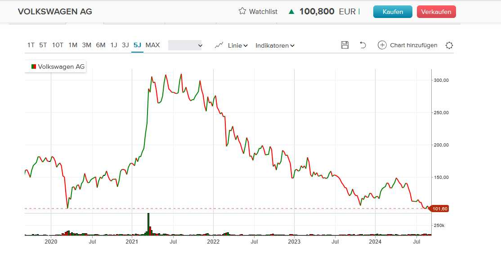
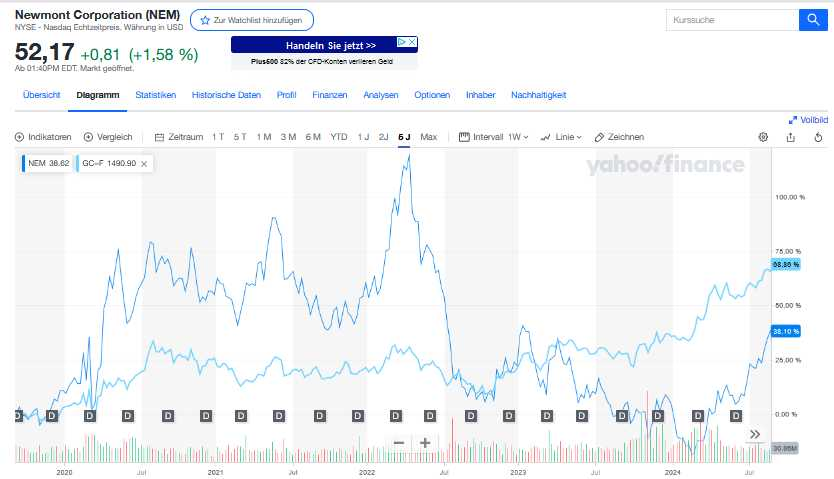

# AktienETFs

# 

--------------------------

# iShares World Equity High Income UCITS ETF USD (Dist)

---------

## Empfehlung von Aktienmasseur

- **VanEck Morningstar Developed Markets Dividend Leaders UCITS ETF**

- TER 0,38 %

- 1.060 Mio

- ISIN: NL0011683594 WKN: A2JAHJ

- ~ 4 %

- KGV 10,

- 99 Unternehmen, 41 % Finazen, 16% Gesundheit, 10% Energie, 30 % USA, 11 % France , viel Europa

- Rendite 13.7 %

- **SPDR S&P Global Dividend Aristocrats UCITS ETF**

- TER 0,45 %

- 1180 Mio

- KGV 10,65

- 98 Unternehmen, 22 % Versorgung, 22 % Finanzen, 12 % Immobilien

- 50 % USA Canada, Schweiz, ...

- ~3,7 %

- 12,89 % Rendite

- **Franklin Global Quality Dividend UCITS ETF**

- IE00BF2B0M76 / A2DTF0

- TER 0,3 %

- 91 Mio

- KGV 17,42

- 100 Unternehmen 24 % Finanz, 17% Industrie, 13 % Gesundheit, 11 % IT, 10 % Basiskosnumgüter

- USA 51 % Japan 12 % 

- ~2,33 %

- Rendite 20, %

- solides Dividenden wachstum, kleine Anzahl Unternehmen

- **iShares MSCI World Quality Dividend ESG UCITS ETF USD (Dist)**

- ISIN IE00BYYHSQ67

- WKN A2DRG5

- 0,38 % TER

- 799 Mio

- KGV 18,36

- 178 Unternehmen, 29 % IT, 17 % Gesundheit, 12 % Finanzen 2,3 % Kosum

- USA 47 %, Schweiz 8 %, Japan 8 % UK 6% Deutschlan 

- ~ 2,4  %

- Rendite 15,56 %

- Mittelfeld, hoher KGV

**Vanguard FTSE All-World High Dividend Yield UCITS ETF Distributing**

- TER 0,29 %

- 4580 Mio

- KGV 14,5 %

- 1990 Unternehmen, 26 % Finanz, 10% Basiskonsum, 9% IT, 9 % Gesundheit

- 53 % USA, ....

- ~2.99 %

- 14,57 % Rendite

- Sehr guter Allrounder, Mittmässiger Wachstum

## Dividenden ETF empfohlen von "Der Dividentensammler""

iShares EM Dividend UCITS ETF USD (Dist) 7 % TER 0,6 %

Xtrackers STOXX Global Select Dividend 100 Swap UCITS ETF 7 % TER 0,5 %SPDR 

SPDR S&P US Dividend Aristocrats UCITS 1-2 %   0,35 %

iShares STOXX Global Select Dividend 100 Swap UCITS ETF 1-2 % TER 0,46 %

iShares Dow Jones Asia Pacific Select Dividend 50 UCITS (DE) 7 % TER 0,35 %

Invesco Morningstar US ENergy Knfrastructure MLP UCITS ETF (Dist)  8 % TER 0,5 %

## Dividenden ETF Empfehlung

15.11.2024  Der Dividendensammler 

Mit Dividenden-ETFs in die Rente | Ü60 und für die Rente anlegen - YouTube

https://www.youtube.com/watch?v=TfqOOnQEPnU

- ETF mit hoher Dividendenrendite:      
  
  - Global X SuperDividend A3DEKS
  
  - 50 %

- ETF mit Dividendenwachstum: 
  
  - SPDR S&P US Dividend Aristocrats - A1JKSO
  
  - 30 %

- ETF mit soliden Dividenden: 
  
  - XTR.ST.GL.SE.DI.100SW.1D - DBX1DG
  
  - 20 %

## Juni 2024 Youtube Entspannt investieren:

Dividenden und Anleihe-ETFs

1) Xtrackers II EUR Overnight Rate Swap UCITS ETF 1C
   ISIN LU0290358497
   WKN DBX0AN
   Thesaurierend
   1700 Mio
   TER 0.1%
   ECB-Leitzins in etwa
2) Vanguard FTSE All-World High Dividend Yield UCITS ETF Distributing
   ISIN IE00B8GKDB10
   WKN A1T8FV
   Ausschüttend ab 2021 ~3.5% 
   4700 Mio
   TER 0.29%
   FTSE All-World High Dividend Yield Index
3) VanEck Morningstar Developed Markets Dividend Leaders UCITS ETF
   ISIN NL0011683594
   WKN A2JAHJ 
   Ausschüttend > 4%
   1084 Mio
   TER 0,38%

## 21.10.2024 Youtube Options Welten

Covered Call ETFs

- Global X Nasdaq 100 Covered Call UCITS ETF D  (A2QR39)

- JPMorgan Global Equity Premium Income UCITS ETF USD (A3EHRE)

05.09.2024 Dr. Dennis Riedl

VOLKSWAGEN AG  WKN 766400  ISIN DE0007664005 (100,2 €)

Ein günstige Aktie? VW-Aktie ist wegen drohenden Entlassungen gefallen.

Analysten VW Gewinne weiter steigern, wenn auch nur langsam.

Wird sich die Aktie auf absehbare Zeit erholen (beobachten)

---

05.09.2024 Dr. Dennis Riedl

Newmont Cooperation, WKN 853823  ISIN US6516391066 (52 $, 46,96 €)

Gold steigt und Goldminen lauf vom Verlauf dem Goldpreis hinterher und hat gewissen Hebel character (also steigt höher als Gold)

---

8.9.2024 OptionsWelten

Anleihen:

### iShares USD TIPS 0-5 UCITS ETF USD (Dist)

ISIN IE00BDQYWQ65
WKN A2DKPQ
TER 0,1%
1,04 Milliard €
US-Dollar
Ausschüttungsrendite 7,84 %
Gesamtrendite 5 Jahre 23,8 %

### iShares EUR High Yield Corporate Bond ESG UCITS ETF EUR (Acc)

ISIN IE00BJK55C48
WKN A2PNZM 
TER 0,25%
Thesaurierend
2,3 Milliard €
Euro
keine 5 Jahre

Aktien-ETF

### iShares STOXX Global Select Dividend 100 UCITS ETF (DE)

ISIN DE000A0F5UH1
WKN A0F5UH 

TER 0,46%

2,38 Mill €

Dividende 6,2%

Rendite 5 Jahre 33,4 %

### iShares EURO STOXX Banks 30-15 UCITS ETF (DE)

ISIN DE0006289309
WKN 628930
TER 0,52%
1,04 Milliard €  (heute 823 Mill €)
Dividend 5,07%
Rendite 5 Jahre 94,6%
13,36 €

### JP Morgan Equity Premium Income ETF

ISIN IE0003UVYC20
WKN A3EHRE
TER 0.35 %
Covered-Call Strategie

12.5% Ausschüttung Jan. 24

---

8.8.24 von Entspannt Investieren

Bonds:

### Xtrackers II EUR Overnight Rate Swap UCITS ETF 1C

ISIN LU0290358497
WKN DBX0AN

1.7 Milliarden €

TER 0,1 %

Euro Short Term Rate

Dividenden ETF:

### Vanguard FTSE All-World High Dividend Yield UCITS ETF Distributing

ISIN IE00B8GKDB10   
WKN A1T8FV
TER 0.29 %4,56 Mill €
US-Dollar 60,96 €
3.09 % Dividende
Performance 5 Jahre 45,69 %

### VanEck Morningstar Developed Markets Dividend Leaders UCITS ETF

ISIN NL0011683594
WKN A2JAHJ 

TER 0,38 %

909 Mio   €

38,18 €
Euro
22 % US Aktie
Dividende 4,66 %
5 Jahresperformance 66,51 %
