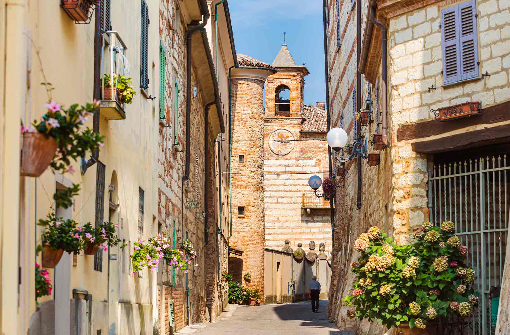

Mailand, Gardasee, Toskana - diese beliebten italienischen Urlaubsdestinationen erzeugen sofort schönste Bilder. Aber: Wie viel wissen Sie über das Piemont? Wenig? Da geht es Ihnen wie vielen anderen! Gut so, denn dadurch ist die Region im Nordwesten Italiens noch nicht so touristisch über- rannt. Vielfältig zeigt sich hier bereits die Landschaft: Von den Gipfeln der Alpen bis zu den Weinbergen der Langhe gibt es hier sowohl kleine Bergdörfer als auch Schlösser, Burgen und Weingüter zu entdecken. Lebendig geht es in Turin zu, der Hauptstadt der Region, die mit ihrer Archi- tektur fasziniert. Auch mit kulinarischen Highlights weiß Piemont zu punkten: Beim jährlich im November stattfindenden Schokoladenfestival CioccolaTò dreht sich in Turin alles tagelang um die süße Versuchung. Im Sommer dagegen sind die duftenden Lavendelfelder in Sale San Giovanni einen Besuch wert. Oder Pollen- zo, wo in einem Landgut aus dem 19. Jahr- hundert heute die,„Università di Scienze Gastronomiche" der Slow-Food-Bewe- gung untergebracht ist. Sie merken: Kul- tur, Architektur und Kulinarik gehen hier eine besonders enge Liaison ein. Also, nichts wie hin!

SEHENSWERTE ORTE IM PIEMONT

- Traumhafte See-Lage: Orta San Giulio
- Kleiner Kurort am Lago Maggiore: Stresa 
- Mittelalter-Charme: Barolo 
- Geheimtipp ohne Tourist:innen: Neive
- Heiße Quellen zum Entspannen: Acqui Terme

## Ruhe tanken

Alexas Ausflugstipps im Piemont: Die Dörfer Barbaresco, La Morra und Canelli. Letzteres ist nur 10 Minuten
vom Almaranto entfernt