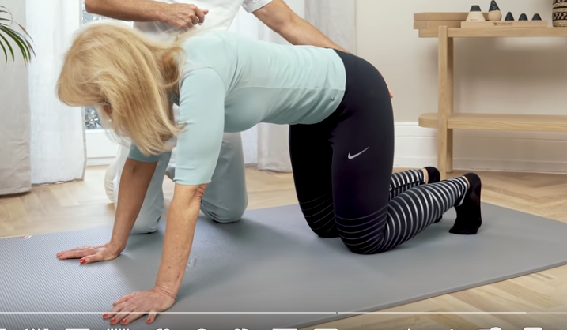
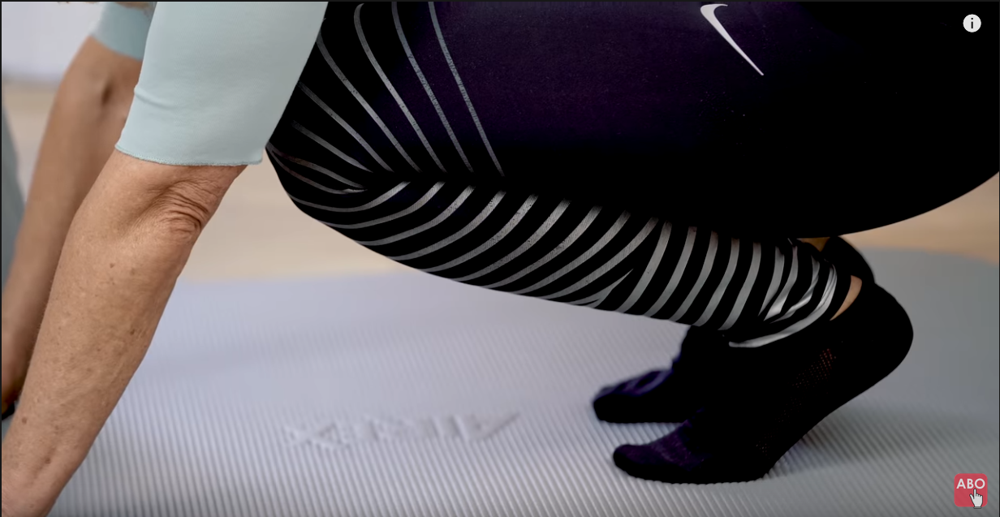
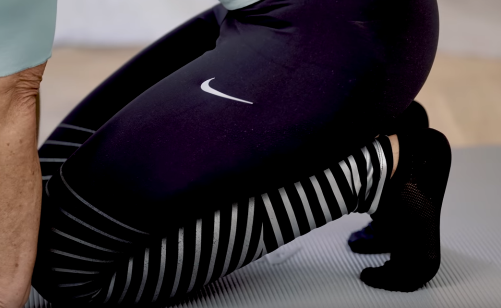

# Fuß-Halux-Vulgus Übungen

## Mittelfußdehnung

Aus dem Vierfüßlerstand mit aufgestellten Zehen zurück auf die Zehen gehen

bis der Mittelfuß gespannt wird. Hauptdehung im Mittelfuß

2 - 2 1/2 Minuten dehnen

Danach vor auf die Knie gehen

Soweit zurückgehen bis der Großzeh gedehnt wird, 2-2.5 Minuten
