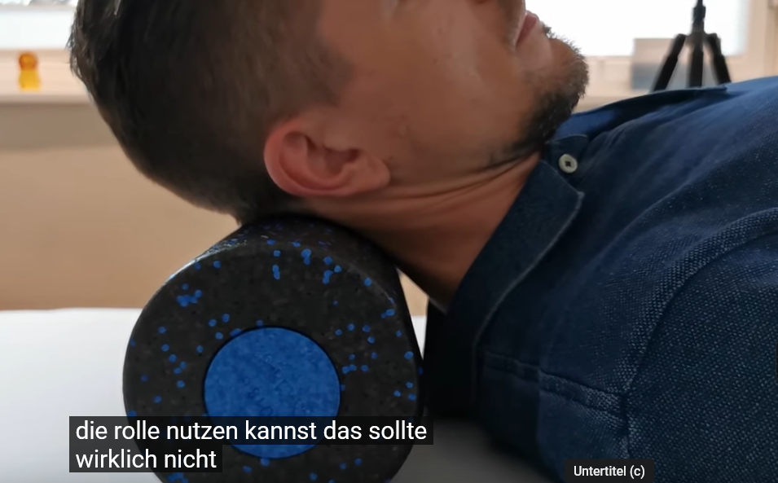

# Halswirbelgymnastik

Von Knopp & Niehaus: https://www.youtube.com/@KnopNiehaus

## Erste Übung

Aufrecgt Stehen oder Sitzen

Mit den Händen am Hinterkopf Kopf nach vorne unten ziehen

hinterer Nacken dehnen 60-90 Sek. nicht zu doll

### Erweiterung

Kopf 45 nach links/rechts drhen und in dieser Richtung dehen

60-90 Sek. jeweils

## Zweite Übung

Kopf mit Mittelfinger nach vorne und hinten führen

Dabei gerader Blick

An den Enden kurze Bleiben

10-20 Wiederholungen

## Dritte Übung

Kopf maximal zur Seite drehen

Dann kleine Nickbewegeungen machen

10-20 Wiederholungen

## Vierte Übung

Zuerst Geradeaus Kinn nach vorne unten Nacken strecken

Dann Drehbewegung nach libks und rechts mit gedehtem NAcken, Kinn auf Brust lassen

10 - 20 Wiederhlungen

## Fünfte Übung

Kopf aufrecht 45 grad nach rechts/links drehen

Schulter auf der Seite unten halten

Gegenüberligende Hand zum ziehen in die 45 Grad Ebene Seitneigeposition:

60 - 90 Sekunden dehnen

## Sechste Übung

 Fazienball an die Wand

Kinn, wie in eins nach hinten führen und gegen den Ball drücken

Kopf drehen

60 - 90 Sekunden dehnen

## Siebte Übung

Ähnliche Übung nur mit Rolle

60 - 90 Sekunden dehnen
