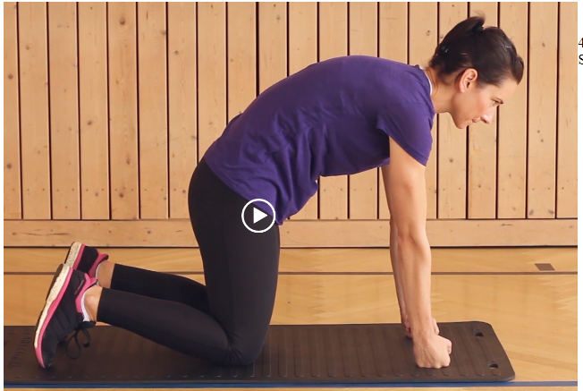
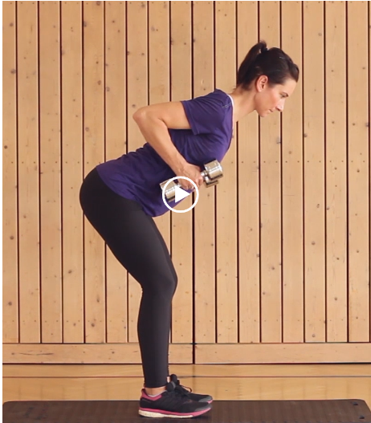
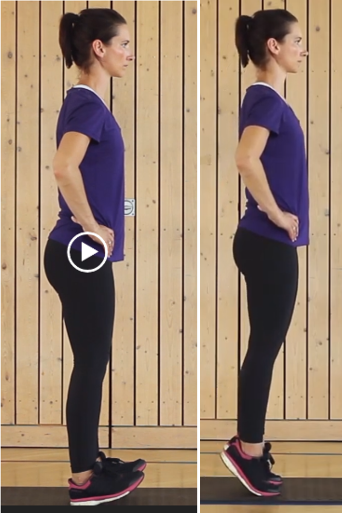
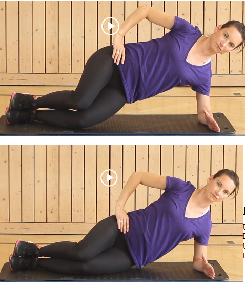

# MISPEX Level1

## Übung 1 Katze - Buckel

- Unterlage stabil

- Dauer 10 Wiederholungen , 3 Serien

- Pause max 30 sec

- Knie hüftbreit

- Hände/Fäuste schulterbreit

- Kopf still halten

.

.

.

## Übung 2 - Heben

- Unterlage:stabil  

- Dauer:3 Serien  

- Umfang:10 Wdh.  

- Pause:max. 30 Sek

- Rumpf stabilisieren

- Arme/Ellenbogen eng am Körper zurückführen

- Fersen haben mgl. keinen Bodenkontakt

.

.

## Übung 3 - Ferse - Ballen

- Unterlage stabil                                                                   - ufrechter Stand  

- Dauer:3 Serien

- Pause:max. 30 Sek

- Aufrechter Stand

- Rumpf stabil halten    

- Umfang:10 Wdh.                                                                     - Fersen/Zehen so hoch wie mgl. bewegen  

  .

  .

  .

## Übung 4 - kurzer Seitstütz mit Becken lösen absenken

- Unterlage:stabil  
- Dauer:3 Serien
- 10 Wdh. pro Seite 
- Pause:max. 30 Sek.
- Becken gleichmäßig heben und ablegen                                              
- Aus der Schulter rausdrücken
- Ellenbogen direkt unter der Schulter   

