# RückenTraining für Zuhause

Aus einem Youtube-Video herausgeschnitten, da dort kein zeitlicher Ablauf

18 Stationen, mit Timer habe ich es auf jeweils eine Minute gestellt und 10 Sek. Pause

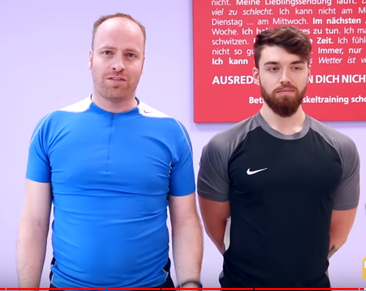

# A) Mobilisierung des unteren Rückens

## 1) Am Boden auf dem Rücken

- Beine links und rechts gegeneinander vorschieben

- Zeit: eine gewisse Zeit

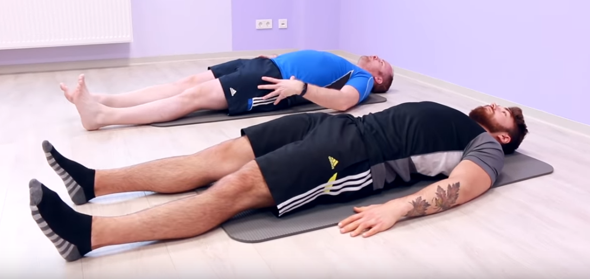

## 2) Am Boden Verdrehung der Wirbelsäule links

## 3) Am Boden Verdrehung der Wirbelsäule rechts

- Nach Links:Rechtes Bein über Linkes. Arme seitwärts ausstellen und zur linken Seite Knie fallen lassen. Schulter bleibt auf dem Boden

- Nach Rechts

- Veränderung: bevor man verdreht Hüfte anheben und etwas zur anderen Seite versetzen (bei nach Links, etwas nach rechts)

- Zeit: einige Zeit

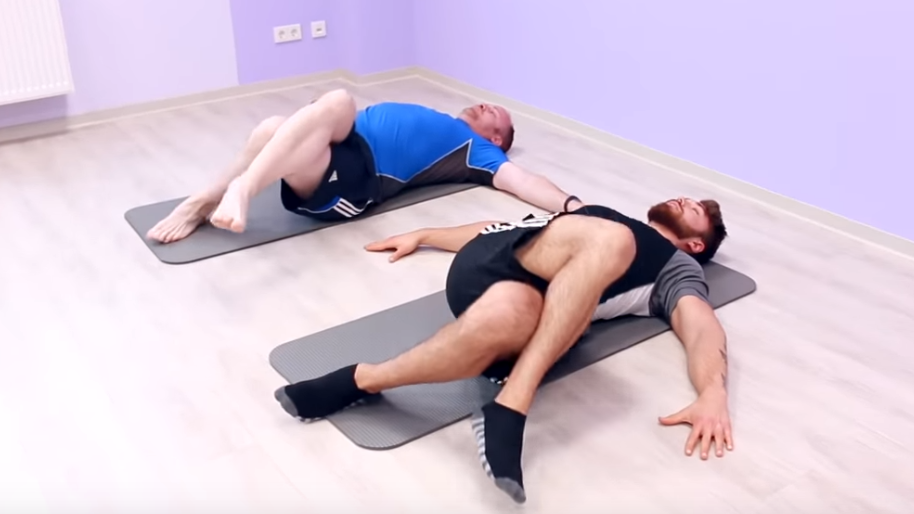

## 4) Schaukeln

- auf dem Rücken liegen, Knie heranziehen und vor und zurück schaukeln, aber auch rechts und links leicht drehen
- Zeit: einige Zeit

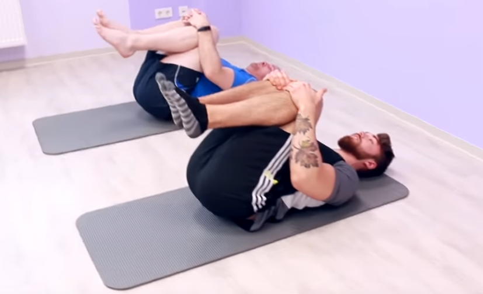

------

# B) Übungen Brustwirbelsäule

## 5) Katze - Kuh

- Vierfüsslerstand, Katze Kinn auf Brust, Buckel nach oben, Kuh: Blick nach vorne richten, Brust und Bauchnabel nach unten schieben
- Zeit:  mehrfach Wechsln

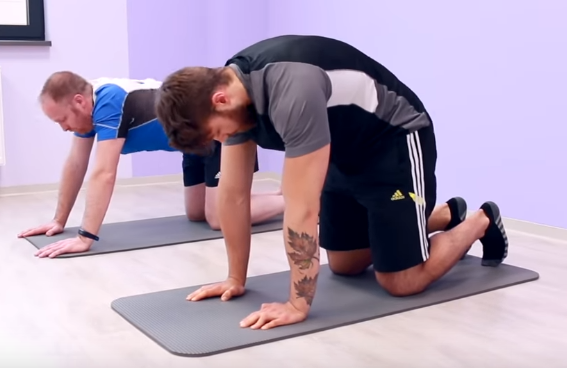

## 6) Rücken entspannen

- Von Katze - Kuh Po hinten ablegen und mit Arme nach vorne entspannen
- einige Zeit

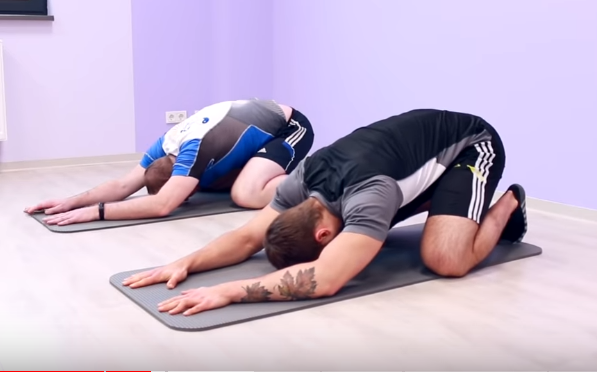

# C) Rotation + Hüftbeuger

## 7) Verdrehung links

## 8) Verdrehung rechts

- Auf Kniee ein Bein aufstellen, hinteres Bein ausstrecken, Hüfte nach vorne kippen, Po anspannen, Hüfte vorschieben, Arme übereinander und zum Aufgestellten Bein (Ausatmen) drehen

- Zeit: einige male

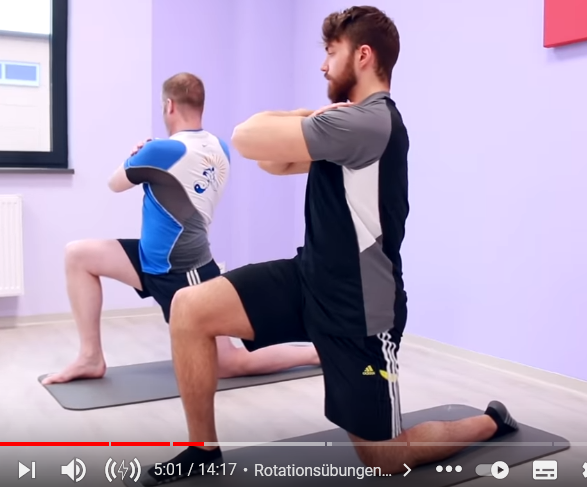

## 9) Dehnung Seite links

## 10) Dehnung Seite rechts

- Wie oben, Becken nach hinten kippen und Arm der nicht aufgestellten seite nach oben dehnen, gleichzeitig anderer Arm nach unten 
- Zeit einige male

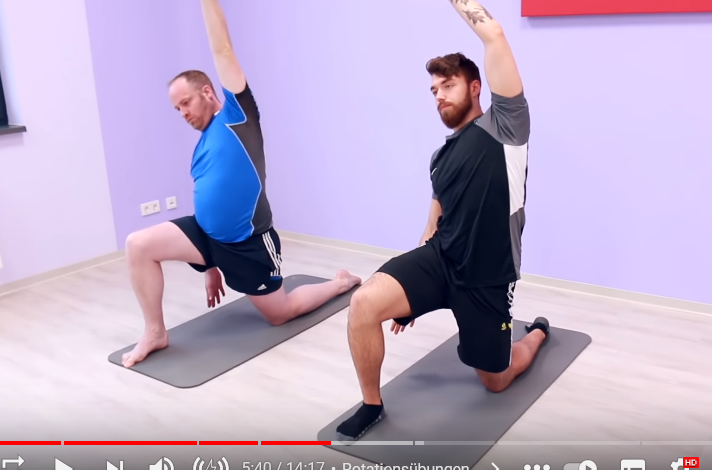

# D) Beweglichkeit Becken

## 11) Becken kippen

- Stehen, Becken kippen; Hüfte nach vorne schieben und wieder zurück

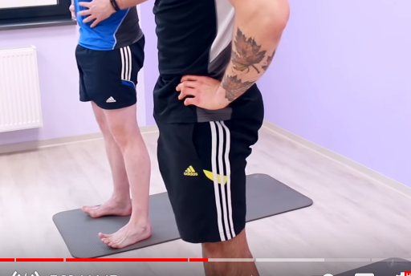

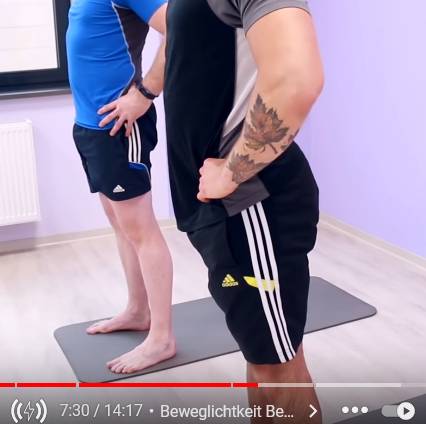

# E) Stabilisierung

## 12) Einbein Stand rechts

## 13) Einbein Stand links

- Auf einem Bein stehen ausbalancieren, Wechsel
- Zeit etwa eine Minute stehen

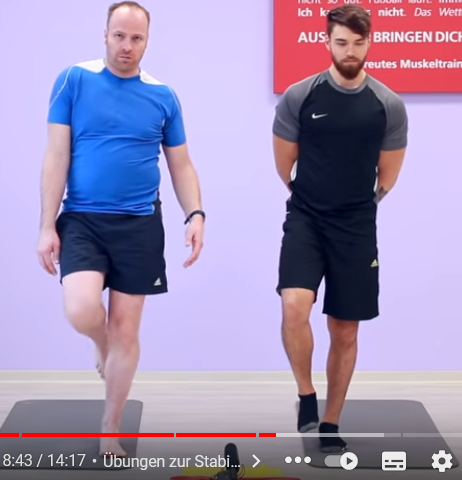

## 14) Plank

- In Plank-Stellung, Po fest anspannen, Bauch anspannen und Becken nach hinten ziehen
- Zeit einige Zeit

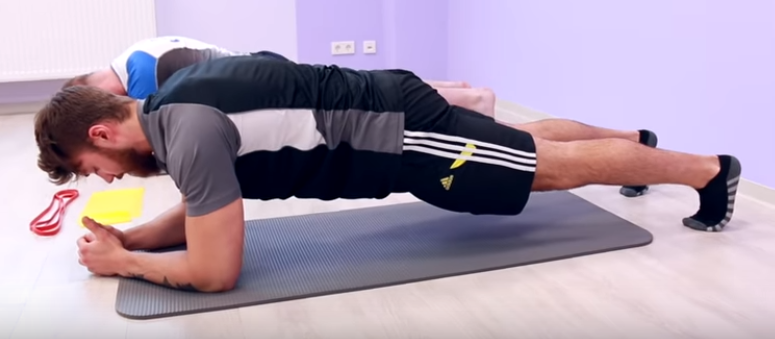

## 15) Bauchlage

- Auf Bauch legen, ein T bilden, dann V und W
- Zeit einige male

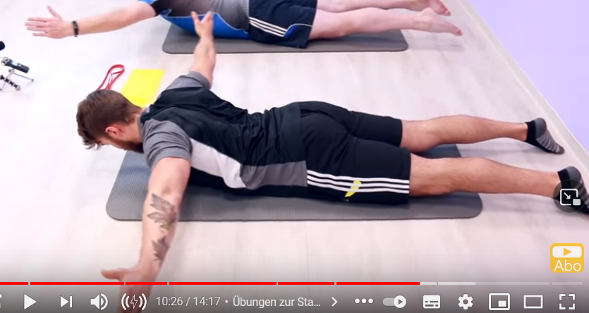

## 16) Face Lift

- Theraband auf Brusthöhe festhalten und der Übende zieht Schultern hach hinten und Brust raus.

- Daumen nach hinten und dann über Kopf spannen

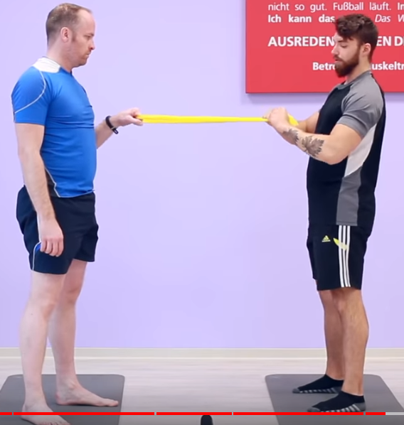

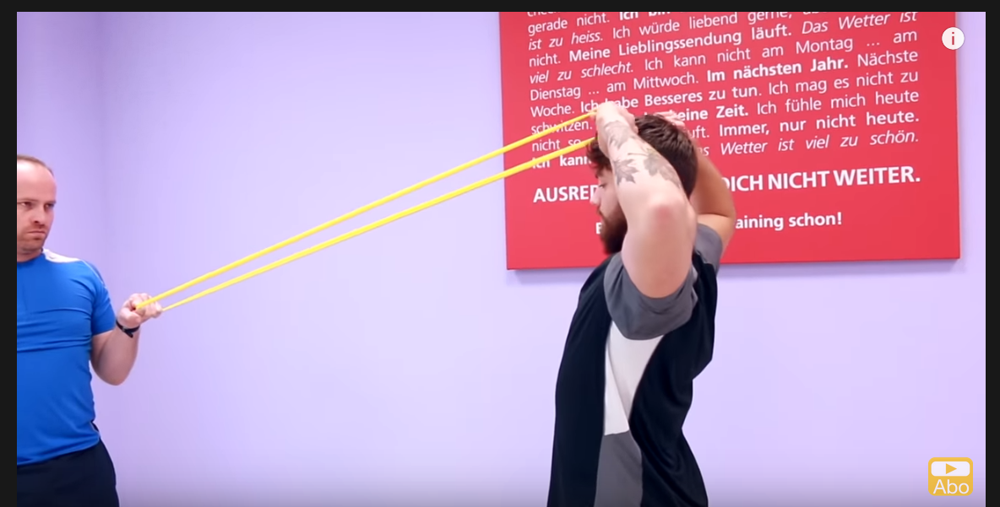

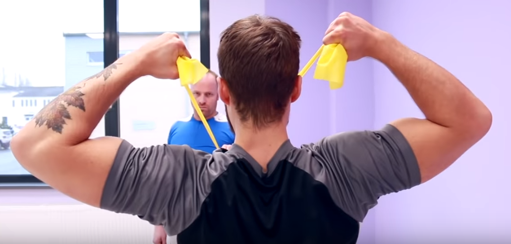

## 17) Press links

## 18) Press rechts

- Band auf Elebogenhöhe
- leichte Spannung im Band Arme am Körper
- Bauch fest anspannen und nach vorne schieben

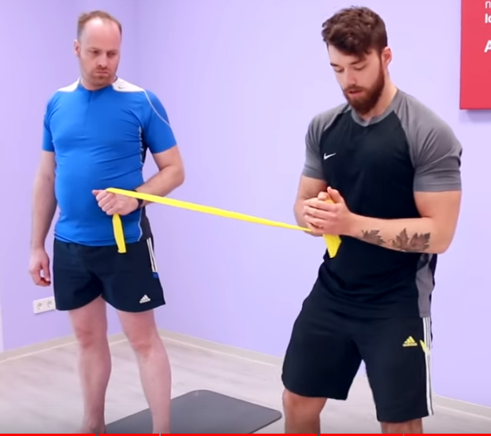

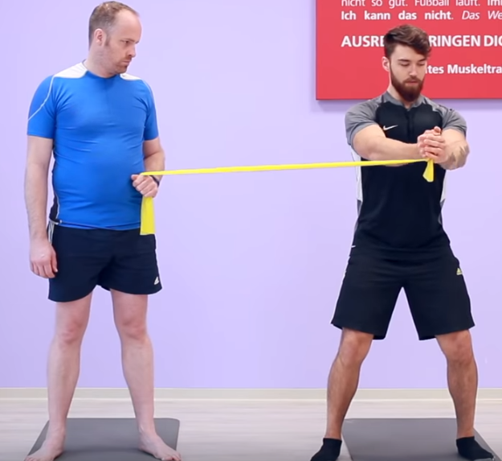
