# Rückentraining für Zuhause 2

8 Übungen jeweils 45 s oder 60 s

## 1. Plank

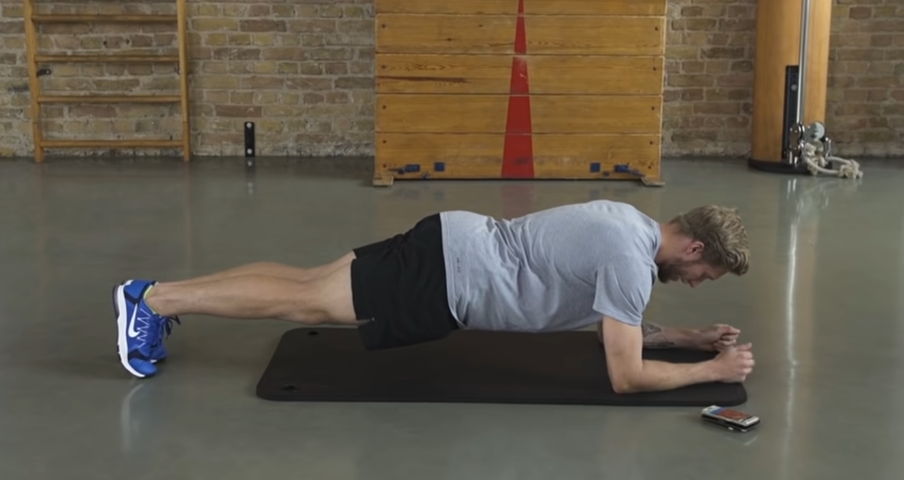

- Fersen zusammen drücken und Po anspannen

- Arme auf den Boden auseinander schieben

- Bauch einziehen
  
  ## 2. Schneeengel
  
  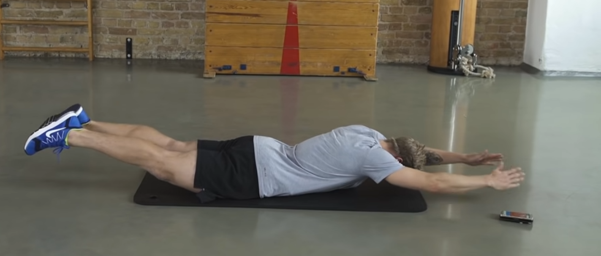

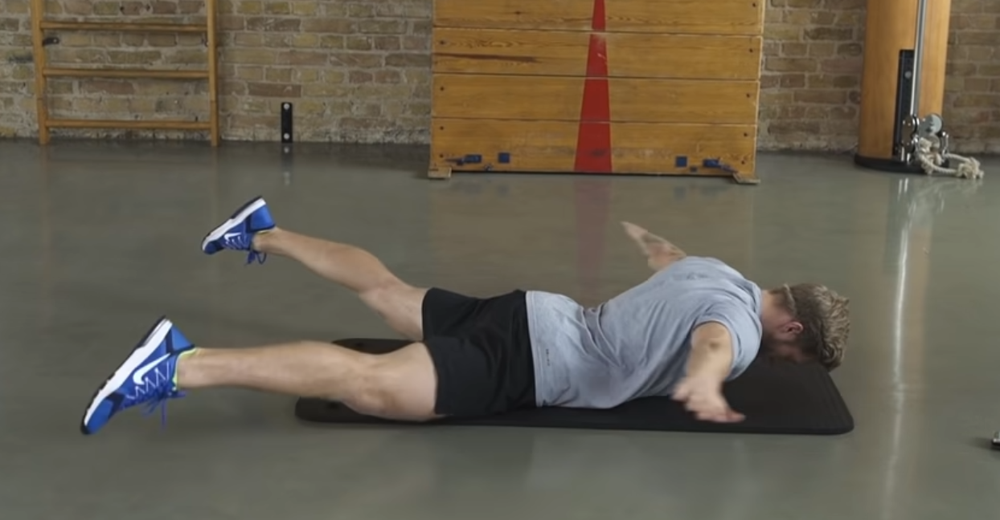

- Kopf gerade nach unten halten

- Knie abgehoben halten
  
  ## 3. Unterarmstütz seitlich
  
  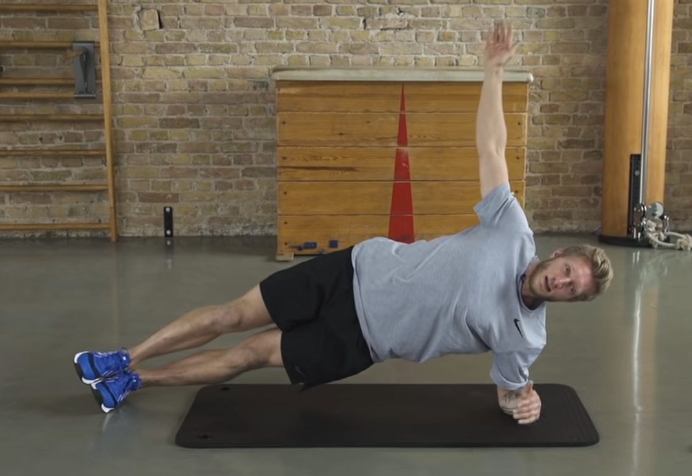

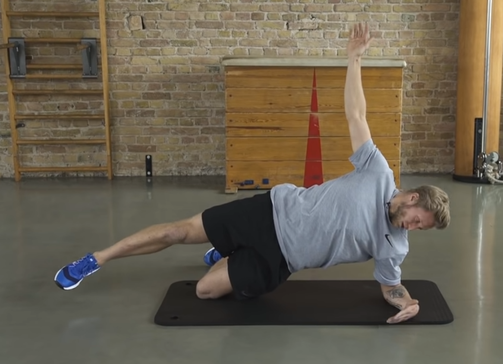

- leichtere Variante
- Eine gerade Linie
- Nicht mit dem Po ausweichen

## 4. Diagonale Pendeln

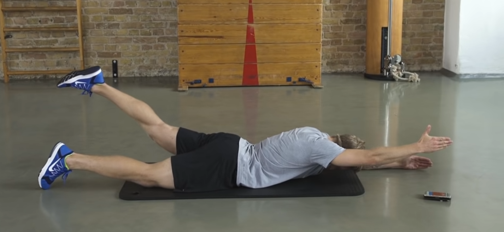

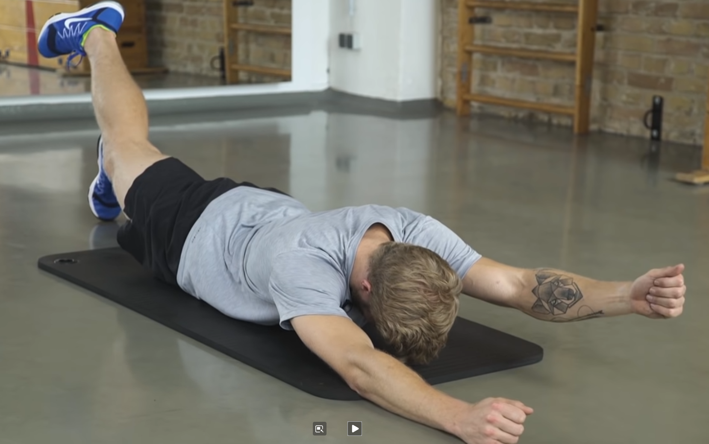

- 3 sec halten
- Gegenseite bleibt am Boden
- Um Gerdae zu bleieben, Arm mindestens bis zum Ohr, Kopf ist nach unten gerichtet

## 5. Andere Seite des Unterarmstütz seitlich

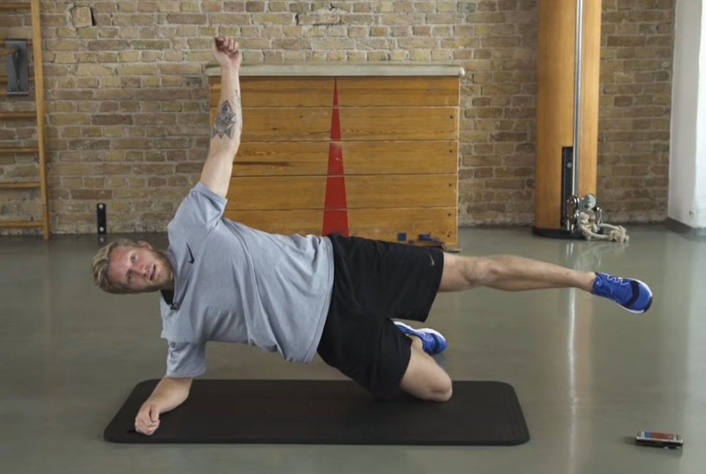

## 6. Bird and Dog

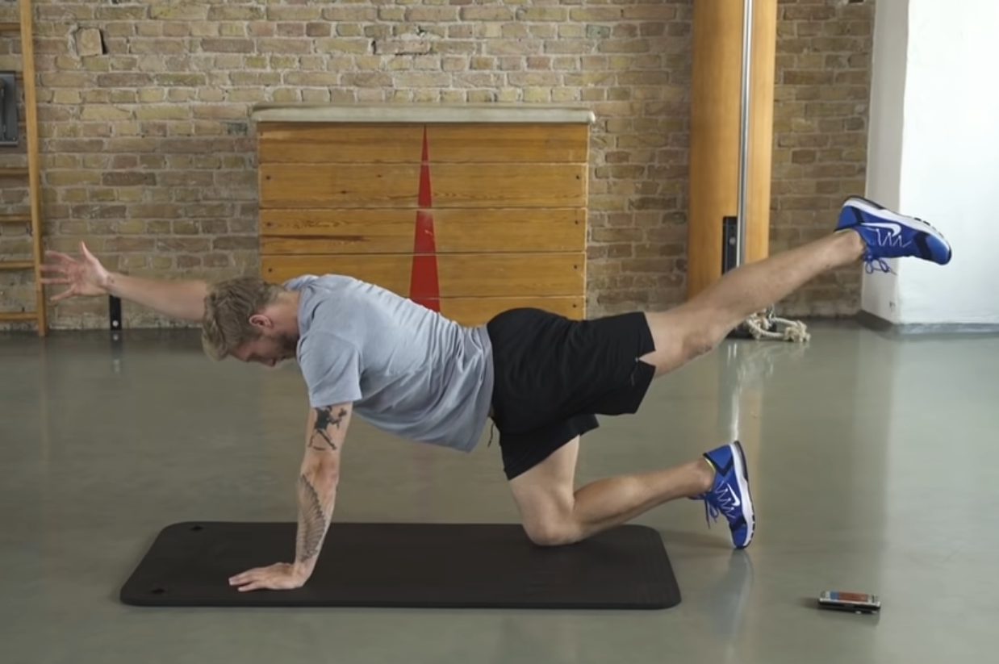

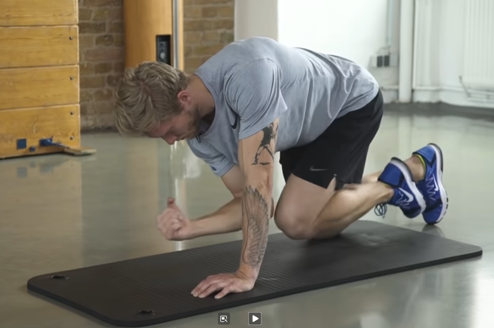

- Beine und Knie zusammen führen
- Rücken gerade halten
- Nicht kippen

## 7. Beckenlift

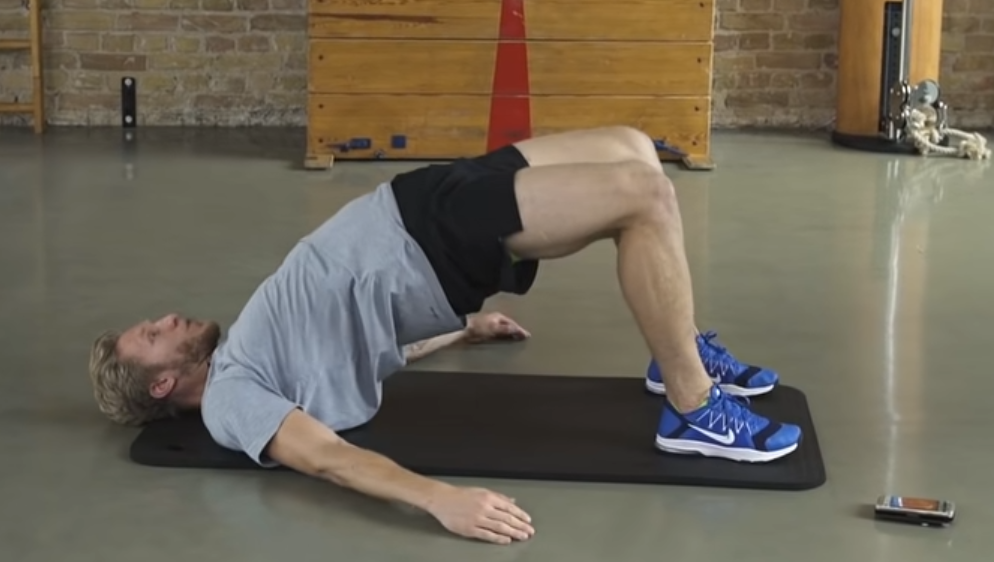

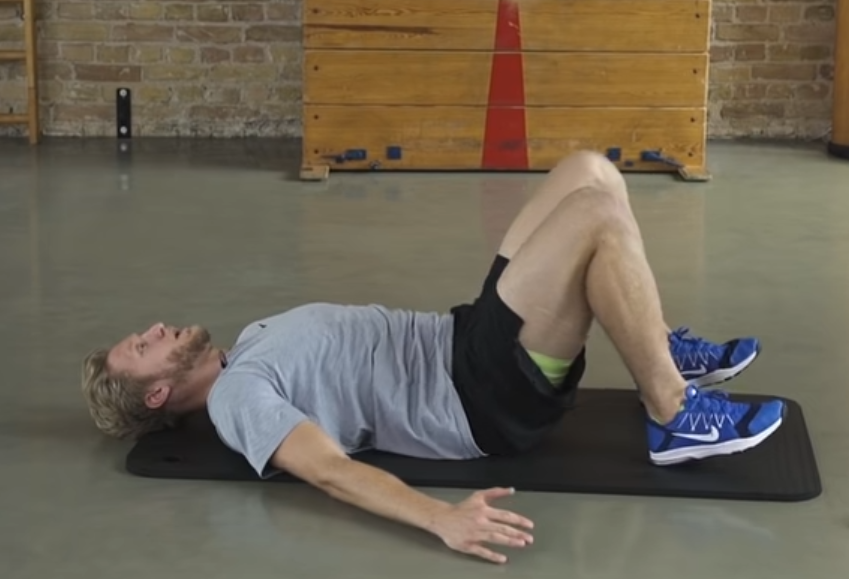

- Bauch und Po fest

## 8. Andere Seite von Bird and Dog

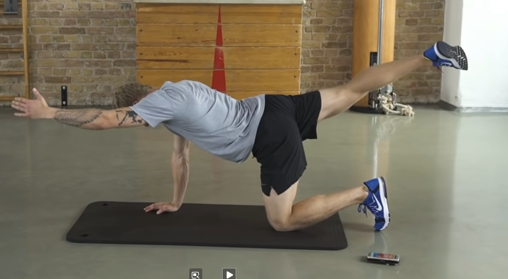