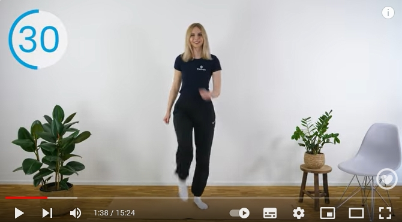

# Seniorenfitness 10 min

## Zeit

8x60 sec + 4x30 sec + je 10 sec Pause => 10x60 sec + je 10 sec Pause

## Aufwärmen

### 1. Auf der Stelle Laufen (60 sec)

### 2. Auf der Stelle Laufen und Boxen (60 sec)

## Kraftübung

### 3. Auf die Zehenspitze und zurück (Zehen heben) (60 sec)

### 4. Squads auf den Stuhl, aber nicht absetzen (60 sec)

Tief

Hoch

### 5. Knie zur Brust, vorne sitzen auf dem Stuhl, Hände hinten abstützen (60 sec)

### 6. Vierfüßlerstand diagonal (60 sec)

### 7. Blank auf dem Knie (60 sec)

### 8. Swimming mit den Beinen, abwechselnd anheben (60 sec)

## Cool down

### 9. Äpfelpflücken (30 sec)

### 10. Baum auf/zu (30 sec)

### 11. Schulter kreisen (30 sec)

### 12. Twist in den Armen (30 sec)

