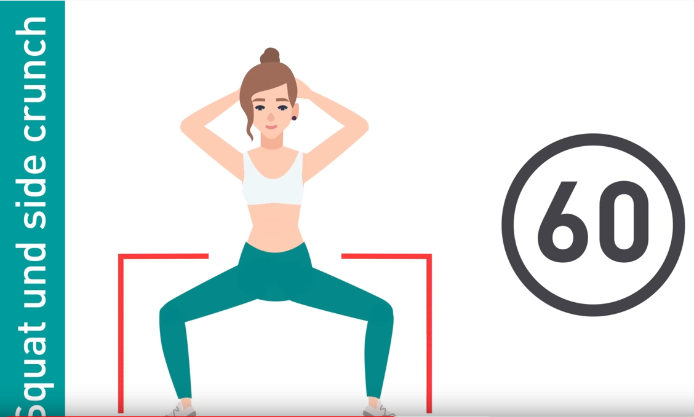

# Vor dem Schlafengehen

# Zeit

2x30 sec +6x60 sec + 2x30 sec + je 10 sec Pause => 8x60 sec + je 10 sec Pause

# Aufwärmen

## 1) Armkreisen

Vorwärts und Rückwärts

 

## 2) Knieheben

abwechselnd linkes und rechtes Knie heben

# Hauptteil

## 3) Squats

## 4) Donky Kicks

## 5) Push-ups

## 6) Squat und side crunch

## 7) Plank

## 8) Toe Touches über Kreuz

# Dehnung

## 9) Quadrizeps-Dehnung

## 10) Rhomboiden-Dehnung

