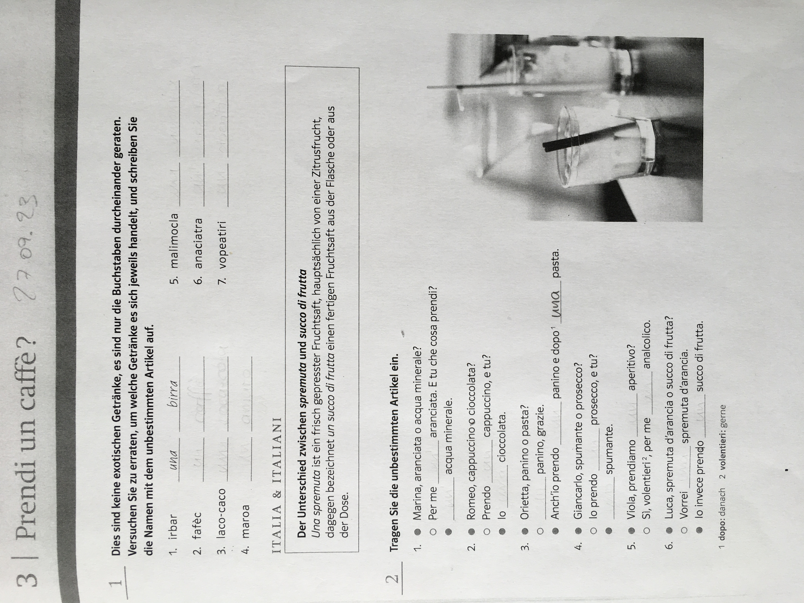

Mail von Rold Schwab:

Hallo Barbara, Thomas und Michal,

außer Waltraud und mir waren am Donnerstag von der alten Besetzung noch Bernd, Thomas(o) und Jörg anwesend. **Kursbeginn ist jetzt um 18 Uhr!**

Neu dazugekommen sind Laura, Melika und Florian. Um auf dem Level wie wir zu sein, haben sich die drei zur Vorbereitung im Selbststudium zu Hause die ersten 2 bzw. 3 Kapital angeeignet.

Micaela hat mit uns zunächst noch einmal ein paar grundsätzliche Themen kurz wiederholt.

- sich und andere vorstellen
- Singular/Plural der bestimmten Artikel männl. /weibl.
- Präpositionen bei Orts- und Länderangaben
- etwas bestellen/reservieren
- Zahlen 1 - 100
- Frage nach dem Befinden

An die Tafel hat Micaela zu diesen Themen nur sehr wenig geschrieben. Man findet das auch auf den Wiederholungs- und Grammatik-Seiten der ersten 3 Kapitel.

Auf dem Übungsblatt "Ripasso 1" haben wir die Nr. 1 besprochen (siehe Anhang 1). Die Nr. 2 kann man zu Hause noch ergänzen.

Im Übungsblatt "Prendi un caffé" haben wir zur Verwendung des unbestimmten Artikels die Nr. 1 und 2 ausgefüllt (siehe Anhang 2).

Als gemeinsame Übung haben wir auf Seite 41 begonnen, die einzelnen Quadrate in 4er-Gruppen zu bearbeiten.

Als Hausaufgabe haben wir vom o.g. Übungsblatt "Prendi un caffé" die Übungen Nr. 3 + 4 erhalten (siehe Anhang 3).

Waltraud und ich sind in der nächsten Stunde am 05.10. nicht da. Bernd wird für uns evtl. Infos und Übungsblätter/Hausaufgaben durchgeben.

Liebe Grüße

Rolf und Waltraud

