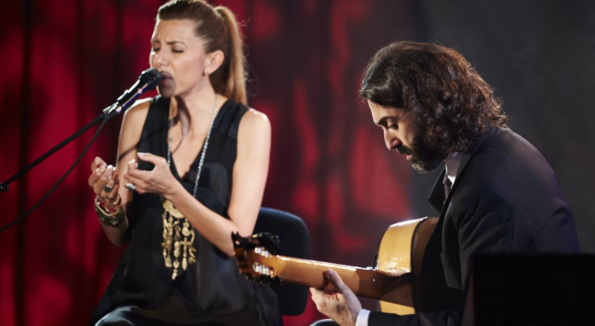
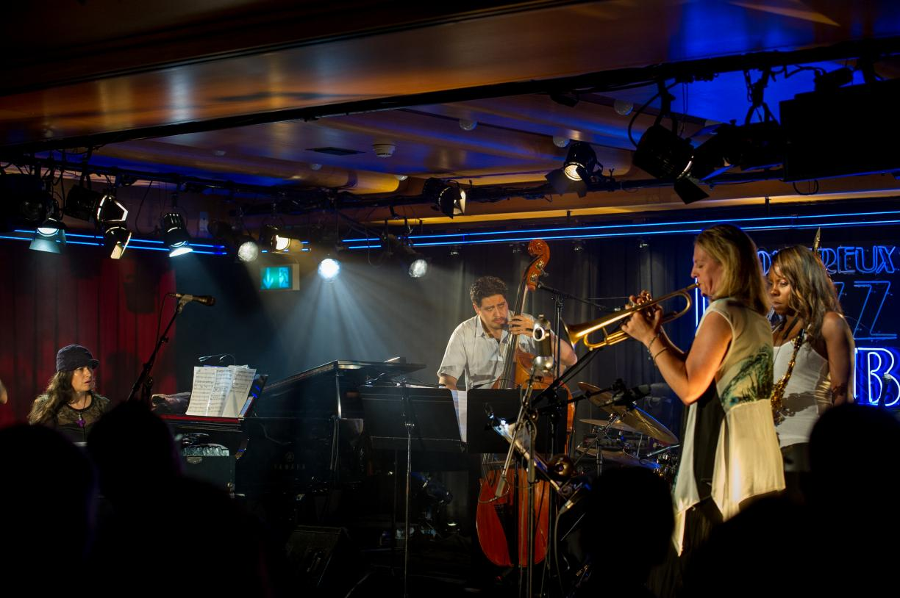
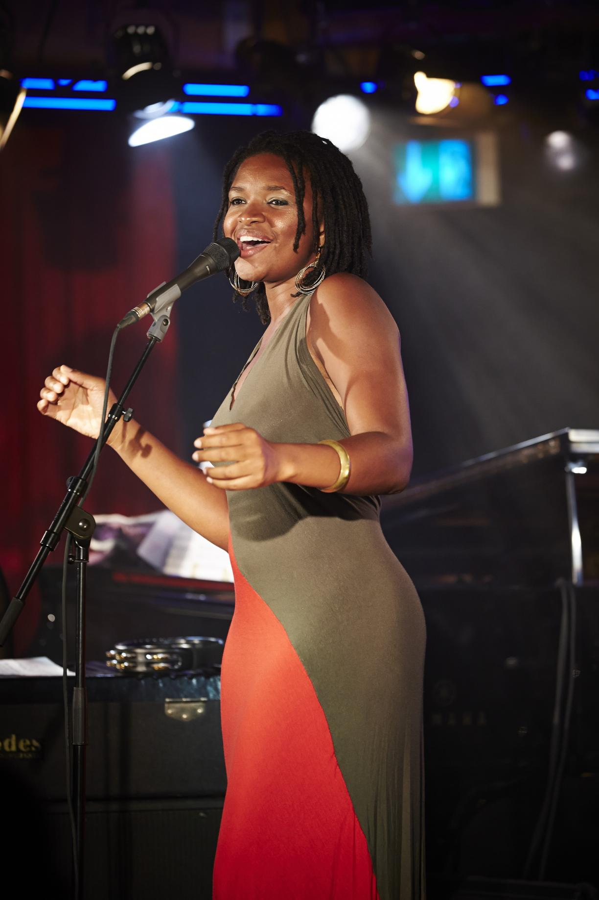
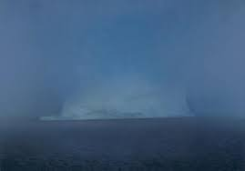
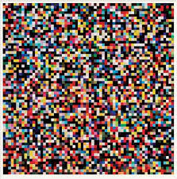
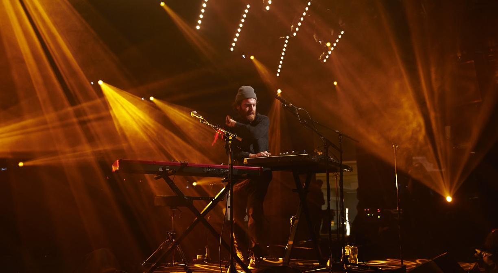
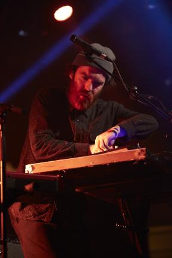
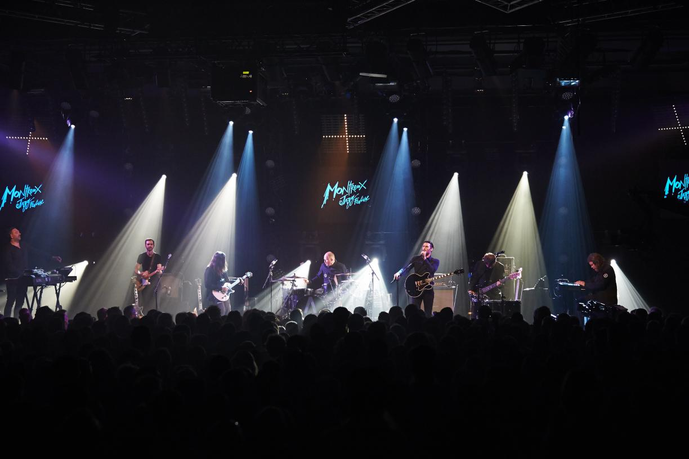

Ich war von Freitag bis heute mit Gloria in Montreux, war ganz gut. Aber ob es ihr mit mir gefallen hat, bin ich mir nicht so sicher.
Leider hat es meistens abends, wo man so rum laufen kann geregnet, das war blöd.
Am Freitag sind wir so über das Fest geschlendert und haben ein japanische Big-Band gesehen (Blue Note Tokyo All-Star Jazz Orchestra directed by Eric Miyashiro ), danach wollten wir noch den Gittaristen Hotei sehen, aber es hat zu sehr geregnet.

Am Samstag sind wir tagsüber nach Thonon, dann über Genf nach Lausanne, waren dort einkaufen und sind dann rechtzeitig zu unserem Konzert gekommen

Zuerst kam Mago & Limon:

Sehr spezielle flamenco-artige Musik und Gesang, war sehr gut.

Danach spielte das Mosaic-Projekt:

Mit 
Lizz Wright (vocals)  (sehr schöne Stimme)
Tia Fuller (saxophone) 
Ingrid Jensen (trumpet) (hat mir im Laufe des Konzerts immer besser gefallen)
Matthew Stevens (guitar) (gut)
Rachel Z (piano)  (war okay)
Josh Hari (double bass)  (der arme hat sich abgekämpft)
Terry Lyne Carrington (drums) (gut gespielt, kam aber ein bischen kühl rüber)

Insgesamt war die Stimmung als Gruppe nicht so harmonisch, hatte ich den Eindruck

Am Sonntag waren wir erst in der Gehard Richter Ausstellung in Basel Fondation Beyeler. Kannte vorher nur Namen und vielleicht ein Bild, war sehr interresant, sehr wilde Sachen, aber auch photorealistische Sachen:

Dann sind wir einigermaßen pünklich zum Chet Faker Konzert, ganz vorne gestanden:

Danach kam Archive, mit einem sehr merkwürdigen Film, der von ihnen musikalisch begleitet wurde und danach ein heftiges Konzert

