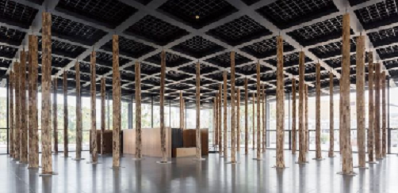
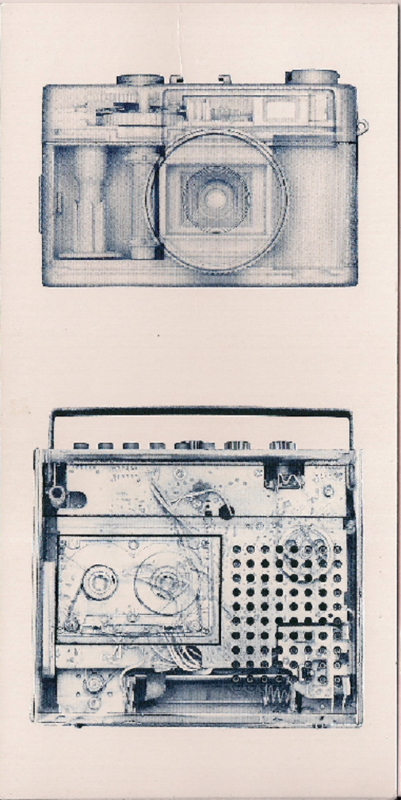

Heute erst in der neuen Nationalgalerie gewesen, Baumstämme von David Cipperfield

 

Bilder vo Moshe Gershuni, dann die ständige Ausstellung. 

Anschliessend im technischen Museum gewesen, um die Fotos von Max Esteban: Vom Vergehen
(Fotos vom Innenleben technischer Geräte) zu sehen:

 
