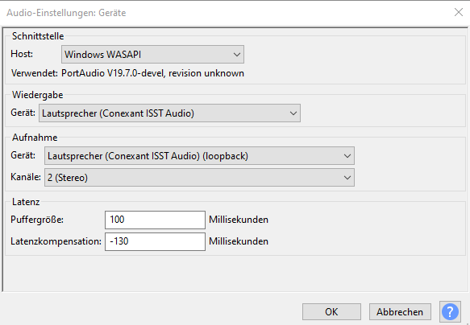

Aufnahmen mit Audacity von DigiJay

Das war ein Problem, da man es nicht richtig aussteuern konnte.
Mit der einstellung 

habe ich direkt vom Lausprecher aufgenommen, es war aber zu laut.
Ich konnte in DigiJAy und nicht in Windows die Stärke runterdrehen:

