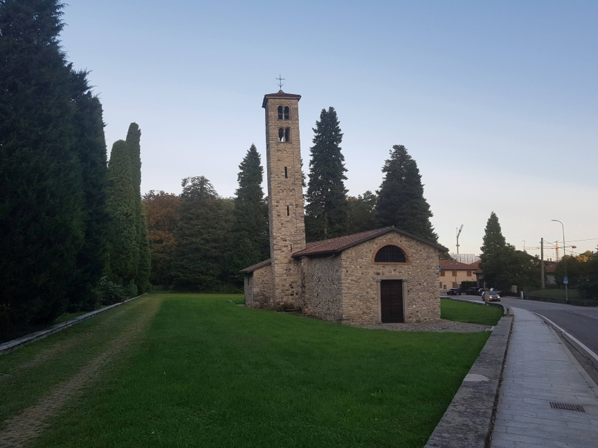

#Urlaub #Apulien #mitDagmar

Wir sind bis nach Como. Dort in der Nähe war die Residence Paolino in Tavernerio hinter Como
Die Residence lag etwas im Industriegebiet im ersten Stock einer kleineren Fabrikhalle. War okay, aber ein bisschen dunkel. Abends spazieren haben eine schiefen Turm gefunden "Chiesa di San Pietro"

Danach Pizzaessen, war viel zu groß! Am nächsten Tag weiter nach Padua