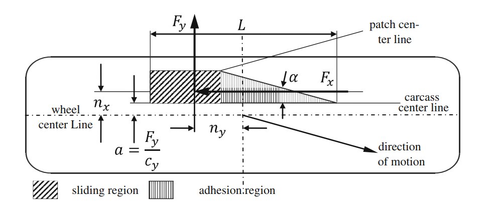
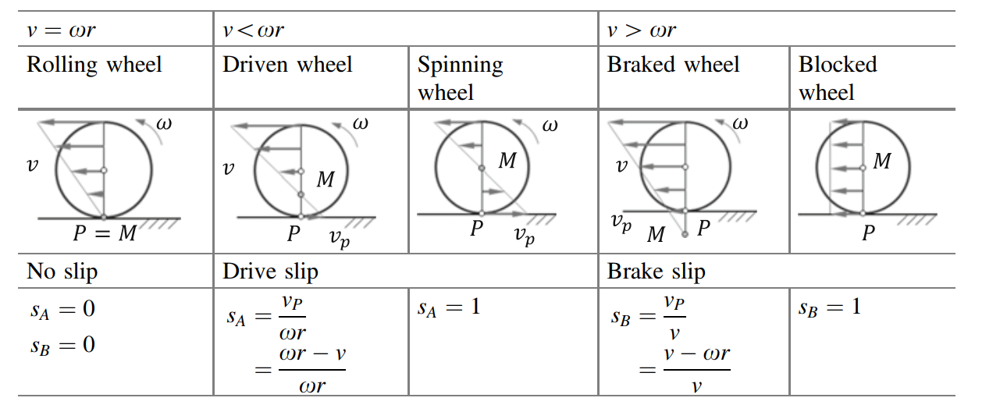
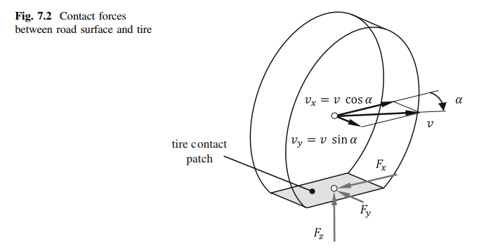

# HSRI-Tire Model #

Taken from Schramm,Hiller,  Bardini, 2018, Vehicle Dynamics, Springer

Modeling of the Road-Tire-Contact, Derivation of the HSRI model through trapezoidal approximation of the contact patch
surface with adhesion and sliding regions  

Sliding velocity:
$$
v_G = v_P \cdot \sqrt{s^2_{A,B}+\tan^2_\alpha}
$$

$v_P$ is the velocity in the contact path
$$
v_P = v - \omega \cdot r_{dyn}
$$

$s_{A,B}$ is the slip defined during drive and braking:

$$
drive slip (v<\omega\cdot r_{dyn}) : s_A = \frac{\omega\cdot r_{dyn}-v}{\omega\cdot r_{dyn}}\\
brake slip (v>\omega\cdot r_{dyn}) : s_B = v -\frac{\omega\cdot r_{dyn}}{v}\\
$$
The side slip angle could defined as:

$$
s_y = \tan(\alpha)=\frac{v_y}{v_x}
$$

The adhesion coefficient between road and tires are described as:
$$
µ = µ_0\cdot\left( 1-k_R\cdot tanh^2(a\cdot v_G)\right)
$$

where $k_R$ and $a$ are force adhesion factors depending on the nature of the road surface. 

## Other definitions ##

From Jaschke, 2002, "Lenkregler für Fahrzeuge mit hoher Schwerpunktlage" and Uffelmann, 1980, "Berechnung des Lenk- und Bremsverhaltens von Kraftfahrzeugen auf rutschiger Fahrbahn" a definition for lower $v_G \lt 80 km/h$ the description should be **(has to be considered)**
$$
µ = µ_0\cdot\left( 1-k_{R}\cdot v_G)\right)
$$
In *C. R. Carlson  and J.C. Gerdes - OPTIMAL ROLLOVER PREVENTION WITH STEER BY WIRE AND DIFFERENTIAL BRAKING*  is $µ$ described with a  friction discount factor due to sliding in the patch $A_S$  ($A_S = 0.02$ was used)   **(has to be considered)**
$$
µ = µ_0 \cdot \left( 1 - A_S\cdot \omega \cdot r_{dyn} \cdot \sqrt{s^2_{A,B}+s^2_y}\right)
$$

From Jaschke, 2002, "Lenkregler für Fahrzeuge mit hoher Schwerpunktlage" and Uffelmann, 1980, "Berechnung des Lenk- und Bremsverhaltens von Kraftfahrzeugen auf rutschiger Fahrbahn" it described to get stiffness $c_s$ and $c_\alpha$ linear and auardatic by vertical tire force $F_z$
$$
\begin{align}
c_s &= \left. \frac{\partial F_x}{\partial s_{A,B}}\right|_{s->0,\alpha=0} = L_s\cdot F_z\\

\\
c_\alpha &= \left. \frac{\partial F_x}{\partial \alpha} \right|_{\alpha->0,s=0} = L_\alpha \cdot F_z\\
\\
\end{align}
$$
  Circumferential stiffness $c_s$ is linear described and corner stiffness $c_\alpha$   parabolic
$$
\begin{align}
L_s &= L_{s,1}\\
\\
L_\alpha &= L_{\alpha,1} + L_{\alpha,2} \cdot \frac{F_z}{F_{z,stat}}
\end{align}
$$
With the circumferential stiffness $c_s$ and corner stiffness $c_\alpha$ the dimensionless value $\bar s_R$ can be described:
$$
\bar s_R = \frac{\sqrt{\left(c_s\cdot s_{A,B}\right)^2+\left(c_\alpha\cdot s_y\right)^2}}{µ\cdot F_z \cdot (1-s_{A,B})}
$$
Is $\bar s_R \le 0.5$ the there is no sliding, only adhesion in the contact patch. The forces are described with:
$$
\begin{align}
F_x &= c_s\cdot s_{A,B}\cdot \left(\frac{1}{1-s_{A,B}}\right)\\
F_y &= c_\alpha \cdot s_y \cdot \left(\frac{1}{1-s_{A,B}}\right)
\end{align}
$$
Is $\bar s_R \gt 0.5$ reached, both sliding and adhesion are present in the contact patch, The forces are described as:
$$
\begin{align}
F_x &= \frac{c_s\cdot s_{A,B} \cdot (\bar s_R - 0.25)} {\bar s^2_R \cdot (1-s_{A,B})}\\
F_y &= \frac{c_\alpha \cdot  s_y \cdot (\bar s_R - 0.25)} {\bar s^2_R \cdot (1-s_{A,B})}
\end{align}
$$
  For calculating aligning torque the lever arms $n_x$ and $n_y$ are used, for $s_R \le 0.5$ 
$$
\begin{align}
n_x &= \frac{2}{3}\cdot L \cdot s_y+\frac{Fy}{c_y}\\
n_y &= \frac{1}{6}\cdot \left(L+2\cdot \bar s_R\cdot (0.5-\bar s_R)\right)
\end{align}
$$
The parameter $c_y$ could be approximated with half of vertical stiffness
$$
c_y \approx \frac{c_z}{2}
$$
For $s_R > 0.5$:
$$
\begin{align}
n_x &= \frac{L}{2}\cdot s_y \cdot \left(\frac{\hat s_R-1/3}{\hat s_R\cdot(\hat s_R-1/4)}\right)+\frac{Fy}{c_y}\\
n_y &= \frac{L}{2}\cdot \left(\frac{12-\frac{1}{\hat s^2_R}}{12-\frac{3}{\hat s_R}}-1\right)\left(\frac{1-(\hat s_R-0.5)}{C_{corr}}\right)
\end{align}
$$
So that the aligning torque can be written:
$$
M_z = -F_y\cdot n_y+F_x\cdot n_x
$$

## Build derivation according slip $s_{A,B} $ and $s_y$ ##

Is $\bar s_R \le 0.5$ 
$$
\begin{align}
\frac{\partial F_x}{\partial s_{A,B}} &= c_s\cdot \left(\frac{s_{A,B}}{(1-s_{A,B})^2} + \frac{1}{1-s_{A,B}}\right)\\
\frac{\partial F_x}{\partial s_{y}} &= 0\\
\frac{\partial F_y}{\partial s_{A,B}} &= c_\alpha \cdot s_y \cdot \frac{1}{(1-s_{A,B})^2}\\
\frac{\partial F_y}{\partial s_{y}} &= c_\alpha\cdot\frac{1}{1-s_{A,B}}
\end{align}
$$
Is $\bar s_R \gt 0.5$ 
$$
\begin{align}
\frac{\partial F_x}{\partial s_{A,B}} &= c_s\cdot \left(\frac{s_{A,B}}{(1-s_{A,B})^2} + \frac{1}{1-s_{A,B}}\right)\cdot\frac{(\bar s_R - 0.25)}{\bar s^2_R} + 
\frac{c_s\cdot s_{A,B} \cdot } {(1-s_{A,B})}\cdot\left(\frac{1}{\bar s^2_R}-\frac{2\cdot(\bar s_R - 0.25)}{\bar s^3_R}\right)\cdot \frac{\partial \bar s_{R}}{\partial s_{A,B}}\\
\\
\frac{\partial F_x}{\partial s_{y}} &= \frac{c_s\cdot s_{A,B} \cdot } {(1-s_{A,B})}\cdot\left(\frac{1}{\bar s^2_R}-\frac{2\cdot(\bar s_R - 0.25)}{\bar s^3_R}\right)\cdot \frac{\partial \bar s_{R}}{\partial s_{y}}\\
\\
\frac{\partial F_y}{\partial s_{A,B}} &=  \frac{c_\alpha \cdot s_y}{(1-s_{A,B})^2}\cdot\frac{\bar s_R - 0.25}{\bar s^2_R} +
\frac{c_\alpha \cdot s_{y} \cdot } {(1-s_{A,B})}\cdot\left(\frac{1}{\bar s^2_R}-\frac{2\cdot(\bar s_R - 0.25)}{\bar s^3_R}\right)\cdot \frac{\partial \bar s_{R}}{\partial s_{A,B}}\\
\\
\frac{\partial F_y}{\partial s_{y}} &= \frac{c_\alpha}{1-s_{A,B}}\cdot \frac{\bar s_R - 0.25}{\bar s^2_R} +
\frac{c_\alpha \cdot s_{y} \cdot } {(1-s_{A,B})}\cdot\left(\frac{1}{\bar s^2_R}-\frac{2\cdot(\bar s_R - 0.25)}{\bar s^3_R}\right)\cdot \frac{\partial \bar s_{R}}{\partial s_{y}}\\
\\
\end{align}
$$
Additionally $\frac{\partial \hat s_R}{\partial s_{A,B}}$ and $\frac{\partial \hat s_R}{\partial s_{y}}$ must be build

$$
\begin{align}
\frac{\partial \bar s_R}{\partial s_{A,B}} &= \frac{1}{µ\cdot F_z}\cdot 
\left(\frac{ \sqrt{\left(c_s\cdot s_{A,B}\right)^2+\left(c_\alpha\cdot s_y\right)^2}}{(1-s_{A,B})^2} +
\frac{c^2_s\cdot s_{A,B}}{(1-s_{A,B})\cdot\sqrt{\left(c_s\cdot s_{A,B}\right)^2+\left(c_\alpha\cdot s_y\right)^2}}\right)\\
\\
\frac{\partial \bar s_R}{\partial s_{y}} &= \frac{c^2_\alpha\cdot s_{y}}{µ\cdot F_z\cdot(1-s_{A,B})\cdot\sqrt{\left(c_s\cdot s_{A,B}\right)^2+\left(c_\alpha\cdot s_y\right)^2}}\\
\\
\end{align}
$$
For the aligning torque:
$$
\begin{align}
\frac{\partial M_z}{\partial s_{A,B}} &= -\frac{\partial F_y}{\partial s_{A,B}}\cdot n_y-F_y\cdot\frac{\partial n_y}{\partial s_{A,B}}+\frac{\partial F_x}{\partial s_{A,B}}\cdot n_x-F_x\cdot\frac{\partial n_x}{\partial s_{A,B}}\\
\\
\frac{\partial M_z}{\partial s_{y}} &= -\frac{\partial F_y}{\partial s_{y}}\cdot n_y-F_y\cdot\frac{\partial n_y}{\partial s_{y}}+\frac{\partial F_x}{\partial s_{y}}\cdot n_x-F_x\cdot\frac{\partial n_x}{\partial s_{y}}
\end{align}
$$
So we need to build derivations of the lever arms $n_x$ and $n_y$:

For $\hat s_R \le 0.5$
$$
\begin{align}
\frac{\partial n_x}{\partial s_{A,B}} &= \frac{1}{c_y}\cdot\frac{\partial F_y}{\partial s_{A,B}}\\
\\
\frac{\partial n_x}{\partial s_{y}} &= \frac{2}{3}\cdot L +\frac{1}{c_y}\cdot\frac{\partial F_y}{\partial s_{y}}\\
\\
\\
\frac{\partial n_y}{\partial s_{A,B}} &= \left(\frac{1}{6}-\frac{2}{3}\cdot\bar s_R\right)\cdot\frac{\partial\bar s_{R}}{\partial s_{A,B}}\\
\\
\frac{\partial n_y}{\partial s_{y}} &= \left(\frac{1}{6}-\frac{2}{3}\cdot\bar s_R\right)\cdot\frac{\partial\bar s_{R}}{\partial s_{y}}\\
\\
\end{align}
$$
For $\hat s_R \gt 0.5$
$$
\begin{align}
\frac{\partial n_x}{\partial s_{A,B}} &= \frac{L}{2}\cdot s_y \cdot \left(\frac{\left(\bar s^2_R-\frac{\bar s_R}{4}\right)-\left(\bar s_R-\frac{1}{3}\right)\cdot \left(2\cdot \bar s_R-\frac{1}{4}\right)}{\bar s_R^2\cdot(\bar s_R-\frac{1}{4})^2}\right)\cdot \frac{\partial\bar s_{R}}{\partial s_{A,B}} + 
\frac{1}{c_y}\cdot\frac{\partial F_y}{\partial s_{A,B}}\\
\\
\frac{\partial n_x}{\partial s_{y}} &= \frac{L}{2} \cdot \left(\frac{\hat s_R-1/3}{\hat s_R\cdot(\hat s_R-1/4)}\right) +
\frac{L}{2}\cdot s_y \cdot \left(\frac{\left(\bar s^2_R-\frac{\bar s_R}{4}\right)-\left(\bar s_R-\frac{1}{3}\right)\cdot \left(2\cdot \bar s_R-\frac{1}{4}\right)}{\bar s_R^2\cdot(\bar s_R-\frac{1}{4})^2}\right)\cdot \frac{\partial\bar s_{R}}{\partial s_{y}} +
\frac{1}{c_y}\cdot\frac{\partial F_y}{\partial s_{y}}\\
\\
\\
\frac{\partial n_y}{\partial s_{A,B}} &= \frac{L}{2\cdot C_{corr}}\cdot \left(\frac{5.5-6\cdot \bar s_R}{12\cdot \bar s_R-3}-\frac{12\cdot(1.5-\bar s_R)\cdot(3\cdot \bar s_R-1)}{(12\cdot \bar s_R-3)^2}\right) \frac{\partial\bar s_{R}}{\partial s_{A,B}}\\
\\
\frac{\partial n_y}{\partial s_{y}} &= \frac{L}{2\cdot C_{corr}}\cdot \left(\frac{5.5-6\cdot \bar s_R}{12\cdot \bar s_R-3}-\frac{12\cdot(1.5-\bar s_R)\cdot(3\cdot \bar s_R-1)}{(12\cdot \bar s_R-3)^2}\right) \frac{\partial\bar s_{R}}{\partial s_{y}}
\\
\end{align}
$$

## Parameter sets ##

| Parameter                   | description                                     | values                                                       |
| --------------------------- | ----------------------------------------------- | ------------------------------------------------------------ |
|                             |                                                 |                                                              |
|                             |                                                 |                                                              |
| $µ_0$                       | [-] friction coefficient                        | [1.1,0.8,0.3,0.15] => dry, whet, snow, ice                   |
| $L_s$                       | [N/N] Factor circumferential stiffness $c_s$    | from $C_s$=[180000.0,138206,57272,33750] N  based on $F_z$ = 3000 N |
|                             |                                                 | $L_s$ = [60.0, 46.069, 19.091, 11.25]                        |
| $L_{\alpha,1},L_{\alpha,2}$ | [N/N] Factor corner stiffness $c_s$             | from $C_\alpha$=[60000.0,42866,17923,21486] N based on $F_z$ = 3000 N |
|                             |                                                 | $L_{\alpha,1}$=[20.0, 14.2887, 5.9743, 7.162]                |
|                             |                                                 | $L_{\alpha,0}$=[0.0, 0.0, 0.0, 0.0]  (not known parameter)   |
| $k_{R}$                     | [-]  force adhesion factors for calculating $µ$ | $k_{R}$ =[0.007,0.0235,0.0247,0.0392]                        |
| a                           | [-] force adhesion factors for calculating $µ$  | a=1.0 (no values found)                                      |
| $C_{corr}$                  | Correction Factor                               | $C_{corr}$ = 1.0 (no values found)                           |
| $c_z$  $d_z$                | [N/m],[Ns/m] vertical stiffness and damping     | $c_z$ = 130000 N/m  $d_z$=1000 Ns/m                          |
| $c_y$  $d_y$                | [N/m],[Ns/m] lateral stiffness and damping      | $c_y$ = 65000 N/m  $d_y$=500 Ns/m                            |
| $c_x$  $d_x$                | [N/m],[Ns/m] longitudinal stiffness and damping | $c_x$ = 65000 N/m  $d_x$=500 Ns/m                            |

  

