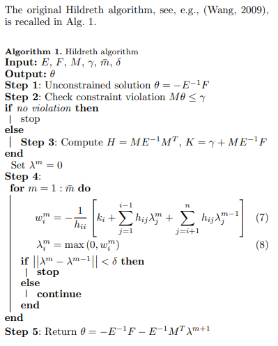
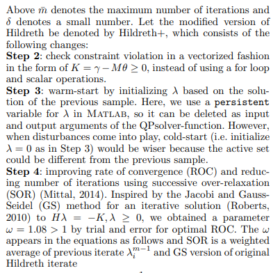
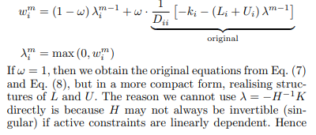
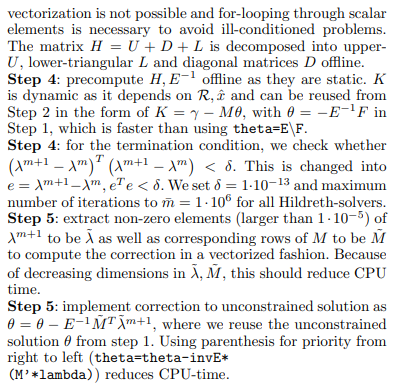
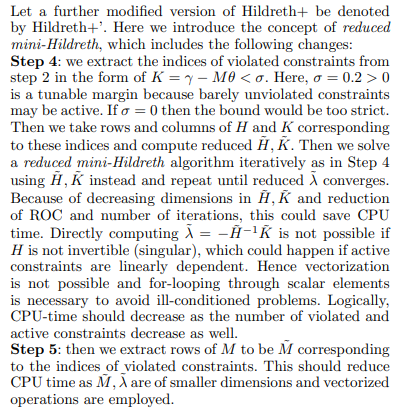

# 

# 4. MPC, Linear Diskrete with Disturbance Using Laguerre Polynoms and Constraints

## 4.1 Constraints on incremental input $\Delta u^{max}$, $\Delta u^{min}$

The idea is to to use all inputs and to put specific input w/o constraints to a very high value, so that it won't be limiting. In this way it is easier to programm

Minimum and maximum Constraints for one horizon step $j$

Eq4.1

$$
\begin{aligned}
\Delta u^{min} &\le \Delta u(k_i+j) \le \Delta u^{max}\\
\end{aligned}
$$

transformed to

Eq4.2

$$
\begin{aligned}
\Delta u(k_i+j) &\le \Delta u^{max}\\
-\Delta u(k_i+j) &\le -\Delta u^{min}\\
\end{aligned}
$$

with

Eq4.3

$$
\Delta u(k+j) = \begin{bmatrix}\Delta u_1(k+j)\\
                             \Delta u_2(k+j)\\
                             ...\\
                             \Delta u_m(k+j)\end{bmatrix}

$$

Eq4.4

$$
\Delta u^{max} = \begin{bmatrix}\Delta u_1^{max}\\
                             \Delta u_2^{max}\\
                             ...\\
                             \Delta u_m^{max}\end{bmatrix}
$$

$$
\Delta u^{min} = \begin{bmatrix}\Delta u_1^{min}\\
                             \Delta u_2^{min}\\
                             ...\\
                             \Delta u_m^{min}\end{bmatrix}
$$

gathered over control horizon $j=0...N_c-1$

Eq4.5

$$
\Delta U = \begin{bmatrix}\Delta u(k_i)\\
                          \Delta u(k_i+1)\\
                             ...\\
                             \Delta u(k_i+N_c+-1)\end{bmatrix}
$$

matrix form unequation

Eq4.6

$$
\begin{aligned}
M \cdot \Delta U &\le \gamma\\
\\
\begin{bmatrix}
M_-\\M_+
\end{bmatrix}\cdot \Delta U &\le 
\begin{bmatrix}
\gamma_-\\ \gamma_+
\end{bmatrix}
\end{aligned} 
$$

With left side

Eq.4.7

$$
\begin {aligned}
M_+ &= \begin{bmatrix}
I_k\\
&I_{k+1}\\
&&...\\
&&&I_{k+N_c-1}\\
\end{bmatrix}\\
M_- &= -M_+
\end{aligned}
$$

For inputs w/o limit the ones in $I_k$ could be set to zero
and right side

Eq 4.8

$$
\begin{aligned}
\gamma_+ &= 
\begin{bmatrix}
\Delta u^{max}\\
\Delta u^{max}\\
...\\
\Delta u^{max}
\end{bmatrix} (m\cdot N_c \times 1)\\
\gamma_- &=
\begin{bmatrix}
-\Delta u^{min}\\
-\Delta u^{min}\\
...\\
-\Delta u^{min}
\end{bmatrix} (m\cdot N_c \times 1)
\end{aligned}
$$

For inputs w/o limit the $\Delta u$ in $\gamma$ could be set to 1.

| variable                  | size                  | comment                                                                                |
| ------------------------- | --------------------- | -------------------------------------------------------------------------------------- |
| $I_{k+i}$ $i=0...(N_c-1)$ | $m\times m$           | Unit matrix, could also set partly to zero i no limitation is set for a specific input |
| $\gamma _-, \gamma_+$     | $m\cdot N_c \times 1$ |                                                                                        |

### 4.1.1 With Laguerre Coefficients

With **Laguerre Coefficients** for one prediction step j it changes to

Eq4.10

$$
\begin{aligned}
\begin{bmatrix}
\Delta u_1^{min}\\
\Delta u_2^{min}\\
...\\
\Delta u_m^{min}
\end{bmatrix} 
&\le
\begin{bmatrix}
L_1(j)^T\\
&L_2(j)^T\\
&&...\\
&&&L_m(j)^T
\end{bmatrix} \cdot \eta 
\le
\begin{bmatrix}
\Delta u_1^{max}\\
\Delta u_2^{max}\\
...\\
\Delta u_m^{max}
\end{bmatrix}\\
\\
\Delta u^{min} &\le M(j) \cdot \eta \le \Delta u^{max}\\
\\
M(j) &= 
\begin{bmatrix}
L_1(j)^T\\
&L_2(j)^T\\
&&...\\
&&&L_m(j)^T
\end{bmatrix}
\space(m\times (N_1+N_2+...+N_m))
\\
\eta &= 
  \begin{bmatrix}
    \eta_1\\
    \eta_2\\
    ...\\
    \eta_m
  \end{bmatrix}
\space((N_1+N_2+...+N_m)\times 1)
\\
\end{aligned}
$$

the matrix form of unequation changes to

Eq4.11

$$
\begin{aligned}
M \cdot \eta &\le \gamma\\
\\
\begin{bmatrix}
M_+\\M_-
\end{bmatrix}\cdot \eta &\le 
\begin{bmatrix}
\gamma_+\\ \gamma_-
\end{bmatrix}
\end{aligned} 
$$

For $M_+$ and $M_-$ it changes to

Eq4.11

$$
\begin{aligned}
M_+ &= 
\begin{bmatrix}
M(0)\\M(1)\\...\\M(N_c-1)
\end{bmatrix}\\
\\
M_- &= 
\begin{bmatrix}
-M(0)\\-M(1)\\...\\-M(N_c-1)
\end{bmatrix}\\

\end{aligned}
$$

| variable             | size                                   | comment |
| -------------------- | -------------------------------------- | ------- |
| $L_i(j)^T\\ i=1...m$ | $1\times N_i$                          |         |
| $M(j)$               | $m\times (N_1+N_2+...+N_m)$            |         |
| $M_+, M_-$           | $(m\cdot N_c)\times (N_1+N_2+...+N_m)$ |         |
| $\eta$               | $(N_1+N_2+...+N_m)\times 1$            |         |

## 4.2 Constraints on absolut input $u^{max}$,  $u^{min}$

Minimum and Maximum Constraints for one horizon step j

Eq12.1

$$
\begin{aligned}
u^{min} &\le u(k_i+j) \le u^{max}\\
\end{aligned}
$$

transformed to

Eq4.12.2

$$
\begin{aligned}
u(k_i) &\le u^{max}\\
u(k_i+1) &\le u^{max}\\
.\\
u(k_i+N_c-1) &\le u^{max}\\
\\
u(k_i+j) &= \begin{bmatrix}u_1(k+i)\\
\\
                             u_2(k+i)\\
                             ...\\
                             u_m(k+i)\end{bmatrix}\\
\\
u^{max} = \begin{bmatrix}u_1^{max}\\
                             u_2^{max}\\
                             ...\\
                             u_m^{max}\end{bmatrix}
\end{aligned}
$$

Minimum

Eq 4.13

$$
\begin{aligned}
u(k_i) &\ge u^{min}\\
u(k_i+1) &\ge u^{min}\\
.\\
u(k_i+i) &\ge u^{min}\\
.\\
u(k_i+N_c-1) &\ge u^{min}\\
\\
\\
-u(k_i) &\le -u^{min}\\
-u(k_i+1) &\le -u^{min}\\
.\\
-u(k_i+j) &\le -u^{min}\\
.\\
-u(k_i+N_c-1) &\le -u^{min}\\
\\
u^{min} = \begin{bmatrix}u_1^{min}\\
                             u_2^{min}\\
                             ...\\
                             u_m^{min}\end{bmatrix}
\end{aligned}
$$

rewrite $u(k_i+j)$

Eq4.14

$$
\begin{bmatrix}
u(k_i)\\
u(k_i+1)\\
...\\
u(k_i+N_c-1)
\end{bmatrix}
=
\begin{bmatrix}
I_{m\times m}\\
I_{m\times m}\\
...\\
I_{m\times m}\\

\end{bmatrix} \cdot u(k_i-1) + 
\begin{bmatrix}
I_{m\times m} & 0_{m\times m} & ...\\
I_{m\times m} & I_{m\times m} & 0_{m\times m} & ...\\
...\\
I_{m\times m} & I_{m\times m} & I_{m\times m} &  I_{m\times m} & ...
\end{bmatrix} \cdot
\begin{bmatrix}
\Delta u(k_i)\\
\Delta u(k_i+1)\\
...\\
\Delta u(k_i+N_c-1)
\end{bmatrix}
$$

with

$$
\begin{aligned}
-(C_1\cdot u(k_i-1)+C_2 \cdot \Delta U) &\le -U^{min}\\
C_1\cdot u(k_i-1)+C_2 \cdot \Delta U &\le U^{max}\\
\\
C_1 &=\begin{bmatrix}
I_{m\times m}\\
I_{m\times m}\\
...\\
I_{m\times m}\\

\end{bmatrix} (N_c\cdot m \times m)\\
\\
C_2 &= 
\begin{bmatrix}
I_{m\times m} & 0_{m\times m} & ...\\
I_{m\times m} & I_{m\times m} & 0_{m\times m} & ...\\
...\\
I_{m\times m} & I_{m\times m} & I_{m\times m} &  I_{m\times m} & ...
\end{bmatrix} 
\space (N_c\cdot m \times N_c\cdot m)
\\
\\
\Delta U &= \begin{bmatrix}\Delta u(k_i)\\
                          \Delta u(k_i+1)\\
                             ...\\
                             \Delta u(k_i+N_c+-1)\end{bmatrix}
(N_c\cdot m \times 1)
\\
\\
U^{min} &=\begin{bmatrix}
u_{min}\\
u_{min}\\
...\\
u_{min}\\

\end{bmatrix} (N_c\cdot m \times 1)\\
\\
U^{max} &= \begin{bmatrix}
u_{max}\\
u_{max}\\
...\\
u_{max}\\

\end{bmatrix} (N_c\cdot m \times 1)\\
\end{aligned}
$$

and

$$
\begin{aligned}
M \cdot \Delta U &\le \gamma\\
\\
\begin{bmatrix}
-C_2\\
C_2
\end{bmatrix} \cdot \Delta U &\le 
\begin{bmatrix}
-U^{min} + C_1\cdot u(k_i-1)\\
U^{max} - C_1\cdot u(k_i-1)
\end{bmatrix}\\
\\
M &= \begin{bmatrix}
-C_2\\
C_2
\end{bmatrix} \\
\\
\gamma &= \begin{bmatrix}
-U^{min} + C_1\cdot u(k_i-1)\\
U^{max} - C_1\cdot u(k_i-1)
\end{bmatrix}
\end{aligned}
$$

| variable                   | size                                 | comment |
| -------------------------- | ------------------------------------ | ------- |
| $-C_2,C_2$ $i=0...(N_c-1)$ | $N_c\cdot m\times N_c\cdot m$        | __      |
| $M$                        | $2\cdot N_c\cdot m\times N_c\cdot m$ |         |
| $-U^{min},U^{max}$         | $N_c\cdot m\times 1$                 |         |
| $C_1$                      | $m\cdot N_c \times m$                |         |
| $u(k_i-1)$                 | $m\times 1$                          |         |
| $\gamma _-, \gamma_+$      | $m\cdot N_c \times 1$                |         |
| $\gamma$                   | $2\cdot m\cdot N_c \times 1$         |         |
| $\Delta U$                 | $N_c\cdot m \times 1$                |         |

### 4.2.1 With Laguerre Coefficients

with Laguerre Coefficients $u(k_i+j)$ can be written as

$$
u(k_i+j)=u(k_i-1)+\sum_{i=0}^{j-1} \Delta u(i)
$$

with

$$
u(k+j) = 
\begin{bmatrix}
u_1(k+j)\\
u_2(k+j)\\
...\\
u_m(k+j)
\end{bmatrix}
$$

and

$$
\Delta u(i)= 
\begin{bmatrix}
\Delta u_1(i)\\
\Delta u_2(i)\\
...\\
\Delta u_m(i)
\end{bmatrix}
$$

For each Input:

$$
\begin{aligned}
u_1(k_i+j)&=u_1(k_i-1)+\sum_{i=0}^{j-1} L_1^T(i)\cdot \eta_1\\
u_2(k_i+j)&=u_2(k_i-1)+\sum_{i=0}^{j-1} L_2^T(i)\cdot \eta_2\\
...\\
u_m(k_i+j)&=u_m(k_i-1)+\sum_{i=0}^{j-1} L_m^T(i)\cdot \eta_m
\end{aligned}
$$

and gathered to

$$
\begin{aligned}
u(k+j) &= u(k-1) + P(k+j) \cdot \eta\\
\\
\eta &= 
\begin{bmatrix}
\eta_1\\ \eta_2\\...\\ \eta_m
\end{bmatrix}  (N \times 1 = (N_1+N_2+...+N_m)\times 1 )
\\
\\
P(k+j) &=
\begin{bmatrix}
\sum_{i=0}^{j-1} L_1^T(i) & 0_{1\times N_1} & ... & 0_{1\times N_1}\\
0_{1\times N_2} & \sum_{i=0}^{j-1} L_2^T(i) & ... & 0_{1\times N_2}\\
...\\
0_{1\times N_m} & 0_{1\times N_m} & ...  &\sum_{i=0}^{j-1} L_m^T(i)
\end{bmatrix} (m\times N)
\end{aligned}
$$

The contraint function is then

$$
\begin{bmatrix}
P(k)\\
P(k+1)\\
...\\
P(k+N_c-1)
\end{bmatrix} \cdot \eta \le
U^{max} -
\begin{bmatrix}
I_{m\times m}\\
I_{m\times m}\\
...\\
I_{m\times m}
\end{bmatrix} \cdot u(k_i-1)

$$

gathered to

$$
\begin{aligned}
-C_2 \cdot \eta &\le -U^{min} + C_1 \cdot u(k-1)\\
C_2 \cdot \eta &\le U^{max} - C_1 \cdot u(k-1)\\
\\
C_2 &= 
\begin{bmatrix}
P(k)\\
P(k+1)\\
...\\
P(k+N_c-1)
\end{bmatrix}  (N_{c}\cdot m \times N)
\\
C_1 &=
\begin{bmatrix}
I_{m\times m}\\
I_{m\times m}\\
...\\
I_{m\times m}
\end{bmatrix}  (N_c\cdot m \times m)
\end{aligned}
$$

or

$$
\begin{aligned}
M \cdot \eta &\le \gamma\\
\\
\begin{bmatrix}
-C_2\\
C_2
\end{bmatrix} \cdot \eta &\le 
\begin{bmatrix}
-U^{min} + C_1\cdot u(k-1)\\
U^{max} - C_1\cdot u(k-1)
\end{bmatrix}\\
\\
M &= \begin{bmatrix}
-C_2\\
C_2
\end{bmatrix} \\
\\
\gamma &= \begin{bmatrix}
-U^{min} + C_1\cdot u(k-1)\\
U^{max} - C_1\cdot u(k-1)
\end{bmatrix}
\end{aligned}
$$

| variable              | size                                 | comment |
| --------------------- | ------------------------------------ | ------- |
| $-C_2,C_2$            | $N_c\cdot m\times N$                 | _       |
| $M$                   | $2\cdot N_c\cdot m\times N_c\cdot m$ |         |
| $-U^{min},U^{max}$    | $N_c\cdot m\times 1$                 |         |
| $C_1$                 | $m\cdot N_c \times m$                |         |
| $u(k_i-1)$            | $m\times 1$                          |         |
| $\gamma _-, \gamma_+$ | $m\cdot N_c \times 1$                |         |
| $\gamma$              | $2\cdot m\cdot N_c \times 1$         |         |

## 

## 4.3 Output Constraints $y^{min}, y^{max}$

$$
\begin{aligned}
y^{min} &\le y(k_i+j) \le y^{max}\\
\end{aligned}
$$

$$
y(k_i+j) = \begin{bmatrix}y_1(k_i+j)\\
                          y_2(k_i+j)\\
                          ...\\
                          y_q(k_i+j) \end{bmatrix}\space
y^{min} = \begin{bmatrix}y^{min}_1\\
                         y^{min}_2\\
                         ...\\
                         y^{min}_q \end{bmatrix}\space
y^{max} = \begin{bmatrix}y^{max}_1\\
                         y^{max}_2\\
                         ...\\
                         y^{max}_q \end{bmatrix}
$$

Use of slag variable

$$
\begin{aligned}
y^{min}-s_v &\le y(k_i+j) \le y^{max}+s_v\\
\end{aligned}

$$

With output-equations Eq2.18:

$$
\begin{aligned}
  y(k_i+j|k_i) &= F(j) \cdot x_A(k_i) 
                + \Phi(j-1) \cdot \Delta U 
                + \Theta(j-1) \cdot \Delta V\\
F(j) &= C_A \cdot A_A^{j}\\
\Phi(j-1) &= 
\begin{bmatrix}
C_A \cdot A_A^{j-1}\cdot B_A & 
C_A \cdot A_A^{j-2}\cdot B_A &
... &
C_A\cdot A_A^0\cdot B_A &
0 &
... &
0
\end{bmatrix} \\
\Theta(j-1) &= 
\begin{bmatrix}
C_A \cdot A_A^{j-1}\cdot E_A & 
C_A \cdot A_A^{j-2}\cdot E_A &
... &
C_A\cdot A_A^0\cdot E_A &
0 &
... &
0
\end{bmatrix} \\
\Delta V &= 
\begin{bmatrix}
\Delta \nu(k_i) &
\Delta \nu(k_i+1) &
... &
\Delta \nu(k_i+N_c+-1)
\end{bmatrix}^T
\end{aligned}
$$

| variable        | size                  | comment |
| --------------- | --------------------- | ------- |
| $y(k_i+j\|k_i)$ | $q \times 1$          |         |
| $F(j)$          | $q\times n_A$         | _       |
| $\Phi(j-1)$     | $q\times m\cdot N_c$  |         |
| $\Theta(j-1)$   | $q\times m\cdot N_c$  |         |
| $\Delta V$      | $m\cdot N_c \times 1$ |         |

$$
\begin{aligned}
\Phi(j-1) \cdot \Delta U   &\le y_{max} - F(j)\cdot x_A(k_i) 
                                        - \Theta(j-1) \cdot \Delta V \\
-\Phi(j-1) \cdot \Delta U   &\le -y_{min} + F(j)\cdot x_A(k_i) 
                                          + \Theta(j-1) \cdot \Delta V \\
 \end{aligned}
$$

$$
\begin{aligned}
\begin{bmatrix}
\Phi(0)\\\Phi(1)\\..\\\Phi(N_c-1)
\end{bmatrix}
 \cdot \Delta U   &\le 
\begin{bmatrix}
I_{q\times q}\\ I_{q\times q}\\...\\I_{q\times q}
\end{bmatrix}
\cdot y_{max} - 
\begin{bmatrix}
F(1)\\ F(2)\\...\\F(N_c)
\end{bmatrix}
\cdot x_A(k_i) - 
\begin{bmatrix}
\Theta(0)\\\Theta(1)\\..\\\Theta(N_c-1)
\end{bmatrix}
 \cdot \Delta V 
\\
-\begin{bmatrix}
\Phi(0)\\\Phi(1)\\..\\\Phi(N_c-1)
\end{bmatrix}
 \cdot \Delta U   &\le 
-\begin{bmatrix}
I_{q\times q}\\ I_{q\times q}\\...\\I_{q\times q}
\end{bmatrix}
\cdot y_{min} + 
\begin{bmatrix}
F(1)\\ F(2)\\...\\F(N_c)
\end{bmatrix}
\cdot x_A(k_i) +
\begin{bmatrix}
\Theta(0)\\\Theta(1)\\..\\\Theta(N_c-1)
\end{bmatrix}
 \cdot \Delta V \\
 \end{aligned}
$$

$$
\begin{aligned}
M_{Phi} \cdot \Delta U   &\le 
D_1
\cdot y_{max} - 
D_2
\cdot x_A(k_i) - 
D_3
\cdot \Delta V = \gamma_+
\\
-M_{Phi}
 \cdot \Delta U   &\le 
-D_1
\cdot y_{min} + 
D_2
\cdot x_A(k_i) +
D_§
 \cdot \Delta V = \gamma_-
\\
M \cdot \Delta U &\le \gamma
 \end{aligned}
$$

$$
\begin{aligned}
M_{Phi} &= \begin{bmatrix}
\Phi(0)\\\Phi(1)\\..\\\Phi(N_c-1)
\end{bmatrix}
\\
D_1 &= \begin{bmatrix}
I_{q\times q}\\ I_{q\times q}\\...\\I_{q\times q}
\end{bmatrix}\\
D_2 &=
\begin{bmatrix}
F(1)\\ F(2)\\...\\F(N_c)
\end{bmatrix} \\
D_3 &= \begin{bmatrix}
\Theta(0)\\\Theta(1)\\..\\\Theta(N_c-1)
\end{bmatrix} \\
\\
M &= \begin{bmatrix}
M_{Phi}\\-M_{Phi}
\end{bmatrix} \\
\gamma &= \begin{bmatrix}
\gamma_+\\\gamma_-
\end{bmatrix}

\end{aligned}
$$

| variable    | size                                  | comment |
| ----------- | ------------------------------------- | ------- |
| $M_{theta}$ | $q\cdot N_c\times m\cdot N_c$         |         |
| $D_1$       | $q\cdot N_c\times q $                 | _       |
| $D_2$       | $q\cdot N_c\times n_A$                |         |
| $D_3$       | $q\cdot N_c\times m\cdot N_c$         |         |
| $M$         | $2 \cdot q\cdot N_c\times m\cdot N_c$ |         |
| $\gamma$    | $2 \cdot q\cdot N_c\times 1$          |         |

## 4.3.1 With Laguerre Coefficients

with Eq. 3.6

$$
\begin{aligned}
y_A(k_i+j|k_i) &= C_A \cdot A^j_A \cdot x_A(k_i) + C_A \cdot \phi(j)^T \cdot \eta\\
&+ \sum_{i=0}^{j-1} C_A \cdot A^{j-i-1}_A \cdot E_A \cdot \Delta \nu(k_i+j)\\
\\
\\
\phi(j)^T&=\sum_{i=0}^{j-1} A^{j-i-1}_A \cdot
\begin{bmatrix}
    B_1\cdot L_1(i)^T&
    B_2\cdot L_2(i)^T&
    ...&
    B_m\cdot L_m(i)^T
\end{bmatrix}
\end{aligned}
$$

we get 

$$
\begin{aligned}
y_A(k_i+j|k_i) &= 
F(j) \cdot x_A(k_i) + 
C_A \cdot \phi(j)^T \cdot \eta + 
\Theta(j-1) \cdot \Delta V\\
\\

\end{aligned}
$$

and

$$
\begin{aligned}
M_{phi} \cdot \eta   &\le 
D_1
\cdot y_{max} - 
D_2
\cdot x_A(k_i) - 
D_3
\cdot \Delta V = \gamma_+
\\
-M_{hi}
 \cdot \eta   &\le 
-D_1
\cdot y_{min} + 
D_2
\cdot x_A(k_i) +
D_§
 \cdot \Delta V = \gamma_-
\\
M \cdot \eta &\le \gamma
\end{aligned}
$$

and $M_{phi}$ can be written as

$$
\begin{aligned}
M_{phi} &= 
\begin{bmatrix}
C_A \cdot \phi(0)^T \\
C_A \cdot \phi(1)^T \\
... \\
C_A \cdot \phi(N_c-1)^T
\end{bmatrix}
\\
\\
M &= 
\begin{bmatrix}
M_{phi} \\ -M_{phi}
\end{bmatrix}
\end{aligned}
$$

------------------------------------------------------------------------------------

## Hildreth Quadratic Programming

The Approach is based on:

$$
\begin{aligned}
J &= { 1 \over 2 }\cdot x^T\cdot E\cdot x^T + x^T\cdot F\\
M\cdot x &\le \gamma
\end{aligned}
$$

The solution w/o constraints is

$$
x = - E^{-1}\cdot F
$$

Hildreth Programming Algorithm described by : 

Hast Hildreth based Model Predictive Control of Roll Angle for a Fixed-Wing UAV
V.T.T. Lam, A. Sattar, L. Wang, M. Lazar

IFAC PapersOnLine 53-2 (2020) 5757–5763

