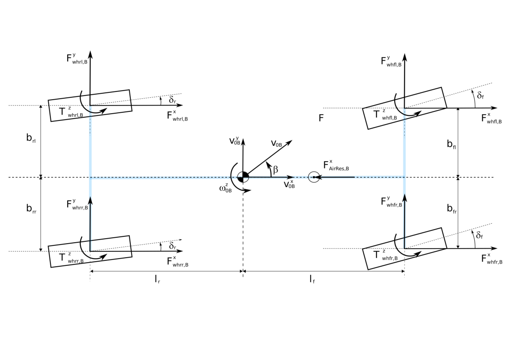
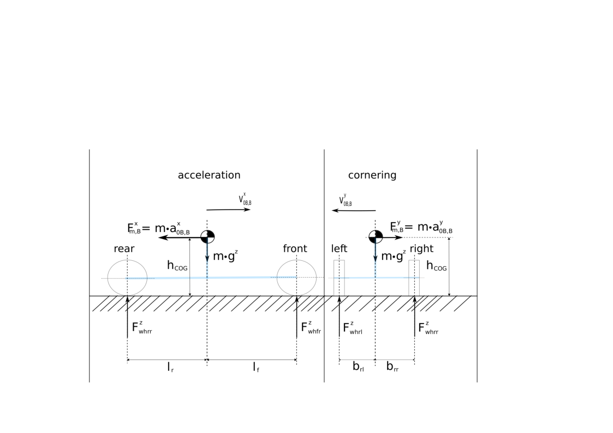

# Nonlinear Two Track Model Dynamic Horizontal Model (Part 1)

## 3. Dynamic Body Equations Horizontal Two Track Model

### 3.1 acceleration description in general

In inertia system we have translational and rotational acceleration
(equation 3.1):

$$
\begin{split}
    a_{0K,0} &= \frac{d}{dt} v_{0K,0}\\
    \alpha_{0K,0} &= \frac{d}{dt} \omega_{0K,0}
\end{split}

$$

(equation 3.2):

$$
\begin{split}
    a_{0K,B} &= A^T_{0B}\cdot a_{0K,0} = A^T_{0B}\cdot [\frac{d}{dt}(A_{0B}\cdot v_{0K,B})] \\
    &= A^T_{0B}\cdot[\dot{A}_{0B}\cdot v_{0K,B} + A_{0B}\cdot \dot{v}_{0K,B}]
\end{split}
$$

$$
\begin{split}
    A^T_{0B}\cdot A_{0B} &= E\\
    \dot{A}_{0B}\cdot v_{0K,B} &= \dot{A}_{0B}\cdot A^T_{0B}\cdot A_{0B}\cdot v_{0K,B}= \omega_{0B,0} \times v_{0K,0}\\
    A^T_{0B}\cdot (\omega_{0B,0} \times v_{BK,0}) &= \omega_{0B,B} \times v_{0K,B}
\end{split}
$$

(equation 3.3):

$$
a_{0K,B} = 
    \omega_{0B,B} \times v_{0K,B} + \dot{v}_{0K,B}
$$

From Equation (equation 2.7) we can derive
(equation 3.4):

$$
\dot{v}_{0K,B} = \dot{v}_{0B,B}+\dot{\omega}_{0B,B} \times r_{BK,B} + \omega_{0B,B}\times \dot{r}_{BK,B} + \ddot{r}_{BK,B}
$$

For the framework (body) we get with (equation 3.3) for K and B

$$
\begin{split}
 a_{0K,B} &= \dot{v}_{0B,B} +
 \dot{\omega}_{0B,B} \times r_{BK,B} + 
\omega_{0B,B}\times \dot{r}_{BK,B} + 
\ddot{r}_{BK,B} +
 \omega_{0B,B} \times v_{0K,B}\\
 a_{0B,B} &= \dot{v}_{0B,B} +\omega_{0B,B} \times v_{0B,B}
\end{split}
$$

Accordingly we get for rotational acceleration from (equation 3.1) for K
(equation 3.6):

$$
\begin{split}
    \alpha_{0K,B} &= \omega_{0B,B} \times \omega_{0K,B} +  \dot{\omega}_{0K,B}\\
    \dot{\omega}_{0K,B} &= \dot{\omega}_{0B,B} + \dot{\omega}_{BK,B}\\
    \alpha_{0K,B} &= \omega_{0B,B} \times \omega_{0K,B} + \dot{\omega}_{0B,B} + \dot{\omega}_{BK,B}
\end{split}
$$

And for B 
(equation 3.7):

$$
\alpha_{0B,B} = \dot{\omega}_{0B,B}
$$

### 3.2 dynamic equations in general

The Approach of Jourdain and D'Alembert is in inertia coordinates for
translational velocity and body coordinates for rotaional velocity
(better constant description of moment of inertia)
(equation 3.8):

$$
M(y)\cdot \dot{z} = q(y,z)
$$

(equation 3.9):

$$
\begin{split}
 M(y) &= \sum_{k=1}^{n} \Biggl\{\frac{\partial v_{0k,0}}{\partial z}^T\cdot m_k \cdot \frac{\partial v_{0k,0}}{\partial z}+\frac{\partial \omega_{0k,k}}{\partial z}^T\cdot T_{Sk,k} \cdot \frac{\partial \omega_{0k,k}}{\partial z}\Biggr\}\\
 q(y,z) &= \sum_{k=1}^{n} \Biggl\{ \frac{\partial v_{0k,0}}{\partial z}^T\cdot [F^e_{k,0}-m_k \cdot a^R_{0k,0} ] + \frac{\partial \omega_{0k,k}}{\partial z}^T \cdot [T^e_{Sk,k}-T_{Sk,k}\cdot \alpha^R_{0k,k}-\omega_{0k,k}\times T_{Sk,k}\cdot \omega_{0k,k}]\Biggr\}
\end{split}
$$

with additional transformation of translational velocity with
$E=A^T_{B0}\cdot A_{B0}$

(equation 3.10):

$$
\begin{split}
M(y) &= \sum_{k=1}^{n} \Biggl\{\frac{\partial v_{0k,k}}{\partial z}^T\cdot m_k \cdot \frac{\partial v_{0k,k}}{\partial z}+\frac{\partial \omega_{0k,k}}{\partial z}^T\cdot T_{Sk,k} \cdot \frac{\partial \omega_{0k,k}}{\partial z}\Biggr\}\\
q(y,z) &= \sum_{k=1}^{n} \Biggl\{ \frac{\partial v_{0k,k}}{\partial z}^T\cdot [F^e_{k,k}-m_k \cdot a^R_{0k,k} ] + \frac{\partial \omega_{0k,k}}{\partial z}^T \cdot [T^e_{Sk,k}-T_{Sk,k}\cdot \alpha^R_{0k,k}-\omega_{0k,k}\times T_{Sk,k}\cdot \omega_{0k,k}]\Biggr\}
\end{split}
$$

(equation 3.11):

The partial derivation of velocity is 

$$
\begin{split}
    \dot{v}_{0k,k} &= \frac{\partial v_{0k,k}(y,z)}{\partial z} \cdot \dot{z}+ \frac{\partial v_{0k,k}(y,z)}{\partial y} \cdot \dot{y}\\
    a^R_{0k,k} &= \frac{\partial v_{0k,k}(y,z)}{\partial y} \cdot \dot{y} = \frac{\partial v_{0k,k}(y,z)}{\partial y} \cdot K(y)\cdot z\\
    \dot{\omega}_{0k,k} &= \frac{\partial \omega_{0k,k}(y,z)}{\partial z} \cdot \dot{z}+ \frac{\partial \omega_{0k,k}(y,z)}{\partial y} \cdot \dot{y}\\
    \alpha^R_{0k,k} &= \frac{\partial \omega_{0k,k}(y,z)}{\partial y} \cdot \dot{y} = \frac{\partial \omega_{0k,k}(y,z)}{\partial y} \cdot K(y)\cdot z
\end{split}
$$

$a^R_{0k,k}$ and $\alpha^R_{0k,k}$ are so called rest acceleration.

### 3.3 dynamic equation horizontal model

Because of one mass (total mass m) the coordinate system of the body can
be set into the center of gravity (no movement of COG on the body) see
figure 3.1

figure 3.1: HorizontalModel2

Based on (equation 3.8) and (equation 3.10) we can write for the horizontal model:
(equation 3.12):

$$
z_F = 
\begin{bmatrix}   
v^x_{0B,B} \\ v^y_{0B,B} \\ \omega^z_{0B,B}
\end{bmatrix}
=
\begin{bmatrix}   
z_{F1} \\ z_{F2} \\ z_{F3}
\end{bmatrix}
$$

(equation 3.13):

$$
\begin{split}
 v_{0B,B} &= 
\begin{bmatrix}  
 v^x_{0B,B} \\ v^y_{0B,B} \\ 0
 \end{bmatrix}\\
 \omega_{0B,B} &= 
\begin{bmatrix}  
 0 \\ 0 \\ \omega^z_{0B,B}
 \end{bmatrix}
\end{split}
$$

(equation 3.14):

$$
\begin{split}
\frac{\partial v_{0B,B}}{\partial z_{F1}} &= \begin{bmatrix}1 \\ 0 \\ 0 \end{bmatrix}, \frac{\partial v_{0B,B}}{\partial z_{F2}} = \begin{bmatrix}0 \\ 1 \\ 0 \end{bmatrix},
\frac{\partial v_{0B,B}}{\partial z_{F3}} = \begin{bmatrix}0 \\ 0 \\ 0 \end{bmatrix}\\
\frac{\partial \omega_{0B,B}}{\partial z_{F1}} &= \begin{bmatrix}0 \\ 0 \\ 0 \end{bmatrix},
\frac{\partial \omega_{0B,B}}{\partial z_{F2}} = \begin{bmatrix}0 \\ 0 \\ 0 \end{bmatrix},
\frac{\partial \omega_{0B,B}}{\partial z_{F3}} = \begin{bmatrix}0 \\ 0 \\ 1 \end{bmatrix}
\end{split}
$$

From (equation 3.10) with (equation 3.14) the mass matrix $M(y)$ is:
(equation 3.15):

$$
M(y) = 
\begin{bmatrix}
m & 0 & 0 \\
 & m & 0 \\
0 & 0 & \Theta_z
\end{bmatrix}
$$

The forces $F^e_{k,k}$ can be written with (equation 3.3) (wh => wheel)

(equation 3.16):

$$
F^e = 
\begin{bmatrix}
F_{Fx}-F^x_{AirRes,B} \\
F_{Fy} \\
0
\end{bmatrix}
$$

(equation 3.17)

$$
\begin{split}
F_{Fx} &= F^x_{whfl,B}+F^x_{whfr,B}+F^x_{whrl,B}+F^x_{whrr,B} \\
F_{Fy} &= F^y_{whfl,B}+F^y_{whfr,B}+F^y_{whrl,B}+F^y_{whrr,B}
\end{split}
$$

The air resistance is described by

(equation 3.18):

$$
\begin{split}
F^x_{AirRes,B} &= C^{x}_w \cdot (v^x_{0B,B})^2 \\
C^{x}_w &= \frac{1}{2}\cdot c^x_w \cdot A^x \cdot \rho_{air}
\end{split}

$$

To get the rest acceleration we can compare (equation 3.5) and (equation 3.11)

(equation 3.19):

$$
\begin{split}
\frac{\partial v_{0B,B}(y,z)}{\partial z} \cdot \dot{z} &= \dot{v}_{0B,B}\\
a^R_{0B,B}  = \frac{\partial v_{0B,B}(y,z)}{\partial y} \cdot \dot{y} &= \omega_{0B,B} \times v_{0B,B} = \begin{bmatrix} -\omega^z_{0B}\cdot v^y_{0B}\\\omega^z_{0B}\cdot v^x_{0B} \\0 \end{bmatrix}
\end{split}
$$

The torques $T^e_{Sk,k}$ operate on COG can be written with (equation 3.3) (wh => wheel) 
(equation 3.20):

$$
T^e = \begin{bmatrix}
 0 \\
 0 \\
 T_{Tz} + T_{Fx} + T_{Fy}
 \end{bmatrix}\\

$$

(equation 3.21):

$$
\begin{split}
T_{Tz} &= T^z_{whfl,B}+T^z_{whfr,B}+T^z_{whrl,B}+T^z_{whrr,B}\\
T_{Fx} &= -F^x_{whfl,B}\cdot b_{fl} +F^x_{whfr,B}\cdot b_{fr}-F^x_{whrl,B}\cdot b_{rl}+F^x_{whrr,B}\cdot b_{rr}\\
T_{Fy} &= (F^y_{whfl,B}+F^y_{whfr,B})\cdot l_{f}-(F^y_{whrl,B}+F^y_{whrr,B})\cdot l_{r}
\end{split}
$$

To get the rest rotational acceleration we can compare (equation 3.7) with (equation 3.11)

(equation 3.22):

$$
\begin{split}
\alpha^R_{0k,k} &= \begin{bmatrix}0\\0\\0 \end{bmatrix}
\end{split}
$$

The gyroscopic movement $ $ is $\omega_{0k,k}\times T_{Sk,k}\cdot \omega_{0k,k}$ is

(equation 3.23):

$$
\omega_{0B}\times T_{SB}\cdot \omega_{0B} = 
\begin{bmatrix}
0\\0\\\omega^z_{0B} 
\end{bmatrix} \times
\begin{bmatrix}
0\\0\\ \Theta_z \cdot \omega^z_{0B} 
\end{bmatrix} = 
\begin{bmatrix}0\\0\\0\end{bmatrix}
$$

$q(y,z)$ can be written as

(equation 3.24):

$$
q(y,z) = 
\begin{bmatrix}
Q_1\\Q_2\\Q_3
\end{bmatrix} =
\begin{bmatrix}
F_{Fx}-F^x_{AirRes,B}+m\cdot\omega^z_{0B}\cdot v^y_{0B}\\F_{Fy}-m\cdot \omega^z_{0B}\cdot v^x_{0B}\\T_{Tz} + T_{Fx} + T_{Fy}
\end{bmatrix}
$$

Equation (equation 3.12), (equation 3.15) and (eqaution 3.24) can be
written as

(equation 3.25):

$$
\begin{split}
\dot{v}^x_{0B,B} 
&=\frac{1}{m} \cdot \{F_{Fx}-F^x_{AirRes,B}+m\cdot\omega^z_{0B}\cdot v^y_{0B}\}\\
\dot{v}^y_{0B,B} 
&=\frac{1}{m} \cdot \{F_{Fy}-m\cdot\omega^z_{0B}\cdot v^x_{0B}\}\\
\dot{\omega}^z_{0B,B} 
&=\frac{1}{\Theta_z} \cdot \{T_{Tz} + T_{Fx} + T_{Fy}\}
\end{split}
$$

velocity and slip angle are:

(equation 3.26):

$$
\begin{split}
v_B &=\sqrt{(v^x_{0B,B})^2 + (v^y_{0B,B})^2 }\\
tan(\beta) &=\frac{v^y_{0B,B}}{v^x_{0B,B}}
\end{split}
$$

Description of variables:

| states            | c code name     | unit     | comment                                                  |
| ----------------- | --------------- | -------- | -------------------------------------------------------- |
| $v^x_{0B,B}$      | vx_0BB          | m/s      | horizontal velocity in x-direction body                  |
| $v^y_{0B,B}$      | vy_0BB          | m/s      | horizontal velocity in y-direction body                  |
| $\omega^z_{0B,B}$ | omegaz_0BB      | rad/s    | yaw rate body                                            |
| $\beta$           | beta_veh        | rad      | side slip angle in center of gravity                     |
| $v_{0B}$          | v_0B            | m/s      | velocity                                                 |
| input             |                 |          |                                                          |
|                   | $i=fl,fr,rl,rr$ |          |                                                          |
| $F^x_{whi,B}$     | Fx_whi_B        | N        | longitudinal force wheel in body coordinates             |
| $F^y_{whi,B}$     | Fy_whi_B        | N        | lateral Force wheel in body coordinates                  |
| $T^z_{whi,B}$     | Tz_whi_B        | Nm       | torque around vertical axis of wheel in body coordinates |
| $F^x_{AirRes,B}$  | Fx_airres_B     | N        | air resistance                                           |
| parameter         |                 |          |                                                          |
| m                 | m_veh           | kg       | vehicle mass                                             |
| $\Theta_z$        | thetaz_veh      | kg m\*m  | moment of inertia around vertical axis                   |
| $c^x_w$           | cx_w\_veh       | -        | resistance factor                                        |
| $A^x$             | Ax_veh          | m\*m     | projected area in x-Direction vehicle                    |
| $\rho_{air}$      | rho_air         | kg/m/m/m | density air                                              |

### 3.4 connection body to wheel

figure 3.2: WheelModel, wheel forces, velocities and orque distribution

#### 3.4.1 velocity transformation body to wheel in wheel coordinates

velocties in body coordinates at the wheels are: $i=f,r; j=l,r$
(equation 3.27):

$$
\begin{split}
v_{whij,B} &=v_{0B} + \omega_{0B} \times r_{COGwhij,B}\\
\begin{bmatrix}v^x_{whij,B}\\v^y_{whij,B}\\0\end{bmatrix} &= 
\begin{bmatrix}v^x_{0B}-\omega^z_{0B}\cdot r^y_{COGwhij,B}\\v^y_{0B}+\omega^z_{0B}\cdot r^x_{COGwhij,B}\\0\end{bmatrix}\\
A^B_{whij} &= 
\begin{bmatrix} 1&0&-r^y_{COGwhij,B}\\
                 0&1&r^x_{COGwhij,B}
\end{bmatrix}\\
\begin{bmatrix}v^x_{whij,B}\\v^y_{whij,B}\end{bmatrix} &= 
A^B_{whij} \cdot \begin{bmatrix}v^x_{0B,B}\\v^y_{0B,B}\\\omega^z_{0b,B}\end{bmatrix}
\\
\\
r_{COGwhfl,B} &= \begin{bmatrix}l_{f}\\b_{fl}\\0\end{bmatrix}\\
r_{COGwhfr,B} &= \begin{bmatrix}l_{f}\\-b_{fr}\\0\end{bmatrix}\\
r_{COGwhrl,B} &= \begin{bmatrix}-l_{r}\\b_{rl}\\0\end{bmatrix}\\
r_{COGwhrr,B} &= \begin{bmatrix}-l_{r}\\-b_{rr}\\0\end{bmatrix}
\end{split}
$$

velocties in wheel coordinates are: $i=f,r; j=l,r$
(equation 3.28):

$$
\begin{split}
\begin{bmatrix}v^L_{whij}\\v^S_{whij}\end{bmatrix} &= 
\begin{bmatrix}\cos(\delta_{i}) & \sin(\delta_{i}) \\-\sin(\delta_{i}) & \cos(\delta_{i})\end{bmatrix}
\cdot \begin{bmatrix}v^x_{whij,B}\\v^y_{whij,B}\end{bmatrix}\\
A^\delta_{whij} &= \begin{bmatrix}\cos(\delta_{i}) & \sin(\delta_{i}) \\-\sin(\delta_{i}) & \cos(\delta_{i})\end{bmatrix}\\
\begin{bmatrix}v^L_{whij}\\v^S_{whij}\end{bmatrix} &= 
A^\delta_{whij} \cdot \begin{bmatrix}v^x_{whij,B}\\v^y_{whij,B}\end{bmatrix}\\
\end{split}
$$

With merging (equation 3.27) and (equation 3.28)
(equation 3.29):

$$
\begin{split}
A_{whij} &= A^\delta_{whij} \cdot A^B_{whij}\\
A_{whij} &= \begin{bmatrix}
\cos(\delta_{i}) & \sin(\delta_{i}) &  \left(-\cos(\delta_{i})\cdot r^y_{COGwhij,B}+sin(\delta_{i})\cdot r^x_{COGwhij,B}\right)\\
-\sin(\delta_{i}) & \cos(\delta_{i}) & \left(sin(\delta_{i})\cdot r^y_{COGwhij,B}+\cos(\delta_{i})\cdot r^x_{COGwhij,B}\right)
\end{bmatrix}\\
\begin{bmatrix}v^L_{whij}\\v^S_{whij}\end{bmatrix} &= 
A_{whij} \cdot \begin{bmatrix}v^x_{0B,B}\\v^y_{0B,B}\\\omega^z_{0b,B}\end{bmatrix}
\end{split}
$$

The partial derivations are:\
(equation 3.30):

$$
\begin{split}
\frac{ \partial v^L_{whij} }{ \partial v^x_{0B,B} } &= \cos(\delta_{i})\\
\frac{ \partial v^S_{whij} }{ \partial v^x_{0B,B} } &= -\sin(\delta_{i})\\
\frac{ \partial v^L_{whij} }{ \partial v^y_{0B,B} } &= \sin(\delta_{i})\\
\frac{ \partial v^S_{whij} }{ \partial v^y_{0B,B} } &= \cos(\delta_{i})\\
\frac{ \partial v^L_{whij} }{ \partial \omega^z_{0b,B} } &= -\cos(\delta_{i})\cdot r^y_{COGwhij,B}+sin(\delta_{i})\cdot r^x_{COGwhij,B}\\
\frac{ \partial v^S_{whij} }{ \partial \omega^z_{0b,B} } &= sin(\delta_{i})\cdot r^y_{COGwhij,B}+\cos(\delta_{i})\cdot r^x_{COGwhij,B}
\end{split}
$$

Description of variables:

| output          | c-code name      | unit | comment                                          |
| --------------- | ---------------- | ---- | ------------------------------------------------ |
|                 | $ij=fl,fr,rl,rr$ |      |                                                  |
| $v^x_{whij,B}$  | vx_whijB         | m/s  | velocity at wheel in body coordinates x-dir      |
| $v^y_{whij,B}$  | vy_whijB         | m/s  | velocity at wheel in body coordinates y-dir      |
| $v^L_{whij}$    | vL_whij          | m/s  | wheel velocity longitudinal in rolling direction |
| $v^S_{whij}$    | vS_whij          | m/s  | wheel velocity lateral in side slip direction    |
| input           |                  |      |                                                  |
| $r_{COGwhij,B}$ | r_COGwhij        | m    | position vector from COG to ij-wheel             |
| $\delta_{i}$    | delta_whi        | rad  | steer angle at wheel front or rear               |

#### 3.4.2 force transformation from wheel coordinates into body coordinates

forces in body coordinates are: $i=f,r; j=l,r$
(equation 3.31):

$$
\begin{bmatrix}F^x_{whij,B}\\F^y_{whij,B}\\T^z_{whij,B}\end{bmatrix} = 
\begin{bmatrix}\cos(\delta_{i}) & -\sin(\delta_{i}) & 0 \\ \sin(\delta_{i}) & \cos(\delta_{i}) & 0 \\ 0 & 0 & 1\end{bmatrix}
\cdot \begin{bmatrix}F^x_{whij,wh}\\F^y_{whij,wh}\\T^z_{whij,wh}\end{bmatrix}
$$

$$
\begin{split}
A_{whij} &= 
\begin{bmatrix}\cos(\delta_{i}) & -\sin(\delta_{i}) & 0 \\ \sin(\delta_{i}) & \cos(\delta_{i}) & 0 \\ 0 & 0 & 1\end{bmatrix}\\
\begin{bmatrix}F^x_{whij,B}\\F^y_{whij,B}\\T^z_{whij,B}\end{bmatrix} &= 
A_{whij} \cdot \begin{bmatrix}F^x_{whij,wh}\\F^y_{whij,wh}\\T^z_{whij,wh}\end{bmatrix}
\end{split}
$$

Description of variables:

| output          | c-code name      | unit | comment                                      |
| --------------- | ---------------- | ---- | -------------------------------------------- |
|                 | $ij=fl,fr,rl,rr$ |      |                                              |
| $F^x_{whij,B}$  | Fx_whij_B        | N    | wheel force x-dir in body coordinates        |
| $F^y_{whij,B}$  | Fy_whij_B        | N    | wheel force y-dir in body coordinates        |
| $T^z_{whij,B}$  | Mz_whij_B        | Nm   | wheel torque z-dir                           |
| input           |                  |      |                                              |
| $F^x_{whij,wh}$ | Fy_whij_wh       | N    | tyre forces longitudinal on wheel            |
| $F^y_{whij,wh}$ | Fx_whij_wh       | N    | tyre forces from Slide slip lateral on wheel |
| $T^z_{whij,wh}$ | Tz_whij_wh       | Nm   | tyre self aligning torque                    |

#### 3.4.3 wheel vertical force

For calculating the tyre forces the vertical forces on the tyre are
needed. They are not based on deflection and spring calculation, but
calculated from gravity, longitudibnal and lateral acceleration

figure 3.3 vertical wheel forces, based on accelerations and gravity

Only with gravity we can calculate by torque around rear axle / front
axle 

(equation 3.33):

$$
\begin{split}
F^z_{whvl}+F^z_{whvr} &= m \cdot g^z \cdot \frac{l_r}{(l_f+l_r)}\\
F^z_{whrl}+F^z_{whrr} &= m \cdot g^z \cdot \frac{l_f}{(l_f+l_r)}
\end{split}

$$

$$
\begin{split}
F^z_{whfl} &= m \cdot g^z \cdot \frac{l_r}{(l_f+l_r)} \cdot \frac{b_{fr}}{(b_{fl}+b_{fr})}\\
F^z_{whfr} &= m \cdot g^z \cdot \frac{l_r}{(l_f+l_r)} \cdot \frac{b_{fl}}{(b_{fl}+b_{fr})}\\
F^z_{whrl} &= m \cdot g^z \cdot \frac{l_f}{(l_f+l_r)} \cdot \frac{b_{rr}}{(b_{rl}+b_{rr})}\\
F^z_{whrr} &= m \cdot g^z \cdot \frac{l_f}{(l_f+l_r)} \cdot \frac{b_{rl}}{(b_{rl}+b_{rr})}\\
\sum_{ij=fl,fr,rl,rr} F^z_{whij} &= m \cdot g^z
\end{split}
$$

Together with acceleration we reduce load on front axle and increase on
rear axle 
(equation 3.34):

$$
\begin{split}
F^z_{whvl}+F^z_{whvr} &= m\cdot \frac{g^z \cdot l_r - a^x_{0B,B} \cdot h_{COG}}{(l_f+l_r)} \\
F^z_{whrl}+F^z_{whrr} &= m\cdot \frac{g^z \cdot l_f + a^x_{0B,B} \cdot h_{COG}}{(l_f+l_r)} 
\end{split}
$$

$$
\begin{split}
F^z_{whfl} &= m\cdot \frac{g^z \cdot l_r - a^x_{0B,B} \cdot h_{COG}}{(l_f+l_r)} \cdot \frac{b_{fr}}{(b_{fl}+b_{fr})}\\
F^z_{whfr} &= m\cdot \frac{g^z \cdot l_r - a^x_{0B,B} \cdot h_{COG}}{(l_f+l_r)} \cdot \frac{b_{fl}}{(b_{fl}+b_{fr})}\\
F^z_{whrl} &= m\cdot \frac{g^z \cdot l_f + a^x_{0B,B} \cdot h_{COG}}{(l_f+l_r)} \cdot \frac{b_{rr}}{(b_{rl}+b_{rr})}\\
F^z_{whrr} &= m\cdot \frac{g^z \cdot l_f + a^x_{0B,B} \cdot h_{COG}}{(l_f+l_r)} \cdot \frac{b_{rl}}{(b_{rl}+b_{rr})}
\end{split}
$$

When only lateral acceleration is acting the assumpion can be done:

$$
\begin{split}
F^z_{ay,whfl} \cdot (b_{fl}+b_{fr})+F^z_{ay,whrl} \cdot (b_{rl}+b_{rr}) 
&= -m\cdot a^y_{0B,B}\cdot h_{COG} \\

F^z_{ay,whfr} \cdot (b_{fl}+b_{fr})+F^z_{ay,whrr} \cdot (b_{rl}+b_{rr}) 
&= +m\cdot a^y_{0B,B}\cdot h_{COG} \\

F^z_{ay,whfl} \cdot l_f &= F^z_{ay,whrl}\cdot l_r \\

F^z_{ay,whfr} \cdot l_f &= F^z_{ay,whrr}\cdot l_r 
\end{split}

$$

This leads to
(equation 3.35):

$$
\begin{split}
F^z_{ay,whfl} &= -m\cdot a^y_{0B,B} \cdot h_{COG} \cdot \frac{l_{r}}{(b_{fl}+b_{fr})\cdot l_r+(b_{rl}+b_{rr})\cdot l_f}\\
F^z_{ay,whfr} &= +m\cdot a^y_{0B,B} \cdot h_{COG} \cdot \frac{l_{r}}{(b_{fl}+b_{fr})\cdot l_r+(b_{rl}+b_{rr})\cdot l_f}\\
F^z_{ay,whrl} &= -m\cdot a^y_{0B,B} \cdot h_{COG} \cdot \frac{l_{f}}{(b_{fl}+b_{fr})\cdot l_r+(b_{rl}+b_{rr})\cdot l_f}\\
F^z_{ay,whrr} &= +m\cdot a^y_{0B,B} \cdot h_{COG} \cdot \frac{l_{f}}{(b_{fl}+b_{fr})\cdot l_r+(b_{rl}+b_{rr})\cdot l_f}\\
\sum_{ij=fl,fr,rl,rr} F^z_{ay,whij} &= 0
\end{split}
$$

The portion of lateral acceleration can be added to the first (gravity
and longitudinal) 
(equation 3.36):

$$
\begin{split}
F^z_{whfl} &= m\cdot \Biggl\{ \frac{g^z \cdot l_r - a^x_{0B,B} \cdot h_{COG}}{(l_f+l_r)} \cdot \frac{b_{fr}}{(b_{fl}+b_{fr})} -\frac{ a^y_{0B,B} \cdot h_{COG} \cdot l_{r}}{(b_{fl}+b_{fr})\cdot l_r+(b_{rl}+b_{rr})\cdot l_f} \Biggr\}\\
F^z_{whfr} &= m\cdot  \Biggl\{\frac{g^z \cdot l_r - a^x_{0B,B} \cdot h_{COG}}{(l_f+l_r)} \cdot \frac{b_{fl}}{(b_{fl}+b_{fr})} +\frac{ a^y_{0B,B} \cdot h_{COG} \cdot l_{r}}{(b_{fl}+b_{fr})\cdot l_r+(b_{rl}+b_{rr})\cdot l_f} \Biggr\}\\
F^z_{whrl} &=  m\cdot  \Biggl\{\frac{g^z \cdot l_f + a^x_{0B,B} \cdot h_{COG}}{(l_f+l_r)} \cdot \frac{b_{rr}}{(b_{rl}+b_{rr})} -\frac{ a^y_{0B,B} \cdot h_{COG} \cdot l_{f}}{(b_{fl}+b_{fr})\cdot l_r+(b_{rl}+b_{rr})\cdot l_f} \Biggr\}\\
F^z_{whrr} &=  m\cdot  \Biggl\{\frac{g^z \cdot l_f + a^x_{0B,B} \cdot h_{COG}}{(l_f+l_r)} \cdot \frac{b_{rl}}{(b_{rl}+b_{rr})} +\frac{ a^y_{0B,B} \cdot h_{COG} \cdot l_{f}}{(b_{fl}+b_{fr})\cdot l_r+(b_{rl}+b_{rr})\cdot l_f} \Biggr\}
\end{split}
$$

Description of variables:

| input          | c code name      | unit  | comment                                      |
| -------------- | ---------------- | ----- | -------------------------------------------- |
| $a^{x}_{0B,B}$ | ax_0BB           | m/s/s | long acceleration in Body coordinates        |
| $a^{y}_{0B,B}$ | ay_0BB           | m/s/s | lat acceleration in Body coordinates         |
| output         |                  |       |                                              |
|                | $ij=fl,fr,rl,rr$ |       |                                              |
| $F^{z}_{whij}$ | Fz_whij          | rad/s | spinning velocity wheel                      |
| parameter      |                  |       |                                              |
| $g{^z}$        | gravity          | m/s/s | gravity (9.81)                               |
| $l_{f}$        | lf_veh           | m     | long distance vehicle from COG to front axle |
| $l_{r}$        | lr_veh           | m     | long distance vehicle from COG to rear axle  |
| $b_{fl}$       | bfl_veh          | m     | lat distance from COG to front left wheel    |
| $b_{fr}$       | bfr_veh          | m     | lat distance from COG to front right wheel   |
| $b_{rl}$       | brl_veh          | m     | lat distance from COG to rear left wheel     |
| $b_{rr}$       | brr_veh          | m     | lat distance from COG to rear right wheel    |
| $h_{COG}$      | hcog_veh         | m     | height of COG from bottom                    |

## 4. dynamic equations wheel dynamics

### 4.1 dynamic equations wheel spinning

figure 4.1 torque at the wheel plane

(equation 4.1):

$ij=fl,fr,rl,rr$ 

$$
\dot{\Omega}_{ij}^{wh} = \frac{1}{\Theta_{ij}^{wh}} \cdot ( T^{trans}_{ij} + T^y_{wh,ij} - T^{brake}_{ij} )
$$

Description of variables:

| states             | c code name      | unit    | comment                                                                             |
| ------------------ | ---------------- | ------- | ----------------------------------------------------------------------------------- |
|                    | $ij=fl,fr,rl,rr$ |         |                                                                                     |
| $\Omega^{wh}_{ij}$ | omega_wh_ij      | rad/s   | spinning velocity wheel                                                             |
| input              |                  |         |                                                                                     |
| $T^{trans}_{ij}$   | Ttrans_ij        | Nm      | transmission torque                                                                 |
| $T^{brake}_{ij}$   | Tbrake_ij        | Nm      | transmission torque                                                                 |
| $T^y_{whij,wh}$    | Ty_whij_wh       | Nm      | torque acting on spinning wheel including longitudinal force and rolling resistance |
| parameter          |                  |         |                                                                                     |
| $\Theta_{ij}^{wh}$ | theta_wh_ij      | kg m\*m | moment of inertia spinning wheel                                                    |

### tyre forces and torques

figure 4.2: tyre forces and torques

Based on an approach from Prof Rill (see R.T. Uil, master thesis "Tyre
models for steady-state vehicle handling analysis"). The description is
for one wheel/tyre and is not notified by index $ij=fl,fr,rl,rr$

The tyre forces acting on wheel axle can be written in wheel coordinates
as: 
(equation 4.2):

$$
\begin{split}
F_{whij,wh} &= F^L_{tyre,ij}\cdot e^x_{whij} + F^S_{tyre,ij}\cdot e^y_{whij}+F^z_{wh,ij}\cdot e^z_{whij}\\
F_{whij,wh} &= \begin{bmatrix}
               F^x_{whij,wh}\\F^y_{whij,wh}\\F^z_{whij,wh}  
               \end{bmatrix}
             = \begin{bmatrix}
               F^L_{tyre.ij}\\F^S_{tyre.ij}\\F^z_{wh.ij}    
\end{bmatrix}
\end{split}
$$

Where $F^L_{tyre.ij}$ the longitudinal tyre force and $F^S_{tyre.ij}$ the lateral tyre force is. The vertical force is just used for tyre force calculation. It has no direct influence on the
horizontal model. The torque could be written as: 
(equation 4.3):

$$
\begin{split}
T_{whij,wh} &= T^R_{tyre,ij} \cdot e^y_{whij} + (T^A_{tyre,ij}+T^T_{tyre,ij})\cdot e^z_{whij} + r_{MP,ij} \times 
\begin{bmatrix}
F^L_{tyre,ij} \\
F^S_{tyre.ij} \\
0
\end{bmatrix}\\
r_{MPij,wh} &= \begin{bmatrix}
 0\\0\\-R^{dyn}_{ij} 
\end{bmatrix}\\
T_{whij,wh} &= \begin{bmatrix}
 T^x_{whij,wh}\\T^y_{whij,wh}\\T^z_{whij,wh}  
 \end{bmatrix} =
 \begin{bmatrix}
 R^{dyn}_{ij}\cdot F^S_{tyre,ij} \\
 T^R_{tyre,ij}-R^{dyn}_{ij}\cdot F^L_{tyre,ij} \\
 T^A_{tyre,ij}+T^T_{tyre,ij}
 \end{bmatrix}
\end{split}
$$

$T^R_{tyre.ij}$ is the rolling resistance acting in positive spinning
direction, $T^A_{tyre.ij}$ is the align torque based on a pneumatic
trail, $T^T_{tyre.ij}$ is the turn torque (bore torque) which gives an
restistance torque according to the vertical turning ($\dot{\delta}_i$)
and $r_{MP,ij}$ is the position vector from middle wheel to contact
patch. $T^x_{wh,ij}$ has no influnce on the horizontal model,
$T^y_{wh,ij}$ is the tyre torque acting on the spinning wheel and
$T^z_{wh,ij}$ is the vertical torque acting on the horizontal model

| output          |                  |     |                                                                                               |
| --------------- | ---------------- | --- | --------------------------------------------------------------------------------------------- |
|                 | $ij=fl,fr,rl,rr$ |     |                                                                                               |
| $F^x_{whij,wh}$ | Fx_whij_wh       | N   | Wheel force in x-direction in wheel coordinates                                               |
| $F^y_{whij,wh}$ | Fy_whij_wh       | N   | Wheel force in y-direction in wheel coordinates                                               |
| $F^z_{whij,wh}$ | Fz_whij_wh       | N   | Wheel force in z-direction in wheel coordinates                                               |
| $F^L_{tyreij}$  | FL_tyreij_wh     | N   | Tyre long force                                                                               |
| $F^S_{tyreij}$  | FS_tyreij        | N   | Tyre side force                                                                               |
| $T^x_{whij,wh}$ | Tx_whij_wh       | Nm  | Wheel torque around x-axis in wheel coordinates                                               |
| $T^y_{whij,wh}$ | Ty_whij_wh       | Nm  | Wheel torque around y-axis in wheel coordinates                                               |
| $T^z_{whij,wh}$ | Tz_whij_wh       | Nm  | Wheel torque around z-axis in wheel coordinates                                               |
| $T^R_{tyre,ij}$ | TR_tyre_ij       | Nm  | rolling resistance acting in positive spinning direction                                      |
| $T^A_{tyre,ij}$ | TA_tyre_ij       | Nm  | the align torque based on a pneumatic trail                                                   |
| $T^T_{tyre,ij}$ | TT_tyre_ij       |     | turn torque (bore torque) which gives an restistance torque according to the vertical turning |
| parameter       |                  |     |                                                                                               |
| $R^{dyn}_{ij}$  | Rdyn_ij          | m   | dynamic wheel radius                                                                          |

### slip

The slip is defined with diff velocity between longitudinal velocity of
the wheel and its spinning velocity in contact point:

$$
\Delta v^L = v^L_{wh} - R_{dyn}\cdot \Omega
$$

longitudinal and lateral slip is defined 

(equation 4.4):

$$
\begin{split}
s^L &= \frac{-\Delta v^L}{v^L_{wh} + \vert \Delta v^L \vert}\\
s^S &= \frac{-v^S_{wh}}{v^L_{wh} + \vert \Delta v^L \vert}
\end{split}
$$

normalisied slip with a small addional velocity $v_N$  in denominator for
avoiding singularity 

(equation 4.5):

$$
\begin{split}
s^L_{N} &= \frac{s^L}{\hat{s}^L} = \frac{-\Delta v^L}{(v^L_{wh} + \vert \Delta v^L \vert)\cdot \hat{s}^L + v_N}\\
s^S_{N} &= \frac{s^S}{\hat{s}^S} = \frac{-v^S_{wh}}{(v^L_{wh} + \vert \Delta v^L \vert)\cdot \hat{s}^S + v_N}\\
\hat{s}^L &= \frac{F^L_{Max}}{dF^L_0}\\
\hat{s}^S &= \frac{F^S_{Max}}{dF^S_0}\\
s^N &= \sqrt{(s^L_{N})^2+(s^S_{N})^2}
\end{split}
$$

 Where $s^N$ is the generalised slip coefficient. The
normalisation factors $\hat{s}^L$ and $\hat{s}^S$ are calculated from
the location of the maxima $s^L_{Max}$,$s^S_{Max}$, the maximum values
$F^L_{Max}$, $F^S_{Max}$ and the initial inclinations $dF^L_0$, $dF^S_0$.

| output            |                  |     |                                                                    |
| ----------------- | ---------------- | --- | ------------------------------------------------------------------ |
|                   | $ij=fl,fr,rl,rr$ |     |                                                                    |
| $\Delta v^L_{ij}$ | deltavL_ij       | m/s | velocity difference of spinning and long velocity in contact point |
| $s^L_{ij}$        | slipL_ij         |     | longitudinal slip tyre                                             |
| $s^S_{ij}$        | slipL_ij         |     | side (lateral) slip tyre                                           |
| $s^L_{N,ij}$      | slipLN_ij        |     | normlized longitudinal slip tyre                                   |
| $s^S_{N,ij}$      | slipSN_ij        |     | normalized side (lateral) slip tyre                                |
| $\hat{s}^L_{ij}$  | slipLMax_ij      |     | normalization value longitudinal                                   |
| $\hat{s}^S_{ij}$  | slipSMax_ij      |     | normalization value lateral                                        |
| $s^N_{ij}$        | slipN_ij         |     | normalized side from lat and long                                  |

#### derivation slip

for longitudianl slip from (equation 4.5) we get:

(equation 4.6):

$$
\begin{split}
s^L &= \frac{-\Delta v^L}{v^L_{wh}+\vert \Delta v^L \vert + \frac{v_N} {\hat{s^L}}}\\
\Delta v^L &= v^L_{wh} - R_{dyn}\cdot \Omega\\
\\
v^L_{wh} \geq R_{dyn}\cdot \Omega:\\
\\
s^L &= \frac{- v^L_{wh} + R_{dyn}\cdot \Omega}{2\cdot v^L_{wh} - R_{dyn}\cdot \Omega + \frac{v_N} {\hat{s^L}}}\\
\\
\\
\frac {\partial s^L} {\partial v^L_{wh}} &= \frac{ -1.\cdot (2\cdot v^L_{wh} - R_{dyn}\cdot \Omega + \frac{v_N} {\hat{s^L}}) - 2 \cdot  
 (-v^L_{wh} + R_{dyn}\cdot \Omega) }{(2 \cdot v^L_{wh} - R_{Dyn}\cdot \Omega+\frac{v_N}{\hat{s}^L})^2}\\
\\
\frac {\partial s^L} {\partial v^L_{wh}} &= \frac{ - \frac{v_N} {\hat{s^L} } - R_{Dyn}\cdot \Omega} {(2 \cdot v^L_{wh} - R_{Dyn}\cdot \Omega+\frac{v_N}{\hat{s}^L})^2} = \frac{ - \frac{v_N} {\hat{s^L} } - R_{Dyn}\cdot \Omega} {(v^L_{wh} +\vert \Delta v^L \vert + \frac{v_N} {\hat{s^L}})^2} \\
\\
\frac {\partial s^L} {\partial \Omega} &= \frac{ R_{dyn}\cdot(2 \cdot v^L_{wh} - R_{Dyn}\cdot \Omega+\frac{v_N}{\hat{s}^L}) - (- R_{Dyn})\cdot(- v^L_{wh} + R_{dyn}\cdot \Omega) }{(2 \cdot v^L_{wh} - R_{Dyn}\cdot \Omega+\frac{v_N}{\hat{s}^L})^2}\\
\\
\frac {\partial s^L} {\partial \Omega} &= \frac{ R_{dyn}\cdot(v^L_{wh} +\frac{v_N}{\hat{s}^L}) }{(2 \cdot v^L_{wh} - R_{Dyn}\cdot \Omega+\frac{v_N}{\hat{s}^L})^2} = \frac{ R_{dyn}\cdot(v^L_{wh} +\frac{v_N}{\hat{s}^L}) }{(v^L_{wh} +\vert \Delta v^L \vert + \frac{v_N} {\hat{s^L}})^2}\\
\\
v^L_{wh} < R_{dyn}\cdot \Omega:\\
\\
s^L &= \frac{- v^L_{wh} + R_{dyn}\cdot \Omega}{R_{dyn}\cdot \Omega + \frac{v_N} {\hat{s^L}}}\\
\\
\frac {\partial s^L}{\partial v^L_{wh}} &= \frac{-1}{R_{dyn}\cdot \Omega+\frac{v_N}{\hat{s}^L}}= \frac{-1}{v^L_{wh} +\vert \Delta v^L \vert + \frac{v_N} {\hat{s^L}}}\\
\\
\frac {\partial s^L} {\partial \Omega} &= \frac{ R_{dyn}\cdot(R_{Dyn}\cdot \Omega+\frac{v_N}{\hat{s}^L}) - R_{Dyn}\cdot(- v^L_{wh} + R_{dyn}\cdot \Omega) }{(R_{Dyn}\cdot \Omega+\frac{v_N}{\hat{s}^L})^2}\\
\\
\frac {\partial s^L} {\partial \Omega} &= \frac{ R_{dyn}\cdot(v^L_{wh} +\frac{v_N}{\hat{s}^L}) }{(R_{Dyn}\cdot \Omega+\frac{v_N}{\hat{s}^L})^2} = \frac{ R_{dyn}\cdot(v^L_{wh} +\frac{v_N}{\hat{s}^L}) }{(v^L_{wh} +\vert \Delta v^L \vert + \frac{v_N} {\hat{s^L}})^2}
\end{split}
$$

for lateral slip from equation (equation 4.5) we get
(equation 4.7):

$$
\begin{split}
s^S &= \frac{-v^S_{wh}} {v^L_{wh} + \vert \Delta v^L \vert + \frac{v_N}{\hat{s}^S}}\\
\\
\frac {\partial s^S} {\partial v^S_{wh}} &= \frac{ -1.}{v^L_{wh} + \vert \Delta v^L \vert + \frac{v_N}{\hat{s}^S}}\\
\\
v^L_{wh} \geq R_{dyn}\cdot \Omega:\\
\\
\Delta v^L &= v^L_{wh} - R_{dyn}\cdot \Omega\\
\\
s^S &= \frac{- v^S_{wh} }{2\cdot v^L_{wh} - R_{dyn}\cdot \Omega + \frac{v_N} {\hat{s^L}}}\\
\\
\frac {\partial s^S} {\partial \Omega} &= \frac{ -(-R_{dyn})\cdot(-v^S_{wh})} {(2 \cdot v^L_{wh} - R_{Dyn}\cdot \Omega+\frac{v_N}{\hat{s}^L})^2} = \frac{ -R_{dyn}\cdot v^S_{wh} }{(v^L_{wh} +\vert \Delta v^L \vert + \frac{v_N} {\hat{s^L}})^2}\\
\\
v^L_{wh} < R_{dyn}\cdot \Omega:\\
\\
s^S &= \frac{- v^S_{wh} }{R_{dyn}\cdot \Omega + \frac{v_N} {\hat{s^L}}}\\
\\
\frac {\partial s^S} {\partial \Omega} &= \frac{ -R_{dyn}\cdot(-v^S_{wh})} {(R_{dyn}\cdot \Omega + \frac{v_N} {\hat{s^L}})^2} = \frac{ R_{dyn}\cdot v^S_{wh} }{(v^L_{wh} +\vert \Delta v^L \vert + \frac{v_N} {\hat{s^L}})^2}\\
\end{split}
$$

#### tyre forces

The longitudinal and lateral tyre force is in Prof. Rills approach based
on a generalised force curve shape

(equation 4.8)

$$
F^N(s^N)=
\begin{cases}
s^N_{Max} \cdot dF^N_0 \cdot
 \frac
 {\sigma}
 {1 + \sigma \cdot ( \sigma + dF^N_0 \cdot 
  \frac{s^N_{Max}}{F^N_{Max}} - 2. )} & \sigma=\frac{s^N}{s^N_{Max}} & 0 \leq s^N < s^N_{Max}
  \\

F^N_{Max} - ( F^N_{Max} - F^N_{Slide} ) 
\cdot \sigma^2 \cdot (3 -  2 \cdot \sigma) 
& \sigma = \frac{ s^N-s^N_{Max} }{ s^N_{Slide}-s^N_{Max} } 
& s^N_{Max} \le s^N \lt s^N_{Slide} 
 \\
F^N_{Slide} & & s^N \ge s^N_{Slide}  

\end{cases}
$$

For the distribution on longtitudinal and lateral: 

(equation 4.9):

$$
\begin{split}
\cos(\varphi) &= \frac{s^L/\hat{s}^L}{s^N}\\
\sin(\varphi) &= \frac{s^S/\hat{s}^S}{s^N}
\end{split}
$$

tyre forces longitudinal and lateral 

(equation 4.10):

$$
\begin{split}
F^L_{Tyre}&=F^N\cdot\cos(\varphi) = F^N\cdot\frac{s^L/\hat{s}^L}{s^N}\\
F^S_{Tyre}&=F^N\cdot\sin(\varphi) = F^N\cdot\frac{s^S/\hat{s}^S}{s^N}
\end{split}
$$

normalised Parameters 

(equation 4.11):

$$
\begin{matrix}
dF^N_0 &= \sqrt{\left(dF^L_0\cdot\hat{s}^L\cdot\cos(\varphi)\right)^2+\left(dF^S_0\cdot\hat{s}^S\cdot\sin(\varphi)\right)^2} & \text{normalized combined force inclination}\\
s^N_{Max} &= \sqrt{\left(\frac{s^L_{Max}}{\hat{s}^L}\cdot\cos(\varphi)\right)^2+\left(\frac{s^S_{Max}}{\hat{s}^S}\cdot\sin(\varphi)\right)^2} & \text{normalized combined slip at Maximum Force}\\
F^N_{Max} &= 
\sqrt{\left(F^L_{Max}\cdot\cos(\varphi)\right)^2+\left(F^S_{Max}\cdot\sin(\varphi)\right)^2} & \text{normalized combined maximum force }\\
s^N_{Slide} &= \sqrt{\left(\frac{s^L_{Slide}}{\hat{s}^L}\cdot\cos(\varphi)\right)^2+\left(\frac{s^S_{Slide}}{\hat{s}^S}\cdot\sin(\varphi)\right)^2} & \text{normalized combined slip at full sliding}\\
F^N_{Slide} &= 
\sqrt{\left(F^L_{Slide}\cdot\cos(\varphi)\right)^2+\left(F^S_{Slide}\cdot\sin(\varphi)\right)^2} & \text{normalized combined maximum force }
\end{matrix}
$$

##### wheel load dependend influence

Assuming a quadratic dependncy of wheel load ($F^z$) for the forces
($dF^L_0$,$F^L_{Max}$,$F^L_{Slide}$,$dF^S_0$,$F^S_{Max}$,$F^S_{Slide}$)
and linear dependency of slip values
($s^L_{Max}$,$s^L_{Slide}$,$s^S_{Max}$,$s^S_{Slide}$):

(equation 4.12):

$$
\begin{split}
F^i_j &= a \cdot (F^z)^2 + b \cdot F^z + c\\
s^i_j &= d \cdot F^z + e
\end{split}
$$

With two parameters sets (I,II) for two loads and assuming
$F^i_j(F^z=0) = 0$ we get

(equation 4.13):

$$
\begin{split}
a &= \frac{(F^z)_I\cdot (F^i_j)_I - (F^z)_{II}\cdot (F^i_j)_{II}} {(F^z)_I\cdot(F^z)_{II}\cdot((F^z)_{II}-(F^z)_I)}\\
b &= \frac{((F^z)_{II})^2\cdot (F^i_j)_I - ((F^z)_{I})^2\cdot (F^i_j)_{II}}
{(F^z)_I\cdot(F^z)_{II}\cdot((F^z)_{II}-(F^z)_I)}\\
c &= 0\\
d &= \frac{(s^i_j)_{II} - (s^i_j)_{I} }{(F^z)_{II}-(F^z)_I}\\
e &= \frac{(F^z)_{II}\cdot (s^i_j)_{I} - (F^z)_{I}\cdot (s^i_j)_{II} }
 {(F^z)_{II}-(F^z)_I}
\end{split}
$$

##### derivation tyre force about $s^L$ and $s^S$

derivation of $F^L_{Tyre}$ and $F^S_{Tyre}$

(equation 4.14):

$$
\begin{split}
\frac {\partial F^L_{Tyre}} {\partial s^i} &= \frac {\partial } {\partial s^i} (F^N \cdot \cos(\varphi)) = \frac {\partial } {\partial s^i} (F^N ) \cdot \cos(\varphi) + F^N \cdot \frac {\partial } {\partial s^i} (\cos(\varphi)), i=L,S\\
\frac {\partial F^S_{Tyre}} {\partial s^i} &= \frac {\partial } {\partial s^i} (F^N \cdot \sin(\varphi)) = \frac {\partial } {\partial s^i} (F^N ) \cdot \sin(\varphi) + F^N \cdot \frac {\partial } {\partial s^i} (\sin(\varphi)), i=L,S
\end{split}
$$

Derivation $\frac {\partial } {\partial s^i} (F^N), i=L,S$

(equation 4.15):

$$
\begin{split}
\frac {\partial } {\partial s^i} (F^N(s^N)) &= \frac {\partial } {\partial s^N} (F^N(s^N)) \cdot \frac {\partial } {\partial s^i} (s^N) = \frac {\partial } {\partial \sigma} (F^N(\sigma)) \cdot \frac {\partial } {\partial s^N} (\sigma) \cdot \frac {\partial } {\partial s^i} (s^N), i=L,S\\
\\
\frac{\partial}{\partial \sigma}F^N &=
\begin{cases}
s^N_{Max}\cdot dF^N_0\cdot \lbrack \frac{1}{1+\sigma\cdot(\sigma+dF^N_0\cdot \frac{s^N_{Max}}{F^N_{Max}}-2.)} - \frac{\sigma \cdot (2. \cdot \sigma+dF^N_0 \cdot \frac{s^N_{Max}}{F^N_{Max}}-2. )}{(1+\sigma\cdot(\sigma+dF^N_0\cdot \frac{s^N_{Max}}{F^N_{Max}}-2.)^2}\rbrack 
& 0 \leq s^N < s^N_{Max}\\
\\
(F^N_{Max}-F^N_{Slide}) \cdot 6 \cdot \sigma \cdot (\sigma - 1) 
& s^N_{Max} \leq s^N < s^N_{Slide} \\
\\
0 
& s^N_{Slide} \leq s^N  
\end{cases}
\\
\frac{\partial}{\partial s^N}\sigma &=
\begin{cases}
\frac{1}{s^N_{Max}} 
& 0 \leq s^N < s^N_{Max}\\
\\
\frac{1}{s^N_{Slide} - s^N_{Max}} 
& s^N_{Max} \leq s^N < s^N_{Slide} \\
\\
0 
& s^N_{Slide} \leq s^N  
\end{cases}
\\
\frac {\partial } {\partial s^i} s^N &= 
\frac{s^i}{(\hat{s}^i)^2 \cdot s^N}\\
\\
\frac {\partial } {\partial s^L} \cos(\varphi) &= 
\frac{1}{\hat{s}^L \cdot s^N} - \frac{(s^L)^2 }{(\hat{s}^L)^3 \cdot (s^N)^3}
= \frac{(s^N)^2 - 1 }{\hat{s}^L \cdot (s^N)^3}\\
\\
\frac {\partial } {\partial s^S} \cos(\varphi) &=
0\\
\\
\\
\frac {\partial } {\partial s^L} \sin(\varphi) &=
0\\
\\
\frac {\partial } {\partial s^S} \sin(\varphi) &= 
\frac{1}{\hat{s}^S \cdot s^N} - \frac{(s^S)^2 }{(\hat{s}^S)^3 \cdot (s^N)^3}
= \frac{(s^N)^2 - 1 }{\hat{s}^S \cdot (s^N)^3}
\end{split}
$$

#### tyre torques

##### Self aligning torque

The selfaligning torque is calculated with a pneumatic trail $n$. The
pneumatic trail has been normalised by the length L of the contact area
of the tyre.

(equation 4.16):

$$
\begin{split}
T^A &= -n\cdot F^S = -n^N\cdot L \cdot F^S\\
n^N &= \frac{n}{L}
\end{split}
$$

figure 4.3 Normalized pneumatic trail with and without overshoot

(equation 4.17):

$$
n^N=(\frac{n}{L})_0 \cdot
\begin{cases}
(1-\frac{s^S_{A0}}{s^S_{A1}})\cdot (1-s)+ \frac{s^S_{A0}}{s^S_{A1}} \cdot \left( 1-(3-2\cdot s)\cdot s^2\right) 
& s=\frac{\vert s^S\vert}{s^S_{A0}} \vert s^S\vert \leq s^S_{A0}\\
\\
-(1-\frac{s^S_{A0}}{s^S_{A1}})\cdot \frac{\vert s^S\vert - s^S_{A0}}{s^S_{A0}}\cdot s^2 
& s=\frac{s^S_{A1} - \vert s^S\vert}{s^S_{A1} - s^S_{A0}} s^S_{A0} \leq \vert s^S\vert < s^S_{A1}  \\
\\
0 & \vert s^S \vert \geq s^S_{A1}
\end{cases}
$$

##### Turn torque

In particular during steering motions the angular velocity of the wheel
has a component in direction of the track normal which will cause a turn
motion. At large turn motions all particles in the contact patch are
sliding. Then, the maximum turn torque is given by 
(equation 4.18):

$$
T^T_{Max}=R_T\cdot F^N_{Slide}
$$

The turn radius $R_T$ approximate 2/3 of outer radius of contact area
$R_P$. $R_P$ is approxiated by
(equation 4.19): 

$$
\begin{split}
R_P &= \frac{1}{2}\sqrt{B\cdot L}\\
R_T &= \frac{2}{3}\cdot R_P
\end{split}
$$

$L$ is estimated length of contact area and B the width

The turn slip can written as
(equation 4.20): 

$$
s^T=\frac{-R_T\cdot \omega^T}{R_{dyn}\cdot \vert \Omega \vert + v_N}
$$

$\omega^T$ is the steering velocity $\dot{\delta}_F$ bzw. $\dot{\delta}_R$\
The turn torque
(equation 4.21): 

$$
T^T=R_T \cdot dF^N_0 \cdot s^T
$$

##### rolling resistance torque

The rolling resistance torque $T^{R}$ is defined by the rolling
resistance factor $f_{roll}$ and act against the turning direction of
$\Omega$ 
(equation 4.22):

$$
T^{R}=F^z \cdot f_{roll} \cdot R_{dyn} \cdot f_{\Omega}
$$

$f_{\Omega}$ is a signum-function with linearization at zero rotational velocity
( $\Omega_0$should be small) 
(equation 4.23):

$$
f_{\Omega}=\begin{cases}
+1 & \Omega \leq -\Omega_0\\
-\frac{\Omega}{\Omega_0} & -\Omega_0 < \Omega < \Omega_0\\
-1 & \Omega \geq \Omega_0
\end{cases}
$$

##### derivation tyre torque about $s^L$ and $s^S$

We have to build derivation for self alinging torque $T^A_{tyre,ij}$ and
turn torque $T^T_{tyre,ij}$ with $ij=fl,fr,rl,rr$ but $ij$ will now be
neglected
(equation 4.24):

$$
\begin{split}
i=L,S\\
\\
\frac{\partial T^A_{tyre}}{\partial s^i} 
&= \frac{\partial }{\partial s^i} \cdot (-n^N \cdot L \cdot F^S_{tyre})
= -L \cdot \frac{\partial }{\partial s^i} \cdot (n^N \cdot F^S_{tyre}) 
= -L \cdot (      \frac{\partial }{\partial s^i} n^N  \cdot  F^S_{tyre} 

+ n^N                    \cdot          \frac{\partial }{\partial s^i} F^S_{tyre}
  );\\
  \\
  \frac{\partial T^T_{tyre}}{\partial s^i} 
  &= 0
  \end{split}
$$

For $\frac{\partial }{\partial s^i} F^S_{tyre}$ see
(equation 4.15) With equation (equation 4.17)
pneumatic trail derivation is
(equation 4.25):

$$
\begin{split}
\frac{\partial }{\partial s^L}n^N 
&= 0\\
\frac{\partial }{\partial s^S}n^N &=
(\frac{n}{L})_0 \cdot 
\begin{cases}
\frac{\partial }{\partial s} [ (1-\frac{s^S_{A0}}{s^S_{A1}})\cdot (1-s)+ \frac{s^S_{A0}}{s^S_{A1}} \cdot \left( 1-(3-2\cdot s)\cdot s^2\right)]\cdot \frac{\partial s}{\partial s^S}  
& s=\frac{\vert s^S\vert}{s^S_{A0}}  \vert s^S\vert \leq s^S_{A0}\\
\\
\frac{\partial }{\partial s} [-(1-\frac{s^S_{A0}}{s^S_{A1}})\cdot \frac{\vert s^S\vert - s^S_{A0}}{s^S_{A0}}\cdot s^2 ] \cdot \frac{\partial s}{\partial s^S} 
& s=\frac{s^S_{A1} - \vert s^S\vert}{s^S_{A1} - s^S_{A0}}  s^S_{A0} \leq \vert s^S\vert < s^S_{A1}  \\
\\
0 &  \vert s^S \vert \geq s^S_{A1}
\end{cases}\\
\\
\frac{\partial }{\partial s^S}n^N &=
(\frac{n}{L})_0 \cdot 
\begin{cases}
[ \frac{s^S_{A0}}{s^S_{A1}} \cdot (6 s^2 - 6 s + 1) -1] \cdot \frac{sign(s^S)}{s^S_{A0}}  
& s=\frac{\vert s^S\vert}{s^S_{A0}}  \vert s^S\vert \leq s^S_{A0}\\
\\
[(-2s+3s^2) \cdot \frac{(s^S_{A1}-s^S_{A0})^2}{s^S_{A0} \cdot s^S_{A1}} ] \cdot \frac{-sign(s^S)}{s^S_{A1}-s^S_{A0}} 
& s=\frac{s^S_{A1} - \vert s^S\vert}{s^S_{A1} - s^S_{A0}}  s^S_{A0} \leq \vert s^S\vert < s^S_{A1}  \\
\\
0 &  \vert s^S \vert \geq s^S_{A1}
\end{cases}\\
\\
\frac{\partial }{\partial s^S}n^N &=
(\frac{n}{L})_0 \cdot 
\begin{cases}
[ \frac{1}{s^S_{A1}} \cdot (6 s^2 - 6 s + 1) - \frac{1}{s^S_{A0}}] \cdot sign(s^S)  
& s=\frac{\vert s^S\vert}{s^S_{A0}}  \vert s^S\vert \leq s^S_{A0}\\
\\
[(-2s+3s^2) \cdot \frac{(s^S_{A1}-s^S_{A0})}{s^S_{A0} \cdot s^S_{A1}} ] \cdot -sign(s^S) 
& s=\frac{s^S_{A1} - \vert s^S\vert}{s^S_{A1} - s^S_{A0}} s^S_{A0} \leq \vert s^S\vert < s^S_{A1}  \\
\\
0 & \vert s^S \vert \geq s^S_{A1}
\end{cases}
\end{split}
$$

##### derivation tyre torque about $s^T$

Equation (equation 4.21) describes turn torque for each wheel $ij=fl,fr,rl,rr$
(equation 4.26):

$$
\begin{split}
\frac{\partial T^A_{tyre}}{\partial s^T} 
&= 0\\
\\
\frac{\partial T^T_{tyre}}{\partial s^T} 
&= R_T \cdot dF^N_0
\end{split}
$$

##### derivation about $\Omega$

With (equation 4.10) the turn slip for each wheel $ij=fl,fr,rl,rr$ the derivations are
(equation 4.27):

$$
\frac{\partial s^T}{\partial \Omega} =\frac{R_T\cdot \omega^T}{R_{dyn}\cdot \vert \Omega \vert^2}\cdot sign(\Omega)
$$

For the rolling resistance torque
(equation 4.22) $\frac{\partial T^R}{\partial \Omega}$ it is defined by
(equation 4.28):

$$
\frac{\partial T^R}{\partial \Omega}=\begin{cases}
        0 & \Omega \leq -\Omega_0\\
        -F^z \cdot f_{roll} \cdot R_{dyn} \cdot \frac{1}{\Omega_0} & -\Omega_0 < \Omega < \Omega_0\\
        0 & \Omega \geq \Omega_0
    \end{cases}
$$
